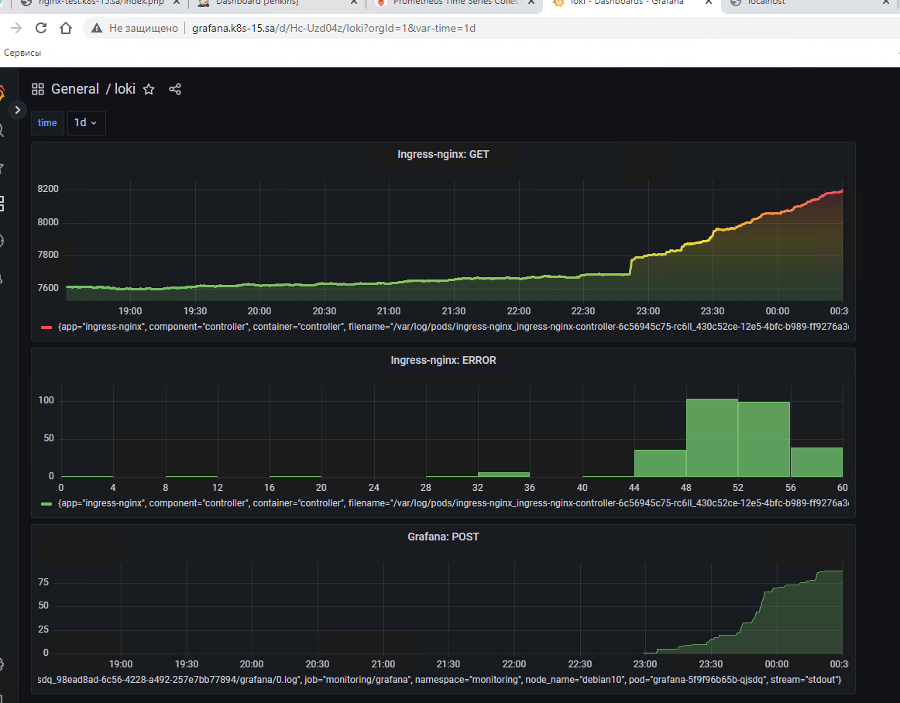
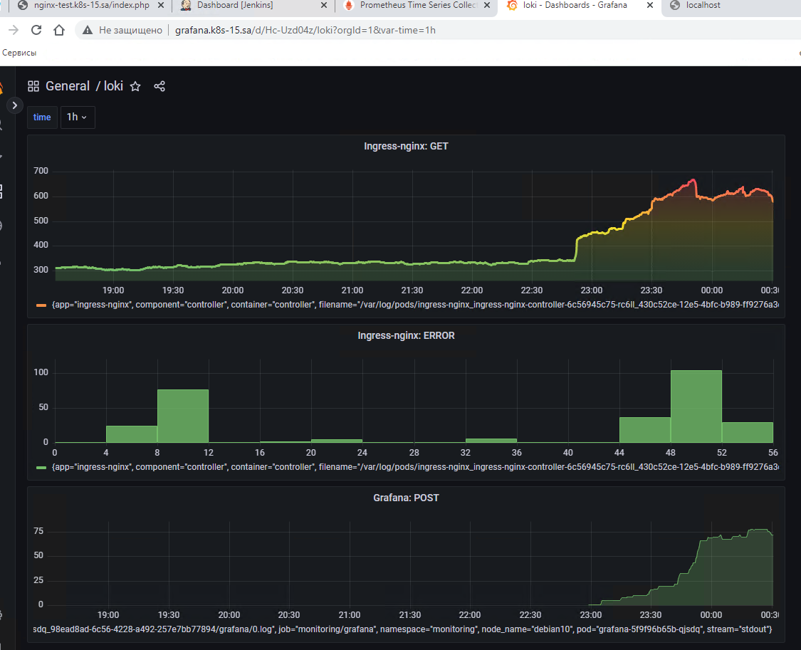
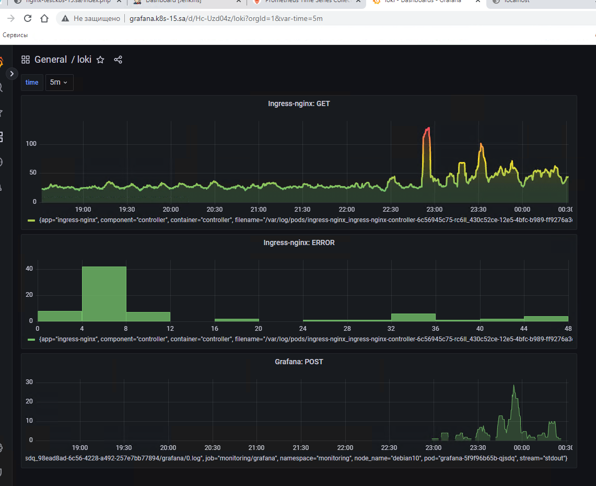

# 17. Log monitoring

## Screenshots




## JSON
```yaml
{
  "annotations": {
    "list": [
      {
        "builtIn": 1,
        "datasource": {
          "type": "grafana",
          "uid": "-- Grafana --"
        },
        "enable": true,
        "hide": true,
        "iconColor": "rgba(0, 211, 255, 1)",
        "name": "Annotations & Alerts",
        "target": {
          "limit": 100,
          "matchAny": false,
          "tags": [],
          "type": "dashboard"
        },
        "type": "dashboard"
      }
    ]
  },
  "editable": true,
  "fiscalYearStartMonth": 0,
  "graphTooltip": 0,
  "id": 3,
  "links": [],
  "liveNow": false,
  "panels": [
    {
      "datasource": {
        "type": "loki",
        "uid": "zcXlRO04k"
      },
      "fieldConfig": {
        "defaults": {
          "color": {
            "mode": "continuous-GrYlRd"
          },
          "custom": {
            "axisCenteredZero": false,
            "axisColorMode": "text",
            "axisLabel": "",
            "axisPlacement": "auto",
            "barAlignment": 0,
            "drawStyle": "line",
            "fillOpacity": 20,
            "gradientMode": "scheme",
            "hideFrom": {
              "legend": false,
              "tooltip": false,
              "viz": false
            },
            "lineInterpolation": "smooth",
            "lineWidth": 3,
            "pointSize": 5,
            "scaleDistribution": {
              "type": "linear"
            },
            "showPoints": "auto",
            "spanNulls": false,
            "stacking": {
              "group": "A",
              "mode": "none"
            },
            "thresholdsStyle": {
              "mode": "off"
            }
          },
          "mappings": [],
          "thresholds": {
            "mode": "absolute",
            "steps": [
              {
                "color": "green",
                "value": null
              },
              {
                "color": "red",
                "value": 80
              }
            ]
          }
        },
        "overrides": []
      },
      "gridPos": {
        "h": 7,
        "w": 14,
        "x": 0,
        "y": 0
      },
      "id": 5,
      "options": {
        "legend": {
          "calcs": [],
          "displayMode": "list",
          "placement": "bottom",
          "showLegend": true
        },
        "tooltip": {
          "mode": "single",
          "sort": "none"
        }
      },
      "pluginVersion": "9.3.4",
      "targets": [
        {
          "datasource": {
            "type": "loki",
            "uid": "zcXlRO04k"
          },
          "editorMode": "code",
          "expr": "count_over_time({app=\"ingress-nginx\"} |=`GET` [$time])",
          "queryType": "range",
          "refId": "A"
        }
      ],
      "title": "Ingress-nginx: GET",
      "type": "timeseries"
    },
    {
      "datasource": {
        "type": "loki",
        "uid": "zcXlRO04k"
      },
      "fieldConfig": {
        "defaults": {
          "color": {
            "mode": "thresholds"
          },
          "custom": {
            "fillOpacity": 80,
            "gradientMode": "none",
            "hideFrom": {
              "legend": false,
              "tooltip": false,
              "viz": false
            },
            "lineWidth": 1
          },
          "mappings": [],
          "thresholds": {
            "mode": "absolute",
            "steps": [
              {
                "color": "green",
                "value": null
              },
              {
                "color": "red",
                "value": 80
              }
            ]
          },
          "unit": "short"
        },
        "overrides": []
      },
      "gridPos": {
        "h": 6,
        "w": 14,
        "x": 0,
        "y": 7
      },
      "id": 3,
      "options": {
        "bucketOffset": 0,
        "legend": {
          "calcs": [],
          "displayMode": "list",
          "placement": "bottom",
          "showLegend": true
        }
      },
      "pluginVersion": "9.3.4",
      "targets": [
        {
          "datasource": {
            "type": "loki",
            "uid": "zcXlRO04k"
          },
          "editorMode": "code",
          "expr": "count_over_time({pod=\"ingress-nginx-controller-6c56945c75-rc6ll\"} |=`ERROR` [$time])",
          "queryType": "range",
          "refId": "A"
        }
      ],
      "title": "Ingress-nginx: ERROR",
      "type": "histogram"
    },
    {
      "datasource": {
        "type": "loki",
        "uid": "zcXlRO04k"
      },
      "fieldConfig": {
        "defaults": {
          "color": {
            "mode": "palette-classic"
          },
          "custom": {
            "axisCenteredZero": false,
            "axisColorMode": "text",
            "axisLabel": "",
            "axisPlacement": "auto",
            "barAlignment": 0,
            "drawStyle": "line",
            "fillOpacity": 25,
            "gradientMode": "none",
            "hideFrom": {
              "legend": false,
              "tooltip": false,
              "viz": false
            },
            "lineInterpolation": "linear",
            "lineWidth": 1,
            "pointSize": 5,
            "scaleDistribution": {
              "type": "linear"
            },
            "showPoints": "auto",
            "spanNulls": false,
            "stacking": {
              "group": "A",
              "mode": "none"
            },
            "thresholdsStyle": {
              "mode": "off"
            }
          },
          "mappings": [],
          "thresholds": {
            "mode": "absolute",
            "steps": [
              {
                "color": "green",
                "value": null
              },
              {
                "color": "red",
                "value": 80
              }
            ]
          }
        },
        "overrides": []
      },
      "gridPos": {
        "h": 6,
        "w": 14,
        "x": 0,
        "y": 13
      },
      "id": 1,
      "options": {
        "legend": {
          "calcs": [],
          "displayMode": "list",
          "placement": "bottom",
          "showLegend": true
        },
        "tooltip": {
          "mode": "single",
          "sort": "none"
        }
      },
      "pluginVersion": "9.3.4",
      "targets": [
        {
          "datasource": {
            "type": "loki",
            "uid": "zcXlRO04k"
          },
          "editorMode": "code",
          "expr": "count_over_time({pod=\"grafana-5f9f96b65b-qjsdq\"} |=`POST` [$time])",
          "key": "Q-c290e439-c953-464d-b242-9fafb7cff07e-0",
          "queryType": "range",
          "refId": "A"
        }
      ],
      "title": "Grafana: POST",
      "type": "timeseries"
    }
  ],
  "schemaVersion": 37,
  "style": "dark",
  "tags": [],
  "templating": {
    "list": [
      {
        "current": {
          "selected": true,
          "text": "5m",
          "value": "5m"
        },
        "hide": 0,
        "includeAll": false,
        "multi": false,
        "name": "time",
        "options": [
          {
            "selected": true,
            "text": "5m",
            "value": "5m"
          },
          {
            "selected": false,
            "text": "1h",
            "value": "1h"
          },
          {
            "selected": false,
            "text": "1d",
            "value": "1d"
          }
        ],
        "query": "5m, 1h, 1d",
        "queryValue": "",
        "skipUrlSync": false,
        "type": "custom"
      }
    ]
  },
  "time": {
    "from": "now-6h",
    "to": "now"
  },
  "timepicker": {},
  "timezone": "",
  "title": "loki",
  "uid": "Hc-Uzd04z",
  "version": 6,
  "weekStart": ""
}
```