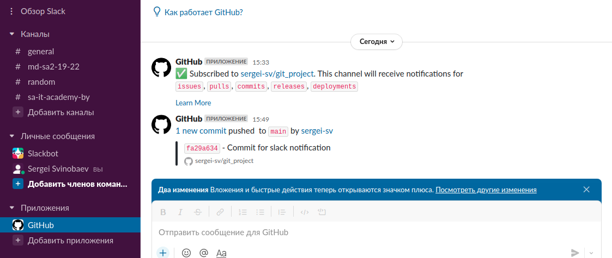

# 03. Git. Hosting
## Remote repositories
[github link](https://github.com/sergei-sv/git_project)

[gitlab link](https://gitlab.com/m7832/git_project_lab)

[bitbucket link](https://bitbucket.org/sergei-sv/git_project_bit/src/main/)

## Create slack integration




## Bash script for pushing changes to Github/Gitlab/Bitbacket
```bash
#!/bin/bash 

git push -all origin
git push -all origin_bit
git push -all origin_lab
```

