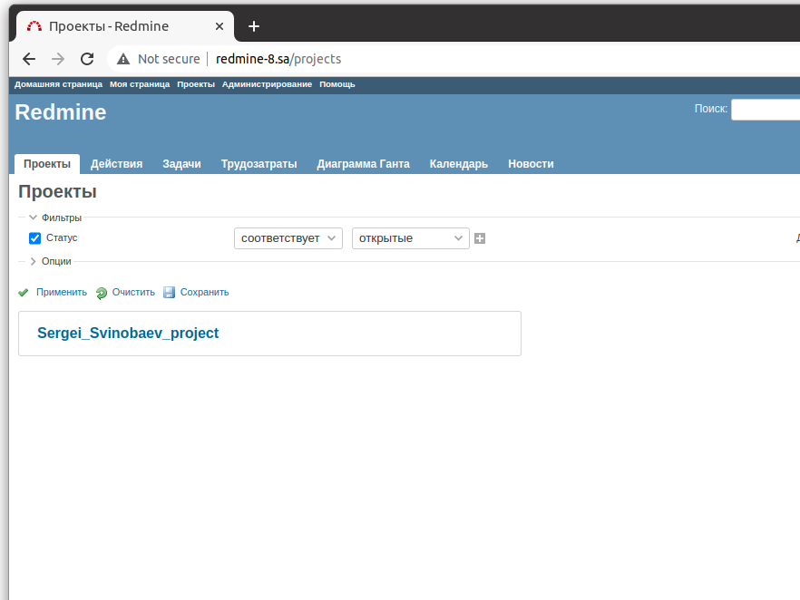

# 08.Ansible.Workshop

## Output from playbook
```bash
vagrant@vagrant:~/ansible$ ansible-playbook -i inv.yaml redmine.yaml

PLAY [host8] *****************************************************************************************************

TASK [Gathering Facts] *******************************************************************************************
Thursday 10 February 2022  20:55:50 +0000 (0:00:00.027)       0:00:00.027 ***** 
ok: [host8]

TASK [debug] *****************************************************************************************************
Thursday 10 February 2022  20:55:57 +0000 (0:00:07.282)       0:00:07.309 ***** 
ok: [host8] => {
    "msg": "192.168.201.8"
}

TASK [Include pre_tasks variables] *******************************************************************************
Thursday 10 February 2022  20:55:57 +0000 (0:00:00.045)       0:00:07.355 ***** 
ok: [host8]

TASK [Redmine. Install packages] *********************************************************************************
Thursday 10 February 2022  20:55:57 +0000 (0:00:00.038)       0:00:07.394 ***** 
ok: [host8]

TASK [mysql : MySQL.Create DB] ***********************************************************************************
Thursday 10 February 2022  20:56:01 +0000 (0:00:03.790)       0:00:11.185 ***** 
ok: [host8]

TASK [mysql : MySQL.Create DB User] ******************************************************************************
Thursday 10 February 2022  20:56:02 +0000 (0:00:00.963)       0:00:12.149 ***** 
ok: [host8]

TASK [redmine : Redmine. Clone repository] ***********************************************************************
Thursday 10 February 2022  20:56:03 +0000 (0:00:00.963)       0:00:13.112 ***** 
ok: [host8]

TASK [redmine : Redmine. Change permissions] *********************************************************************
Thursday 10 February 2022  20:56:04 +0000 (0:00:00.860)       0:00:13.973 ***** 
ok: [host8]

TASK [redmine : Redmine. Change permissions] *********************************************************************
Thursday 10 February 2022  20:56:05 +0000 (0:00:00.905)       0:00:14.879 ***** 
changed: [host8]

TASK [redmine : Config database] *********************************************************************************
Thursday 10 February 2022  20:56:06 +0000 (0:00:00.725)       0:00:15.605 ***** 
ok: [host8]

TASK [redmine : Redmine. Setup 01] *******************************************************************************
Thursday 10 February 2022  20:56:07 +0000 (0:00:01.458)       0:00:17.064 ***** 
changed: [host8]

TASK [redmine : Session store secret generation] *****************************************************************
Thursday 10 February 2022  20:56:13 +0000 (0:00:05.696)       0:00:22.760 ***** 
ok: [host8]

TASK [redmine : Redmine. Setup 02] *******************************************************************************
Thursday 10 February 2022  20:56:13 +0000 (0:00:00.750)       0:00:23.511 ***** 
changed: [host8]

TASK [redmine : Configuration files for virtualhost] *************************************************************
Thursday 10 February 2022  20:56:24 +0000 (0:00:11.058)       0:00:34.569 ***** 
ok: [host8]

TASK [redmine : meta] ********************************************************************************************
Thursday 10 February 2022  20:56:26 +0000 (0:00:01.257)       0:00:35.827 ***** 

TASK [Include post_tasks variables] ******************************************************************************
Thursday 10 February 2022  20:56:26 +0000 (0:00:00.044)       0:00:35.871 ***** 
ok: [host8]

TASK [Add redmine-8.sa to host file] *****************************************************************************
Thursday 10 February 2022  20:56:26 +0000 (0:00:00.038)       0:00:35.910 ***** 
changed: [host8]

TASK [uri] *******************************************************************************************************
Thursday 10 February 2022  20:56:27 +0000 (0:00:00.724)       0:00:36.635 ***** 
ok: [host8]

TASK [lineinfile] ************************************************************************************************
Thursday 10 February 2022  20:56:32 +0000 (0:00:05.345)       0:00:41.980 ***** 
changed: [host8]

PLAY RECAP *******************************************************************************************************
host8                      : ok=18   changed=5    unreachable=0    failed=0    skipped=0    rescued=0    ignored=0   

Thursday 10 February 2022  20:56:33 +0000 (0:00:00.913)       0:00:42.894 ***** 
=============================================================================== 
redmine : Redmine. Setup 02 ------------------------------------------------------------------------------ 11.06s
Gathering Facts ------------------------------------------------------------------------------------------- 7.28s
redmine : Redmine. Setup 01 ------------------------------------------------------------------------------- 5.70s
uri ------------------------------------------------------------------------------------------------------- 5.35s
Redmine. Install packages --------------------------------------------------------------------------------- 3.79s
redmine : Config database --------------------------------------------------------------------------------- 1.46s
redmine : Configuration files for virtualhost ------------------------------------------------------------- 1.26s
mysql : MySQL.Create DB User ------------------------------------------------------------------------------ 0.96s
mysql : MySQL.Create DB ----------------------------------------------------------------------------------- 0.96s
lineinfile ------------------------------------------------------------------------------------------------ 0.91s
redmine : Redmine. Change permissions --------------------------------------------------------------------- 0.91s
redmine : Redmine. Clone repository ----------------------------------------------------------------------- 0.86s
redmine : Session store secret generation ----------------------------------------------------------------- 0.75s
redmine : Redmine. Change permissions --------------------------------------------------------------------- 0.73s
Add redmine-8.sa to host file ----------------------------------------------------------------------------- 0.72s
debug ----------------------------------------------------------------------------------------------------- 0.05s
redmine : meta -------------------------------------------------------------------------------------------- 0.04s
Include pre_tasks variables ------------------------------------------------------------------------------- 0.04s
Include post_tasks variables ------------------------------------------------------------------------------ 0.04s
Playbook run took 0 days, 0 hours, 0 minutes, 42 seconds
```

## Printscreen of my project in application

