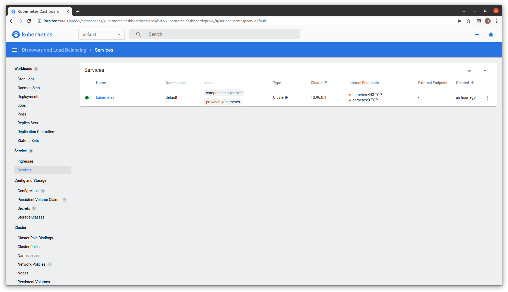

# 10.Kubernetes

### Install minikube
```bash
1  sudo apt update
2  curl -Lo minikube https://storage.googleapis.com/minikube/releases/latest/minikube-linux-amd64   && chmod +x minikube
3  mkdir -p /usr/local/bin/
4  install minikube /usr/local/bin/
5  minikube version
6  minikube start --vm-driver=virtualbox
7  minikube status
8  curl -LO https://storage.googleapis.com/kubernetes-release/release/`curl -s https://storage.googleapis.com/kubernetes-release/release/stable.txt`/bin/linux/amd64/kubectl
9  chmod +x ./kubectl
10 sudo mv ./kubectl /usr/local/bin/kubectl
11 kubectl version --client
```
### Enable dashboard and ingress addons
```bash
minikube addons enable dashboard
minikube addons enable ingress
minikube addons list
kubectl proxy --address='0.0.0.0' --disable-filter=true
```


### Run minikube with different HW options (RAM/CPU)
```bash
minikube start --cpus='4' --memory='3000mb'
```
### Final stage of deployment k8s
```bash
PLAY RECAP *************************************************************************************************************
localhost                  : ok=4    changed=0    unreachable=0    failed=0    skipped=0    rescued=0    ignored=0   
node1                      : ok=693  changed=101  unreachable=0    failed=0    skipped=1171 rescued=0    ignored=3   
node2                      : ok=471  changed=51   unreachable=0    failed=0    skipped=656  rescued=0    ignored=1   

Sunday 13 February 2022  14:45:19 +0000 (0:00:00.064)       0:36:42.139 ******* 
=============================================================================== 
kubernetes-apps/ansible : Kubernetes Apps | Lay Down CoreDNS templates ----------------------------------------- 63.14s
kubernetes-apps/ansible : Kubernetes Apps | Start Resources ---------------------------------------------------- 45.62s
download : download_container | Download image if required ----------------------------------------------------- 43.94s
download : download_container | Download image if required ----------------------------------------------------- 43.85s
download : download_container | Download image if required ----------------------------------------------------- 41.83s
download : download_container | Download image if required ----------------------------------------------------- 41.01s
network_plugin/calico : Calico | Create calico manifests ------------------------------------------------------- 38.01s
kubernetes/control-plane : kubeadm | Initialize first master --------------------------------------------------- 35.01s
download : download_container | Download image if required ----------------------------------------------------- 33.18s
policy_controller/calico : Create calico-kube-controllers manifests -------------------------------------------- 25.32s
download : download_file | Download item ----------------------------------------------------------------------- 23.15s
network_plugin/calico : Start Calico resources ----------------------------------------------------------------- 22.47s
download : download_container | Download image if required ----------------------------------------------------- 22.21s
download : download_container | Download image if required ----------------------------------------------------- 22.15s
download : download_container | Download image if required ----------------------------------------------------- 20.88s
download : download_container | Download image if required ----------------------------------------------------- 20.29s
kubernetes-apps/ansible : Kubernetes Apps | Lay Down nodelocaldns Template ------------------------------------- 19.05s
kubernetes/preinstall : Create kubernetes directories ---------------------------------------------------------- 17.22s
etcd : Check certs | Register ca and etcd admin/member certs on etcd hosts ------------------------------------- 17.02s
container-engine/containerd : containerd | Remove orphaned binary ---------------------------------------------- 16.96s
```