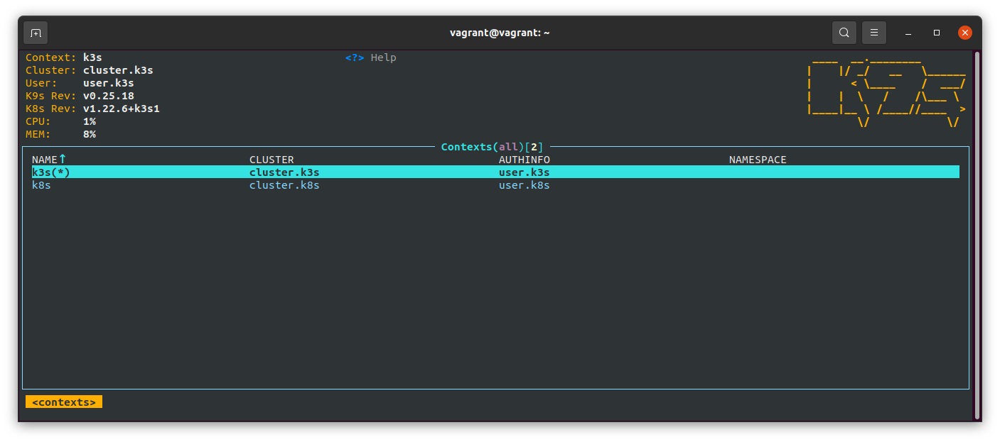
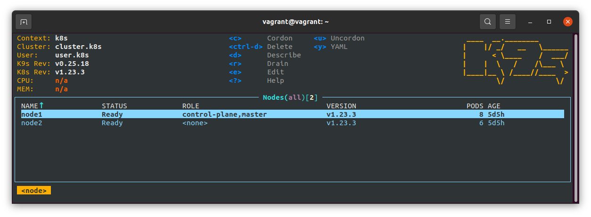
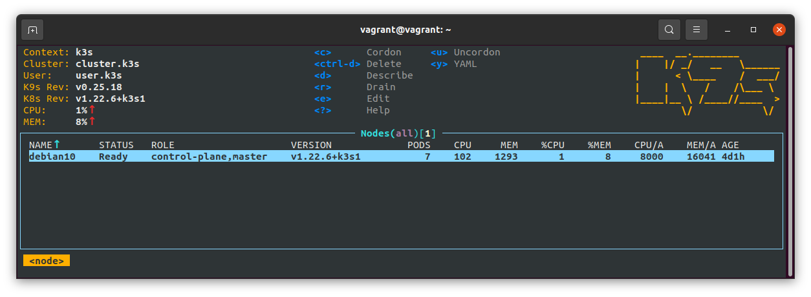

# 11.Kubernetes installation

### Kubectl config
```bash
apiVersion: v1
clusters:
- cluster:
    certificate-authority-data: LS0***tCg==
    server: https://192.168.203.15:6443
  name: cluster.k8s
- cluster:
    certificate-authority-data: LS0t***S0K
    server: https://192.168.203.32:6443
  name: cluster.k3s
contexts:
- context:
    cluster: cluster.k3s
    user: user.k3s
  name: k3s
- context:
    cluster: cluster.k8s
    user: user.k8s
  name: k8s
current-context: k8s
kind: Config
preferences: {}
users:
- name: user.k8s
  user:
    client-certificate-data: LS0***tCg==
    client-key-data: LS0***LQo=
- name: user.k3s
  user:
    client-certificate-data: LS0***LQo=
    client-key-data: LS0***LQo=
```

### Kubectl config use-context
```bash
vagrant@vagrant:~$ kcgc
CURRENT   NAME   CLUSTER       AUTHINFO   NAMESPACE
          k3s    cluster.k3s   user.k3s   
*         k8s    cluster.k8s   user.k8s   

vagrant@vagrant:~$ kcuc k8s
Switched to context "k8s".

vagrant@vagrant:~$ kgno
client: Connected.
NAME    STATUS   ROLES                  AGE    VERSION
node1   Ready    control-plane,master   5d5h   v1.23.3
node2   Ready    <none>                 5d5h   v1.23.3

vagrant@vagrant:~$ kcuc k3s
Switched to context "k3s".

vagrant@vagrant:~$ kgno
NAME       STATUS   ROLES                  AGE    VERSION
debian10   Ready    control-plane,master   4d1h   v1.22.6+k3s1
```

### K9s screenshots




