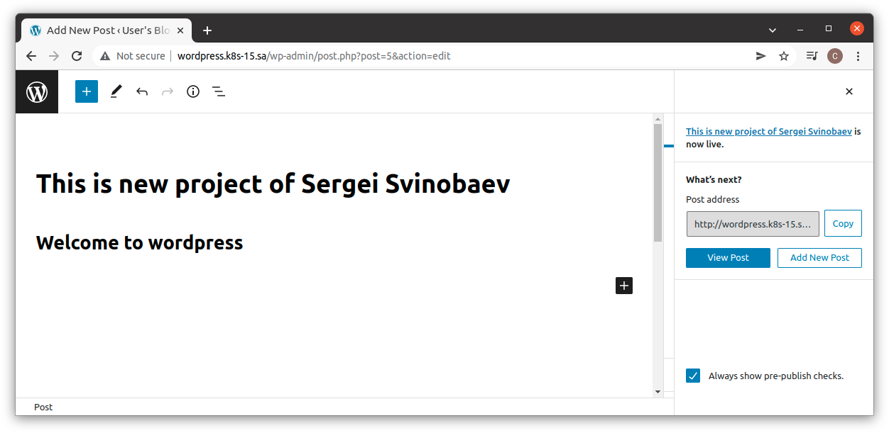
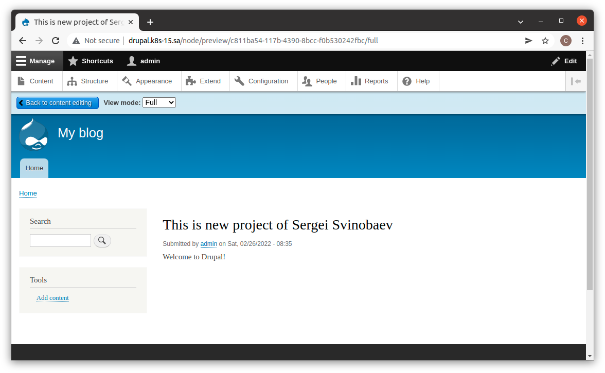

# 13.Kubernetes.Helm

### History helm run commands
```bash
#install helm
mkdir helm
cd helm
wget https://get.helm.sh/helm-v3.8.0-linux-amd64.tar.gz
tar -xf helm-v3.8.0-linux-amd64.tar.gz
ls -l
cd linux-amd64/
ls -l
sudo mv helm /bin/
helm
cd ..
rm -rf helm-v3.8.0-linux-amd64.tar.gz

#add bitnami repo
helm repo add bitnami https://charts.bitnami.com/bitnami

#install nfc-provisioner
helm repo add nfs-subdir-external-provisioner https://kubernetes-sigs.github.io/nfs-subdir-external-provisioner/
helm install nfs-subdir-external-provisioner nfs-subdir-external-provisioner/nfs-subdir-external-provisioner \
    --set nfs.server=192.168.37.105\
    --set nfs.path=/mnt/IT-Academy/nfs-data/sa2-19-22/Sergei_Svinobaev/

#create igress for wordpress
vim wp_ingress.yaml
kubectl apply -f wp_ingress.yaml

#install wordpress
helm install ss-wordpress  --set global.storageClass=nfs-client,wordpressUsername=admin,wordpressPassword=password bitnami/wordpress

#add to file /etc/hosts next string:178.124.206.53 wordpress.k8s-15.sa wordpress.k8s-16.sa 
sudo vim /etc/hosts/

#create igress for drupal
vim dr_ingress.yaml
kubectl apply -f dr_ingress.yaml

#install drupal
helm install ss-drupal  --set global.storageClass=nfs-client,drupalUsername=admin,drupalPassword=password bitnami/drupal

#add to file /etc/hosts next string:178.124.206.53 drupal.k8s-15.sa drupal.k8s-16.sa 
sudo vim /etc/hosts/
```
### Printscreens of my articles


