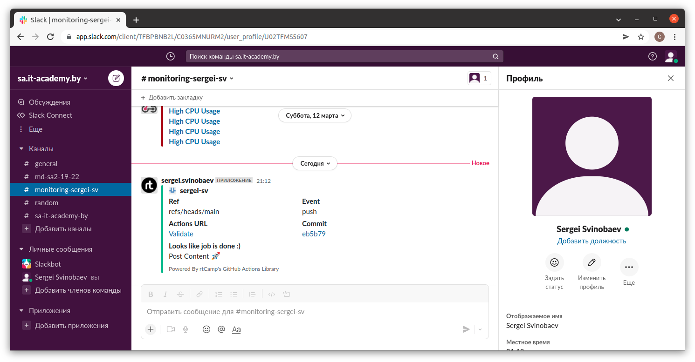

# 17. Testing

## Molecule test
```bash
vagrant@vagrant:~/testing/ansible/roles/webserver$ molecule test
INFO     default scenario test matrix: dependency, lint, cleanup, destroy, syntax, create, prepare, converge, idempotence, side_effect, verify, cleanup, destroy
INFO     Performing prerun...
INFO     Set ANSIBLE_LIBRARY=/home/vagrant/.cache/ansible-compat/13f460/modules:/home/vagrant/.ansible/plugins/modules:/usr/share/ansible/plugins/modules
INFO     Set ANSIBLE_COLLECTIONS_PATH=/home/vagrant/.cache/ansible-compat/13f460/collections:/home/vagrant/.ansible/collections:/usr/share/ansible/collections
INFO     Set ANSIBLE_ROLES_PATH=/home/vagrant/.cache/ansible-compat/13f460/roles:/home/vagrant/.ansible/roles:/usr/share/ansible/roles:/etc/ansible/roles
INFO     Running default > dependency
WARNING  Skipping, missing the requirements file.
WARNING  Skipping, missing the requirements file.
INFO     Running default > lint
INFO     Lint is disabled.
INFO     Running default > cleanup
WARNING  Skipping, cleanup playbook not configured.
INFO     Running default > destroy
INFO     Sanity checks: 'docker'

PLAY [Destroy] *****************************************************************

TASK [Destroy molecule instance(s)] ********************************************
changed: [localhost] => (item=instance1)
changed: [localhost] => (item=instance2)

TASK [Wait for instance(s) deletion to complete] *******************************
ok: [localhost] => (item=instance1)
ok: [localhost] => (item=instance2)

TASK [Delete docker networks(s)] ***********************************************

PLAY RECAP *********************************************************************
localhost                  : ok=2    changed=1    unreachable=0    failed=0    skipped=1    rescued=0    ignored=0

INFO     Running default > syntax

playbook: /home/vagrant/testing/ansible/roles/webserver/molecule/default/converge.yml
INFO     Running default > create

PLAY [Create] ******************************************************************

TASK [Log into a Docker registry] **********************************************
skipping: [localhost] => (item=None) 
skipping: [localhost] => (item=None) 
skipping: [localhost]

TASK [Check presence of custom Dockerfiles] ************************************
ok: [localhost] => (item={'image': 'centos:7', 'name': 'instance1', 'pre_build_image': True})
ok: [localhost] => (item={'image': 'debian:latest', 'name': 'instance2', 'pre_build_image': True})

TASK [Create Dockerfiles from image names] *************************************
skipping: [localhost] => (item={'image': 'centos:7', 'name': 'instance1', 'pre_build_image': True}) 
skipping: [localhost] => (item={'image': 'debian:latest', 'name': 'instance2', 'pre_build_image': True}) 

TASK [Discover local Docker images] ********************************************
ok: [localhost] => (item={'changed': False, 'skipped': True, 'skip_reason': 'Conditional result was False', 'item': {'image': 'centos:7', 'name': 'instance1', 'pre_build_image': True}, 'ansible_loop_var': 'item', 'i': 0, 'ansible_index_var': 'i'})
ok: [localhost] => (item={'changed': False, 'skipped': True, 'skip_reason': 'Conditional result was False', 'item': {'image': 'debian:latest', 'name': 'instance2', 'pre_build_image': True}, 'ansible_loop_var': 'item', 'i': 1, 'ansible_index_var': 'i'})

TASK [Build an Ansible compatible image (new)] *********************************
skipping: [localhost] => (item=molecule_local/centos:7) 
skipping: [localhost] => (item=molecule_local/debian:latest) 

TASK [Create docker network(s)] ************************************************

TASK [Determine the CMD directives] ********************************************
ok: [localhost] => (item={'image': 'centos:7', 'name': 'instance1', 'pre_build_image': True})
ok: [localhost] => (item={'image': 'debian:latest', 'name': 'instance2', 'pre_build_image': True})

TASK [Create molecule instance(s)] *********************************************
changed: [localhost] => (item=instance1)
changed: [localhost] => (item=instance2)

TASK [Wait for instance(s) creation to complete] *******************************
FAILED - RETRYING: [localhost]: Wait for instance(s) creation to complete (300 retries left).
changed: [localhost] => (item={'failed': 0, 'started': 1, 'finished': 0, 'ansible_job_id': '565175463583.3344', 'results_file': '/home/vagrant/.ansible_async/565175463583.3344', 'changed': True, 'item': {'image': 'centos:7', 'name': 'instance1', 'pre_build_image': True}, 'ansible_loop_var': 'item'})
changed: [localhost] => (item={'failed': 0, 'started': 1, 'finished': 0, 'ansible_job_id': '616604050432.3372', 'results_file': '/home/vagrant/.ansible_async/616604050432.3372', 'changed': True, 'item': {'image': 'debian:latest', 'name': 'instance2', 'pre_build_image': True}, 'ansible_loop_var': 'item'})

PLAY RECAP *********************************************************************
localhost                  : ok=5    changed=2    unreachable=0    failed=0    skipped=4    rescued=0    ignored=0

INFO     Running default > prepare
WARNING  Skipping, prepare playbook not configured.
INFO     Running default > converge

PLAY [Converge] ****************************************************************

TASK [Gathering Facts] *********************************************************
fatal: [instance2]: FAILED! => {"ansible_facts": {}, "changed": false, "failed_modules": {"ansible.legacy.setup": {"ansible_facts": {"discovered_interpreter_python": "/usr/bin/python"}, "failed": true, "module_stderr": "/bin/sh: 1: /usr/bin/python: not found\n", "module_stdout": "", "msg": "The module failed to execute correctly, you probably need to set the interpreter.\nSee stdout/stderr for the exact error", "rc": 127}}, "msg": "The following modules failed to execute: ansible.legacy.setup\n"}
ok: [instance1]

TASK [Include webserver] *******************************************************

TASK [webserver : Print OS/Version] ********************************************
ok: [instance1] => {
    "msg": [
        "OS: CentOS",
        "Version: 7.9"
    ]
}

TASK [webserver : Print Mount point/capacity/used] *****************************
skipping: [instance1] => (item={'block_used': 2579930, 'uuid': 'N/A', 'size_total': 33157857280, 'block_total': 8095180, 'mount': '/etc/hostname', 'block_available': 5515250, 'size_available': 22590464000, 'fstype': 'ext4', 'inode_total': 2064384, 'options': 'rw,relatime,bind', 'device': '/dev/mapper/ubuntu--vg-ubuntu--lv', 'inode_used': 184413, 'block_size': 4096, 'inode_available': 1879971})
skipping: [instance1] => (item={'block_used': 2579930, 'uuid': 'N/A', 'size_total': 33157857280, 'block_total': 8095180, 'mount': '/etc/resolv.conf', 'block_available': 5515250, 'size_available': 22590464000, 'fstype': 'ext4', 'inode_total': 2064384, 'options': 'rw,relatime,bind', 'device': '/dev/mapper/ubuntu--vg-ubuntu--lv', 'inode_used': 184413, 'block_size': 4096, 'inode_available': 1879971})
skipping: [instance1] => (item={'block_used': 2579930, 'uuid': 'N/A', 'size_total': 33157857280, 'block_total': 8095180, 'mount': '/etc/hosts', 'block_available': 5515250, 'size_available': 22590464000, 'fstype': 'ext4', 'inode_total': 2064384, 'options': 'rw,relatime,bind', 'device': '/dev/mapper/ubuntu--vg-ubuntu--lv', 'inode_used': 184413, 'block_size': 4096, 'inode_available': 1879971})
skipping: [instance1]

TASK [webserver : Print RAM capacity/free] *************************************
ok: [instance1] => {
    "msg": [
        "Total memory: 976 MB",
        "Free memory: 154 MB"
    ]
}

PLAY RECAP *********************************************************************
instance1                  : ok=3    changed=0    unreachable=0    failed=0    skipped=1    rescued=0    ignored=0
instance2                  : ok=0    changed=0    unreachable=0    failed=1    skipped=0    rescued=0    ignored=0

WARNING  Retrying execution failure 2 of: ansible-playbook --inventory /home/vagrant/.cache/molecule/webserver/default/inventory --skip-tags molecule-notest,notest /home/vagrant/testing/ansible/roles/webserver/molecule/default/converge.yml
CRITICAL Ansible return code was 2, command was: ['ansible-playbook', '--inventory', '/home/vagrant/.cache/molecule/webserver/default/inventory', '--skip-tags', 'molecule-notest,notest', '/home/vagrant/testing/ansible/roles/webserver/molecule/default/converge.yml']
WARNING  An error occurred during the test sequence action: 'converge'. Cleaning up.
INFO     Running default > cleanup
WARNING  Skipping, cleanup playbook not configured.
INFO     Running default > destroy

PLAY [Destroy] *****************************************************************

TASK [Destroy molecule instance(s)] ********************************************
changed: [localhost] => (item=instance1)
changed: [localhost] => (item=instance2)

TASK [Wait for instance(s) deletion to complete] *******************************
changed: [localhost] => (item=instance1)
changed: [localhost] => (item=instance2)

TASK [Delete docker networks(s)] ***********************************************

PLAY RECAP *********************************************************************
localhost                  : ok=2    changed=2    unreachable=0    failed=0    skipped=1    rescued=0    ignored=0

INFO     Pruning extra files from scenario ephemeral directory
```
---

## CI for testing Kubernetes manifests using kubeval

```yaml
on: [push, pull_request]
name: Validate
jobs:
  kubeval:
    runs-on: ubuntu-latest
    strategy:
      matrix:
        manifests: [prometheus.yaml, grafana.yaml]      
    steps:
    - uses: actions/checkout@master
    - name: test manifests folder
      uses: instrumenta/kubeval-action@master
      with: 
       files: ${{matrix.manifests}}
  slack:
    name: Slack Notification
    runs-on: ubuntu-latest
    steps:
    - uses: actions/checkout@v2
    - name: Slack Notification
      uses: rtCamp/action-slack-notify@v2
      env:
        SLACK_CHANNEL: monitoring-sergei-sv
        SLACK_COLOR: ${{ job.status }}
        SLACK_ICON: https://github.com/rtCamp.png?size=48
        SLACK_MESSAGE: 'Post Content :rocket:'
        SLACK_TITLE: 'Looks like job is done :)'
        SLACK_USERNAME: sergei.svinobaev
        SLACK_WEBHOOK: ${{ secrets.SLACK_WEBHOOK }
```
### Logs of pipeline
job:kubeval (prometheus.yaml)
```bash
Current runner version: '2.288.1'
Operating System
Virtual Environment
Virtual Environment Provisioner
GITHUB_TOKEN Permissions
Secret source: Actions
Prepare workflow directory
Prepare all required actions
Getting action download info
Download action repository 'actions/checkout@master' (SHA:2d1c1198e79c30cca5c3957b1e3b65ce95b5356e)
Download action repository 'instrumenta/kubeval-action@master' (SHA:5915e4adba5adccac07cb156b82e54c3fed74921)
1s
Pull down action image 'garethr/kubeval:latest'
2s
Run actions/checkout@master
Syncing repository: sergei-sv/git_project
Getting Git version info
Deleting the contents of '/home/runner/work/git_project/git_project'
Initializing the repository
Disabling automatic garbage collection
Setting up auth
Fetching the repository
Determining the checkout info
Checking out the ref
/usr/bin/git log -1 --format='%H'
'eb5b798bfbbe4fadd5f0bf4bf494cab01b6dd451'
0s
Run instrumenta/kubeval-action@master
/usr/bin/docker run --name garethrkubevallatest_cb2392 --label 29a95e --workdir /github/workspace --rm -e INPUT_FILES -e INPUT_OUTPUT -e INPUT_VERSION -e INPUT_STRICT -e INPUT_OPENSHIFT -e INPUT_IGNORE_MISSING_SCHEMAS -e HOME -e GITHUB_JOB -e GITHUB_REF -e GITHUB_SHA -e GITHUB_REPOSITORY -e GITHUB_REPOSITORY_OWNER -e GITHUB_RUN_ID -e GITHUB_RUN_NUMBER -e GITHUB_RETENTION_DAYS -e GITHUB_RUN_ATTEMPT -e GITHUB_ACTOR -e GITHUB_WORKFLOW -e GITHUB_HEAD_REF -e GITHUB_BASE_REF -e GITHUB_EVENT_NAME -e GITHUB_SERVER_URL -e GITHUB_API_URL -e GITHUB_GRAPHQL_URL -e GITHUB_REF_NAME -e GITHUB_REF_PROTECTED -e GITHUB_REF_TYPE -e GITHUB_WORKSPACE -e GITHUB_ACTION -e GITHUB_EVENT_PATH -e GITHUB_ACTION_REPOSITORY -e GITHUB_ACTION_REF -e GITHUB_PATH -e GITHUB_ENV -e GITHUB_STEP_SUMMARY -e RUNNER_OS -e RUNNER_ARCH -e RUNNER_NAME -e RUNNER_TOOL_CACHE -e RUNNER_TEMP -e RUNNER_WORKSPACE -e ACTIONS_RUNTIME_URL -e ACTIONS_RUNTIME_TOKEN -e ACTIONS_CACHE_URL -e GITHUB_ACTIONS=true -e CI=true -v "/var/run/docker.sock":"/var/run/docker.sock" -v "/home/runner/work/_temp/_github_home":"/github/home" -v "/home/runner/work/_temp/_github_workflow":"/github/workflow" -v "/home/runner/work/_temp/_runner_file_commands":"/github/file_commands" -v "/home/runner/work/git_project/git_project":"/github/workspace" garethr/kubeval:latest  "-d" "prometheus.yaml" "-o" "stdout" "--strict=true" "--kubernetes-version" "master" "--openshift=false" "--ignore-missing-schemas=true"
WARN - Set to ignore missing schemas
PASS - prometheus.yaml contains a valid ClusterRole (prometheus)
PASS - prometheus.yaml contains a valid ClusterRoleBinding (prometheus)
PASS - prometheus.yaml contains a valid ConfigMap (monitoring.prometheus-server-conf)
PASS - prometheus.yaml contains a valid Deployment (monitoring.prometheus-deployment)
PASS - prometheus.yaml contains a valid Service (monitoring.prometheus-service)
WARN - prometheus.yaml containing a Ingress (monitoring.ingress-prometheus) was not validated against a schema
0s
Post job cleanup.
/usr/bin/git version
git version 2.35.1
/usr/bin/git config --local --name-only --get-regexp core\.sshCommand
/usr/bin/git submodule foreach --recursive git config --local --name-only --get-regexp 'core\.sshCommand' && git config --local --unset-all 'core.sshCommand' || :
/usr/bin/git config --local --name-only --get-regexp http\.https\:\/\/github\.com\/\.extraheader
http.https://github.com/.extraheader
/usr/bin/git config --local --unset-all http.https://github.com/.extraheader
/usr/bin/git submodule foreach --recursive git config --local --name-only --get-regexp 'http\.https\:\/\/github\.com\/\.extraheader' && git config --local --unset-all 'http.https://github.com/.extraheader' || :
1s
Cleaning up orphan processes
```

job:kubeval (grafana.yaml)
```bash
Current runner version: '2.288.1'
Operating System
Virtual Environment
Virtual Environment Provisioner
GITHUB_TOKEN Permissions
Secret source: Actions
Prepare workflow directory
Prepare all required actions
Getting action download info
Download action repository 'actions/checkout@master' (SHA:2d1c1198e79c30cca5c3957b1e3b65ce95b5356e)
Download action repository 'instrumenta/kubeval-action@master' (SHA:5915e4adba5adccac07cb156b82e54c3fed74921)
1s
Pull down action image 'garethr/kubeval:latest'
0s
Run actions/checkout@master
Syncing repository: sergei-sv/git_project
Getting Git version info
Deleting the contents of '/home/runner/work/git_project/git_project'
Initializing the repository
Disabling automatic garbage collection
Setting up auth
Fetching the repository
Determining the checkout info
Checking out the ref
/usr/bin/git log -1 --format='%H'
'eb5b798bfbbe4fadd5f0bf4bf494cab01b6dd451'
0s
Run instrumenta/kubeval-action@master
/usr/bin/docker run --name garethrkubevallatest_c3dbc4 --label 29a95e --workdir /github/workspace --rm -e INPUT_FILES -e INPUT_OUTPUT -e INPUT_VERSION -e INPUT_STRICT -e INPUT_OPENSHIFT -e INPUT_IGNORE_MISSING_SCHEMAS -e HOME -e GITHUB_JOB -e GITHUB_REF -e GITHUB_SHA -e GITHUB_REPOSITORY -e GITHUB_REPOSITORY_OWNER -e GITHUB_RUN_ID -e GITHUB_RUN_NUMBER -e GITHUB_RETENTION_DAYS -e GITHUB_RUN_ATTEMPT -e GITHUB_ACTOR -e GITHUB_WORKFLOW -e GITHUB_HEAD_REF -e GITHUB_BASE_REF -e GITHUB_EVENT_NAME -e GITHUB_SERVER_URL -e GITHUB_API_URL -e GITHUB_GRAPHQL_URL -e GITHUB_REF_NAME -e GITHUB_REF_PROTECTED -e GITHUB_REF_TYPE -e GITHUB_WORKSPACE -e GITHUB_ACTION -e GITHUB_EVENT_PATH -e GITHUB_ACTION_REPOSITORY -e GITHUB_ACTION_REF -e GITHUB_PATH -e GITHUB_ENV -e GITHUB_STEP_SUMMARY -e RUNNER_OS -e RUNNER_ARCH -e RUNNER_NAME -e RUNNER_TOOL_CACHE -e RUNNER_TEMP -e RUNNER_WORKSPACE -e ACTIONS_RUNTIME_URL -e ACTIONS_RUNTIME_TOKEN -e ACTIONS_CACHE_URL -e GITHUB_ACTIONS=true -e CI=true -v "/var/run/docker.sock":"/var/run/docker.sock" -v "/home/runner/work/_temp/_github_home":"/github/home" -v "/home/runner/work/_temp/_github_workflow":"/github/workflow" -v "/home/runner/work/_temp/_runner_file_commands":"/github/file_commands" -v "/home/runner/work/git_project/git_project":"/github/workspace" garethr/kubeval:latest  "-d" "grafana.yaml" "-o" "stdout" "--strict=true" "--kubernetes-version" "master" "--openshift=false" "--ignore-missing-schemas=true"
WARN - Set to ignore missing schemas
PASS - grafana.yaml contains a valid ConfigMap (monitoring.grafana-datasources)
PASS - grafana.yaml contains a valid Deployment (monitoring.grafana)
PASS - grafana.yaml contains a valid Service (monitoring.grafana)
WARN - grafana.yaml containing a Ingress (monitoring.ingress-grafana) was not validated against a schema
0s
Post job cleanup.
/usr/bin/git version
git version 2.35.1
/usr/bin/git config --local --name-only --get-regexp core\.sshCommand
/usr/bin/git submodule foreach --recursive git config --local --name-only --get-regexp 'core\.sshCommand' && git config --local --unset-all 'core.sshCommand' || :
/usr/bin/git config --local --name-only --get-regexp http\.https\:\/\/github\.com\/\.extraheader
http.https://github.com/.extraheader
/usr/bin/git config --local --unset-all http.https://github.com/.extraheader
/usr/bin/git submodule foreach --recursive git config --local --name-only --get-regexp 'http\.https\:\/\/github\.com\/\.extraheader' && git config --local --unset-all 'http.https://github.com/.extraheader' || :
0s
Cleaning up orphan processes
```
job: Slack Notification

```bash
Current runner version: '2.288.1'
Operating System
Virtual Environment
Virtual Environment Provisioner
GITHUB_TOKEN Permissions
Secret source: Actions
Prepare workflow directory
Prepare all required actions
Getting action download info
Download action repository 'actions/checkout@v2' (SHA:ec3a7ce113134d7a93b817d10a8272cb61118579)
Download action repository 'rtCamp/action-slack-notify@v2' (SHA:12e36fc18b0689399306c2e0b3e0f2978b7f1ee7)
5s
Pull down action image 'ghcr.io/rtcamp/action-slack-notify:v2.2.0'
2s
Run actions/checkout@v2
Syncing repository: sergei-sv/git_project
Getting Git version info
Deleting the contents of '/home/runner/work/git_project/git_project'
Initializing the repository
Disabling automatic garbage collection
Setting up auth
Fetching the repository
Determining the checkout info
Checking out the ref
/usr/bin/git log -1 --format='%H'
'eb5b798bfbbe4fadd5f0bf4bf494cab01b6dd451'
1s
Run rtCamp/action-slack-notify@v2
/usr/bin/docker run --name ghcriortcampactionslacknotifyv220_a659d2 --label 29a95e --workdir /github/workspace --rm -e SLACK_CHANNEL -e SLACK_COLOR -e SLACK_ICON -e SLACK_MESSAGE -e SLACK_TITLE -e SLACK_USERNAME -e SLACK_WEBHOOK -e HOME -e GITHUB_JOB -e GITHUB_REF -e GITHUB_SHA -e GITHUB_REPOSITORY -e GITHUB_REPOSITORY_OWNER -e GITHUB_RUN_ID -e GITHUB_RUN_NUMBER -e GITHUB_RETENTION_DAYS -e GITHUB_RUN_ATTEMPT -e GITHUB_ACTOR -e GITHUB_WORKFLOW -e GITHUB_HEAD_REF -e GITHUB_BASE_REF -e GITHUB_EVENT_NAME -e GITHUB_SERVER_URL -e GITHUB_API_URL -e GITHUB_GRAPHQL_URL -e GITHUB_REF_NAME -e GITHUB_REF_PROTECTED -e GITHUB_REF_TYPE -e GITHUB_WORKSPACE -e GITHUB_ACTION -e GITHUB_EVENT_PATH -e GITHUB_ACTION_REPOSITORY -e GITHUB_ACTION_REF -e GITHUB_PATH -e GITHUB_ENV -e GITHUB_STEP_SUMMARY -e RUNNER_OS -e RUNNER_ARCH -e RUNNER_NAME -e RUNNER_TOOL_CACHE -e RUNNER_TEMP -e RUNNER_WORKSPACE -e ACTIONS_RUNTIME_URL -e ACTIONS_RUNTIME_TOKEN -e ACTIONS_CACHE_URL -e GITHUB_ACTIONS=true -e CI=true -v "/var/run/docker.sock":"/var/run/docker.sock" -v "/home/runner/work/_temp/_github_home":"/github/home" -v "/home/runner/work/_temp/_github_workflow":"/github/workflow" -v "/home/runner/work/_temp/_runner_file_commands":"/github/file_commands" -v "/home/runner/work/git_project/git_project":"/github/workspace" ghcr.io/rtcamp/action-slack-notify:v2.2.0
200 OK
0s
Post job cleanup.
/usr/bin/git version
git version 2.35.1
/usr/bin/git config --local --name-only --get-regexp core\.sshCommand
/usr/bin/git submodule foreach --recursive git config --local --name-only --get-regexp 'core\.sshCommand' && git config --local --unset-all 'core.sshCommand' || :
/usr/bin/git config --local --name-only --get-regexp http\.https\:\/\/github\.com\/\.extraheader
http.https://github.com/.extraheader
/usr/bin/git config --local --unset-all http.https://github.com/.extraheader
/usr/bin/git submodule foreach --recursive git config --local --name-only --get-regexp 'http\.https\:\/\/github\.com\/\.extraheader' && git config --local --unset-all 'http.https://github.com/.extraheader' || :
0s
Cleaning up orphan processes
```

### Slack notification


