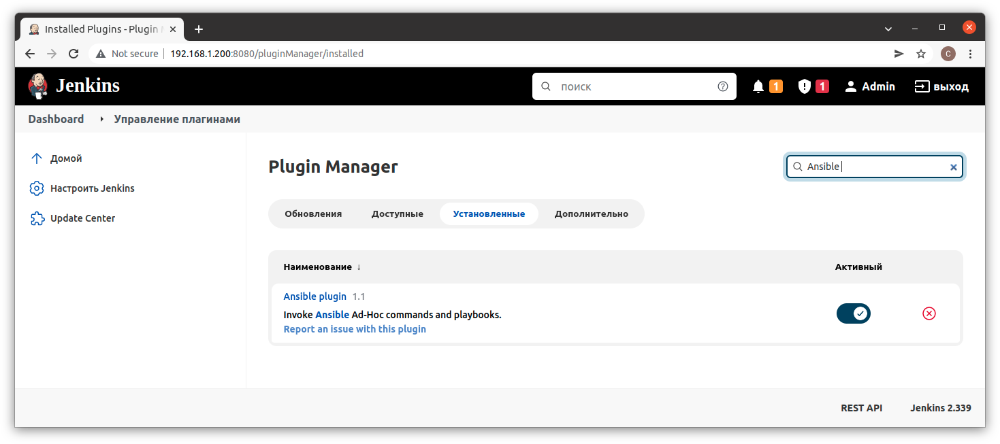
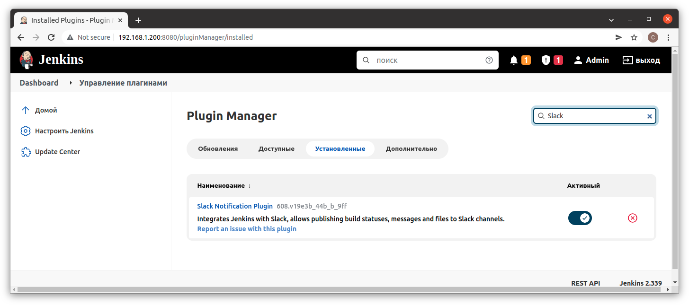
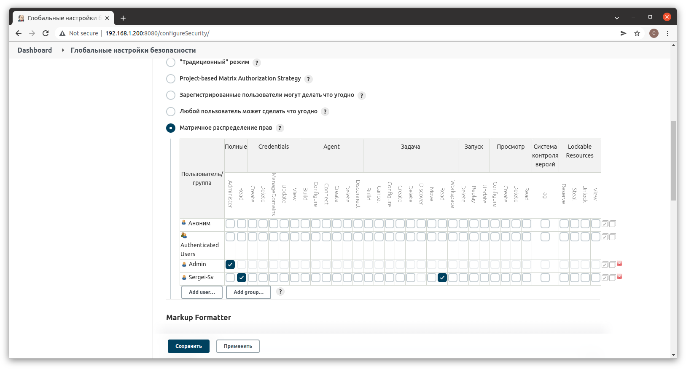
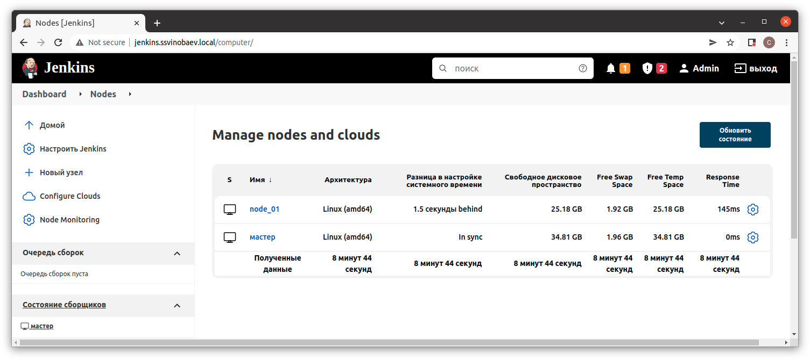

# 18. Jenkins. Start

## Screenshots

### Installed plugins: Ansible, Slack notification



### Jenkins restricted user


### Hide Jenkins behind NGINX



## Vagrantfile Master
```bash
Vagrant.configure("2") do |config|
    config.vm.box = "centos/7"
    config.vm.define "Jenkins"
    config.vm.network "public_network", ip: "192.168.1.200",  bridge: "enp2s0" 
    config.vm.provision :shell, :path => "bootstrap.sh"
end
```

## Vagrantfile node
```bash
Vagrant.configure("2") do |config|
  config.vm.box = "bento/ubuntu-20.04"
    config.vm.define "node_01"
    config.vm.network "public_network", ip: "192.168.1.201",  bridge: "enp2s0" 
    config.vm.provision :shell, :path => "bootstrap.sh"
end
```
## Jenkins revers proxy Nginx
```bash
upstream jenkins {
  keepalive 32; # keepalive connections
  server 192.168.1.200:8080; # jenkins ip and port
}

# Required for Jenkins websocket agents
map $http_upgrade $connection_upgrade {
  default upgrade;
  '' close;
}

server {
  listen          80;       # Listen on port 80 for IPv4 requests

  server_name     jenkins.ssvinobaev.local;  # replace 'jenkins.example.com' with your server domain name

  # this is the jenkins web root directory
  # (mentioned in the /etc/default/jenkins file)
  root            /var/run/jenkins/war/;

  access_log      /var/log/nginx/jenkins.access.log;
  error_log       /var/log/nginx/jenkins.error.log;

  # pass through headers from Jenkins that Nginx considers invalid
  ignore_invalid_headers off;

  location ~ "^/static/[0-9a-fA-F]{8}\/(.*)$" {
    # rewrite all static files into requests to the root
    # E.g /static/12345678/css/something.css will become /css/something.css
    rewrite "^/static/[0-9a-fA-F]{8}\/(.*)" /$1 last;
  }

  location /userContent {
    # have nginx handle all the static requests to userContent folder
    # note : This is the $JENKINS_HOME dir
    root /var/lib/jenkins/;
    if (!-f $request_filename){
      # this file does not exist, might be a directory or a /**view** url
      rewrite (.*) /$1 last;
      break;
    }
    sendfile on;
  }

  location / {
      sendfile off;
      proxy_pass         http://jenkins;
      proxy_redirect     default;
      proxy_http_version 1.1;

      # Required for Jenkins websocket agents
      proxy_set_header   Connection        $connection_upgrade;
      proxy_set_header   Upgrade           $http_upgrade;

      proxy_set_header   Host              $host;
      proxy_set_header   X-Real-IP         $remote_addr;
      proxy_set_header   X-Forwarded-For   $proxy_add_x_forwarded_for;
      proxy_set_header   X-Forwarded-Proto $scheme;
      proxy_max_temp_file_size 0;

      #this is the maximum upload size
      client_max_body_size       10m;
      client_body_buffer_size    128k;

      proxy_connect_timeout      90;
      proxy_send_timeout         90;
      proxy_read_timeout         90;
      proxy_buffering            off;
      proxy_request_buffering    off; # Required for HTTP CLI commands
      proxy_set_header Connection ""; # Clear for keepalive
  }
}
```


