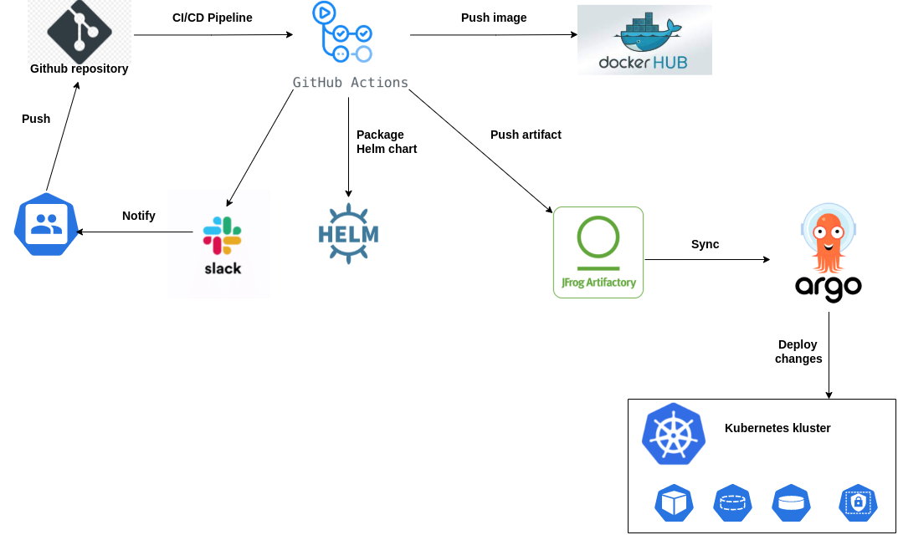

# Project report
---

### Project's reporter: Sergei Svinobaev
### Group number: md-sa2-19-22

---

## Description of application for deployment:

- Application: Wordpress

- Programming language: PHP

- DB: MySQL

- Link on git repository: https://github.com/docker-library/wordpress

---

## Pipeline. High Level Design:

---

## Technologies which were used in project:

### Orchestration: 
Kubernetes

### Automation tools:
Github action, Argo CD

### SCM:
Github

### Notification:
Slack

### Other tools:
 Docker, Helm

---

## CI/CD description:
As soon as any push in branch "main" is recieved to project GIT repo, Github actions runs ci/cd pipeline. First step is check out repo, then automatically bump realise version and push tag. Next step builds docker image and pushes it to the Docker Hub.
Next step is install helm and check our helm chart by kubeval. Next Helm create new artifact and push it to Jfrog Artifactory. Pipeline will send success Slack notification, along with if pipeline will fail, we will receive an alert notification in Slack.
As soon as there is some change in the Jfrog Artifactory, ArgoCD detects it and starts deploying the newest Helm chart in the Kubernetes cluster.

## Rollback flow description and implementation:

With Argo CD we can rollback to any code or application version in our Git repository history

---

## Links:

Project repository: https://github.com/sergei-sv/wp