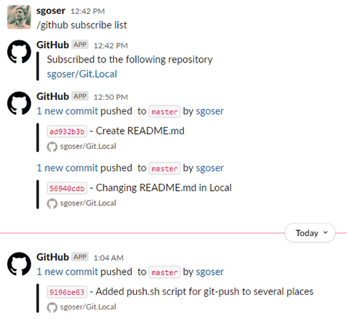

# 03.Git.Hosting

## Repo’s links

[GitHub - https://github.com/sgoser/Git.Local](https://github.com/sgoser/Git.Local)

[GitLab - https://gitlab.com/sgoser/git.local](https://gitlab.com/sgoser/git.local)

[BitBucket - https://bitbucket.org/sgoser/git.local](https://bitbucket.org/sgoser/git.local)

## Report

### Step 1. Repo's, SSH, git-push

Create repo's in all places in web. Add pub ssh. Get repo's links.

```bash
  142  ssh-keygen
  143  cat .ssh/*.pub

  145  cd git/Git.Local
  149  git remote add origin_githab git@github.com:sgoser/Git.Local.git
  218  git push -u origin_githab --all
  217  git remote add origin_gitlab git@gitlab.com:sgoser/git.local.git
  218  git push -u origin_gitlab --all
  222  git remote add origin_bitb git@bitbucket.org:sgoser/git.local.git
  223  git push -u origin_bitb --all

```

### Step 2. Slack/email integration

Notifications in Slack



### Step 3. Pushing script

Script

```bash
#!/bin/bash

RemRepoArr=$(git remote)
for origin in $RemRepoArr
do
echo "git-push on remote $origin all branches"
git push -u $origin --all
done
```

CLI output

```bash
sadmin@devops:~/git/Git.Local$ bash push.sh 
git-push on remote origin_bitb all branches
Enumerating objects: 4, done.
Counting objects: 100% (4/4), done.
Delta compression using up to 2 threads
Compressing objects: 100% (3/3), done.
Writing objects: 100% (3/3), 402 bytes | 201.00 KiB/s, done.
Total 3 (delta 1), reused 0 (delta 0), pack-reused 0
To bitbucket.org:sgoser/git.local.git
   56940cd..9196be6  master -> master
branch 'dev' set up to track 'origin_bitb/dev'.
branch 'features/do_one' set up to track 'origin_bitb/features/do_one'.
branch 'hotfix/we_gonna_die' set up to track 'origin_bitb/hotfix/we_gonna_die'.
branch 'master' set up to track 'origin_bitb/master'.
git-push on remote origin_github all branches
Enumerating objects: 4, done.
Counting objects: 100% (4/4), done.
Delta compression using up to 2 threads
Compressing objects: 100% (3/3), done.
Writing objects: 100% (3/3), 402 bytes | 402.00 KiB/s, done.
Total 3 (delta 1), reused 0 (delta 0), pack-reused 0
remote: Resolving deltas: 100% (1/1), completed with 1 local object.
To github.com:sgoser/Git.Local.git
   56940cd..9196be6  master -> master
branch 'dev' set up to track 'origin_github/dev'.
branch 'features/do_one' set up to track 'origin_github/features/do_one'.
branch 'hotfix/we_gonna_die' set up to track 'origin_github/hotfix/we_gonna_die'.
branch 'master' set up to track 'origin_github/master'.
git-push on remote origin_gitlab all branches
Enumerating objects: 4, done.
Counting objects: 100% (4/4), done.
Delta compression using up to 2 threads
Compressing objects: 100% (3/3), done.
Writing objects: 100% (3/3), 402 bytes | 402.00 KiB/s, done.
Total 3 (delta 1), reused 0 (delta 0), pack-reused 0
To gitlab.com:sgoser/git.local.git
   56940cd..9196be6  master -> master
branch 'dev' set up to track 'origin_gitlab/dev'.
branch 'features/do_one' set up to track 'origin_gitlab/features/do_one'.
branch 'hotfix/we_gonna_die' set up to track 'origin_gitlab/hotfix/we_gonna_die'.
branch 'master' set up to track 'origin_gitlab/master'.
``
