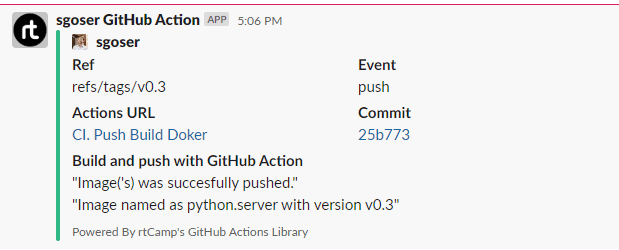

# 08.Docker.Register

## Links

[>> Docker Hub Registry <<](https://hub.docker.com/repository/docker/sgoser/python.server)

[>> GitHub Container Registry <<](https://github.com/users/sgoser/packages/container/package/python.server)

[>> GitHub Action Jobs <<](https://github.com/sgoser/python.server/actions)

[>> GitHub Action File <<](https://github.com/sgoser/python.server/blob/main/.github/workflows/push_build_docker.yaml)

## GitHub Action File

```yaml
name: CI. Push Build Doker

on:
  push:
    tags:
      - "v*.*"

jobs:
  docker:
    env:
        USER_NAME: ${{ github.actor }}
        IMAGE_NAME: "python.server"
    runs-on: ubuntu-latest
    permissions:
      packages: write
      contents: read
    steps:
      - 
        name: Check out the repo
        uses: actions/checkout@v2
      - 
        name: Set up Docker Buildx
        uses: docker/setup-buildx-action@v2
      - 
        name: Login to GitHub Registry
        uses: docker/login-action@v2
        with:
          registry: ghcr.io
          username: ${{ env.USER_NAME }}
          password: ${{ secrets.GHCR_TOKEN }}
      - 
        name: Login to Docker Hub
        uses: docker/login-action@v2
        with:
          username: ${{ env.USER_NAME }}
          password: ${{ secrets.DOCKERHUB_TOKEN }}
      -
        name: Build and push
        uses: docker/build-push-action@v3
        with:
          context: .
          push: true
          tags: |
            ${{ env.USER_NAME }}/${{ env.IMAGE_NAME }}:latest
            ${{ env.USER_NAME }}/${{ env.IMAGE_NAME }}:${{  github.ref_name }}
            ghcr.io/${{ env.USER_NAME }}/${{ env.IMAGE_NAME }}:latest
            ghcr.io/${{ env.USER_NAME }}/${{ env.IMAGE_NAME }}:${{  github.ref_name }}
      -
        name: Slack Notification
        uses: rtCamp/action-slack-notify@v2
        env:
          SLACK_CHANNEL: github_action
          SLACK_COLOR: ${{ job.status }}
          SLACK_ICON: https://github.com/rtCamp.png?size=48
          SLACK_MESSAGE: |-
            "Image('s) was succesfully pushed."
            "Image named as ${{ env.IMAGE_NAME }} with version ${{  github.ref_name }}"
          SLACK_TITLE: 'Build and push with GitHub Action'
          SLACK_USERNAME: sgoser GitHub Action
          SLACK_WEBHOOK: ${{ secrets.SLACK_WEBHOOK }}
```

## Slack Notification Img


