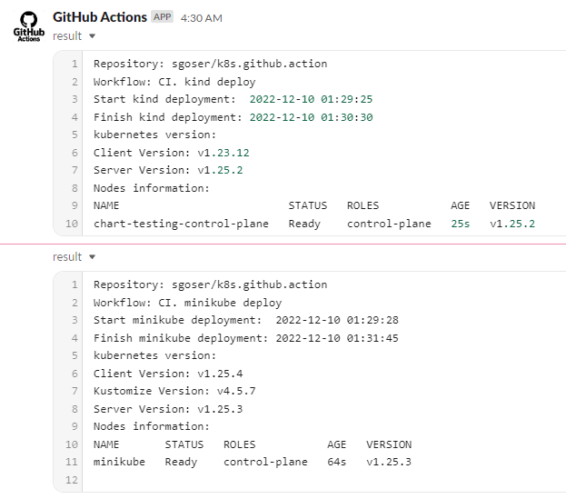

# 09.Kubernetes

## Links

[>> GitHub Action Jobs <<](https://github.com/sgoser/k8s.github.action/actions)

## Action Files

### minikube.yaml

```yaml
name: CI. minikube deploy
on: push
jobs:
  minikube:
    env:
      result_file: result.log
    runs-on: ubuntu-latest
    steps:
    - name: Send time start jobs
      run: |
        echo "Start minikube deployment:  $(date '+%F %T')" >> ${{ env.result_file }}
    - name: start minikube
      id: minikube
      uses: medyagh/setup-minikube@latest
    - name: Send time finish jobs
      run: |
        echo "Finish minikube deployment: $(date '+%F %T')" >> ${{ env.result_file }}
    - name: kubernetes info gathering
      run: |
        echo -e "kubernetes version:\n$(kubectl version --short)" >> ${{ env.result_file }}
        echo "Nodes information:" >> ${{ env.result_file }}
        echo "$(kubectl get nodes)" >> ${{ env.result_file }}
    - name: Additional information in log file
      run: |
        sed -i '1 i\Repository: ${{ github.repository }}' ${{ env.result_file }}
        sed -i '2 i\Workflow: ${{ github.workflow }}' ${{ env.result_file }}
    - name: Upload file to slack 
      uses: adrey/slack-file-upload-action@master
      with:
        token: ${{ secrets.SLACK_TOKEN }}
        path: ${{ env.result_file }}
        channel: github_action
```

### kind.yaml

```yaml
name: CI. kind deploy
on: push
jobs:
  kind:
    env:
      result_file: result.log
    runs-on: ubuntu-latest
    steps:
    - name: Send time start jobs
      run: |
        echo "Start kind deployment:  $(date '+%F %T')" >> ${{ env.result_file }}
    - name: Create k8s Kind Cluster
      uses: helm/kind-action@v1.4.0
    - name: Send time finish jobs
      run: |
        echo "Finish kind deployment: $(date '+%F %T')" >> ${{ env.result_file }}
    - name: kubernetes info gathering
      run: |
        echo -e "kubernetes version:\n$(kubectl version --short)" >> ${{ env.result_file }}
        echo "Nodes information:" >> ${{ env.result_file }}
        echo "$(kubectl get nodes)" >> ${{ env.result_file }}
    - name: Additional information in log file
      run: |
        sed -i '1 i\Repository: ${{ github.repository }}' ${{ env.result_file }}
        sed -i '2 i\Workflow: ${{ github.workflow }}' ${{ env.result_file }}
    - name: Upload file to slack 
      uses: adrey/slack-file-upload-action@master
      with:
        token: ${{ secrets.SLACK_TOKEN }}
        path: ${{ env.result_file }}
        channel: github_action
```

## Slack notifications from my own Slack App

### result.log "CI. kind deploy"

```text
Repository: sgoser/k8s.github.action
Workflow: CI. kind deploy
Start kind deployment:  2022-12-10 01:29:25
Finish kind deployment: 2022-12-10 01:30:30
kubernetes version:
Client Version: v1.23.12
Server Version: v1.25.2
Nodes information:
NAME                          STATUS   ROLES           AGE   VERSION
chart-testing-control-plane   Ready    control-plane   25s   v1.25.2
```

### result.log "CI. minikube deploy"

```text
Repository: sgoser/k8s.github.action
Workflow: CI. minikube deploy
Start minikube deployment:  2022-12-10 01:29:28
Finish minikube deployment: 2022-12-10 01:31:45
kubernetes version:
Client Version: v1.25.4
Kustomize Version: v4.5.7
Server Version: v1.25.3
Nodes information:
NAME       STATUS   ROLES           AGE   VERSION
minikube   Ready    control-plane   64s   v1.25.3
```

### Slack Screenshot


