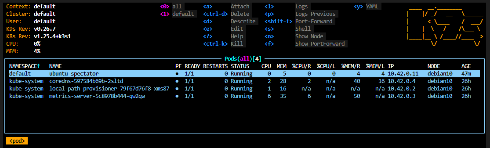
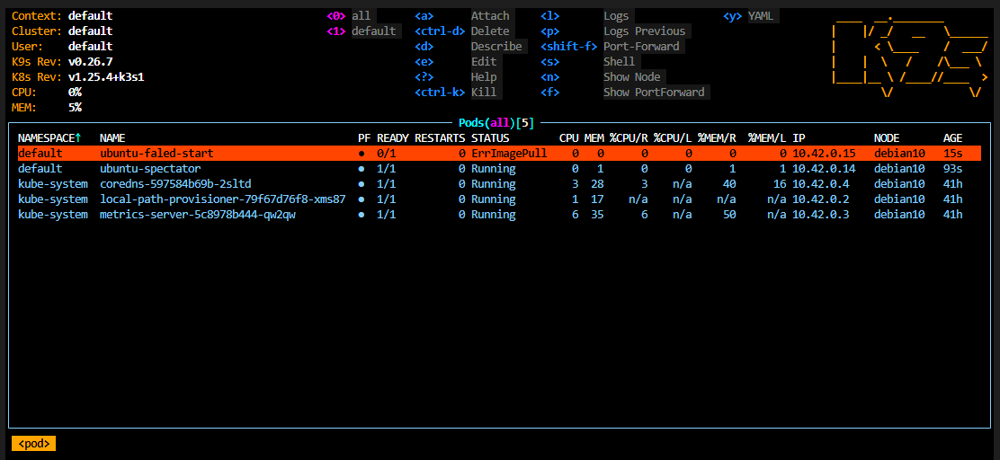
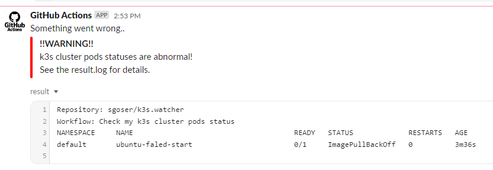
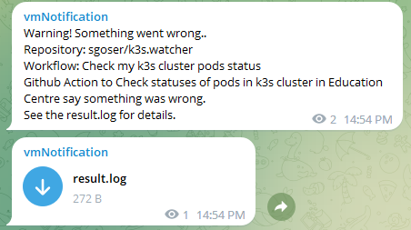

# 10.Kubernetes.Workshop

## Preparing

All workshop steps was done.

Created my ubuntu container with network tools.

Images was pushed to ghcr.io registry.

Created special pair ssh keys for github action.

Created all the necessary secrets.

## Links

[>> GitHub Action Jobs <<](https://github.com/sgoser/k3s.watcher/actions)

## Action Files

Attached to commit in PR.

## Testing and Screenshots

### All pods - working

### All pods - one warning

### Slack Warning Screenshot

### Telegram Warning Screenshot

