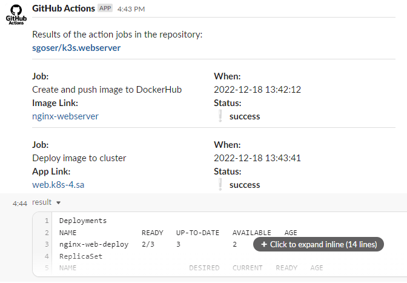
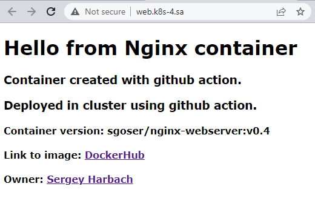
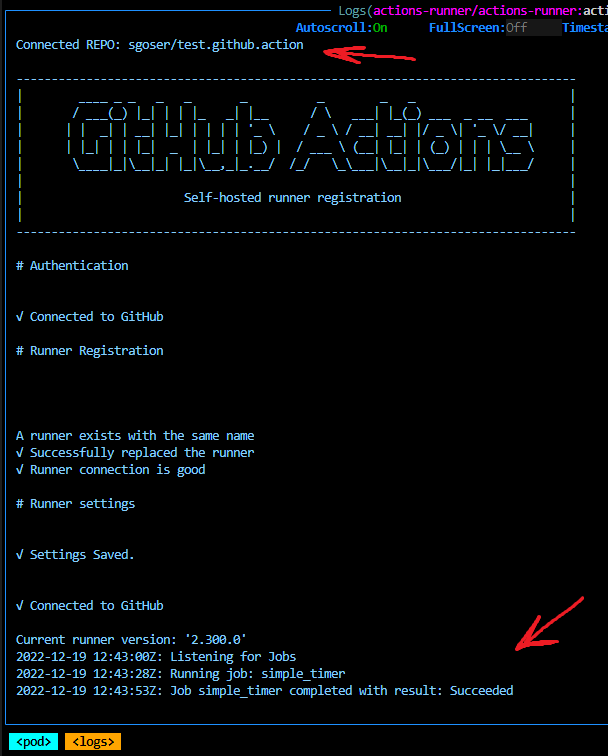

# 11.Kubernetes.Basic-objects

## Part 1. nginx-webserver on cluster using GitHub Actions

## I have chosen the hard way to do my homework

## Preparing

Step 1. Install ingress-nginx-controller (with required for us changes)

Step 2. Creating new namespase on cluster for webserver

Step 3. Making and set all required secrets for GitHub Actions

Step 4. Creating index.html and Dockerfile for container image

Step 5. Creating app-webserver.yaml deployment manifest file for deploy to cluster

## Realization

Step 1. GitHub Action: Сreating my own docker container with my own content and pushing to DockerHub

Step 2. GitHub Action: Deploying to my cluster using file manifest

Step 3. GitHub Action: Getting report in Slack after deploying to cluster

## Report

My Workflow for GitHub Actions **build_push_deploy.yaml** attached to commit in PR.

My Deployment Manifest **app-webserver.yaml**  attached to commit in PR.

My repository with all files and this workflow - [>> there <<](https://github.com/sgoser/k3s.webserver) .

Example action run - [>> there <<](https://github.com/sgoser/k3s.webserver/actions/runs/3726672602) .

Slack notification:



Deployment, ReplicaSet, Pods:

```text
Deployments
NAME               READY   UP-TO-DATE   AVAILABLE   AGE
nginx-web-deploy   3/3     3            3           4h25m
ReplicaSet
NAME                          DESIRED   CURRENT   READY   AGE
nginx-web-deploy-577bc56c94   0         0         0       121m
nginx-web-deploy-7dbcdb578d   3         3         3       72m
Pods
NAME                                READY   STATUS              RESTARTS   AGE
nginx-web-deploy-7dbcdb578d-4kkzr   1/1     Running             0          67s
nginx-web-deploy-7dbcdb578d-xhwqg   1/1     Running             0          67s
nginx-web-deploy-7dbcdb578d-b86zq   1/1     Running             0          21s
```

Browser screen:



## Part 2. GitHub Self-hosted runner in my cluster

## Still using the hard way

### Creating my own container with github self-hosted actions runner scripts. Special bash script to config and run runner

Dockerfile:

```Dockerfile
FROM ubuntu:20.04

LABEL maintainer="sgoser@gmail.com"

### !! commented lines - download action runner scripts from internet !!
### !! added local coping because slow download from internet !!

### set the github runner version

# ARG RUNNER_VERSION="2.300.0"

### install curl ca-certificates (ca-cert needed for curl download)
### libssl-dev - for establishing connection with github

RUN apt-get update \
    && DEBIAN_FRONTEND=noninteractive apt-get install --no-install-recommends --no-install-suggests -y \
    curl ca-certificates libssl-dev \
    && rm -rf /var/lib/apt/lists/*


### add a non-sudo user
RUN useradd -m runner

### create folder and make it as workdir
WORKDIR /home/runner/actions-runner

### cd into the user directory, download and unzip the github actions runner

#RUN cd /home/docker && mkdir actions-runner && cd actions-runner \
#    && curl -O -L https://github.com/actions/runner/releases/download/v${RUNNER_VERSION}/actions-runner-linux-x64-${RUNNER_VERSION}.tar.gz \
#    && tar xzf ./actions-runner-linux-x64-${RUNNER_VERSION}.tar.gz \
#    && rm ./actions-runner-linux-x64-${RUNNER_VERSION}.tar.gz

### added local coping because slow download from internet
COPY actions-runner-linux-x64-2.300.0.tar.gz ./

### unzip the github actions runner and rm after that
RUN tar xzf ./actions-runner-linux-x64-2.300.0.tar.gz \
    && rm ./actions-runner-linux-x64-2.300.0.tar.gz

### install some additional dependencies
RUN chown -R runner ~runner && /home/runner/actions-runner/bin/installdependencies.sh

### copy script
COPY start.sh ./

### make the script executable
RUN chmod +x start.sh

### since the config and run script for actions are not allowed to be run by root,
### set the user to "runner" so all subsequent commands are run as the runner user
USER runner

### set the entrypoint to the start.sh script
ENTRYPOINT ["./start.sh"]
```

Script:

```bash
#!/bin/bash

REPO=$REPO
TOKEN=$TOKEN

cd /home/runner/actions-runner

echo --------------------------------------------------------------------------------
echo Connected REPO: ${REPO}

./config.sh --unattended --replace --url https://github.com/${REPO} --token ${TOKEN}

./run.sh & wait $!
```

### Pushing to DockerHub

Link: [> there <](https://hub.docker.com/r/sgoser/actions-runner/tags)

### Create new namespase and secret in cluster

Secret YAML:

```yaml
---
apiVersion: v1
kind: Secret
metadata:
  namespace: actions-runner
  name: gh-secret
type: Opaque
data:
  repo: <__repo-name|base64__>
  token: <__token|base64__>
```

### Apply as pod to cluster

Pod Manifest:

```yaml
---
apiVersion: v1
kind: Pod
metadata:
  namespace: actions-runner
  name: actions-runner
  labels:
    app: actions-runner
spec:
  containers:
  - name: actions-runner
    image: sgoser/actions-runner:v2.300
    imagePullPolicy: Always

    env:
      - name: REPO
        valueFrom:
          secretKeyRef:
            name: gh-secret
            key: repo
      - name: TOKEN
        valueFrom:
          secretKeyRef:
            name: gh-secret
            key: token

    resources:
      requests:
        cpu: 101m
        memory: 100Mi
      limits:
        cpu: 200m
        memory: 500Mi

  restartPolicy: Never
```

## Result


