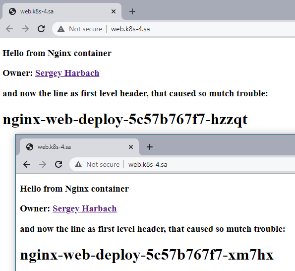
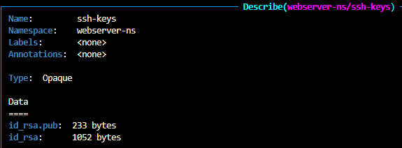
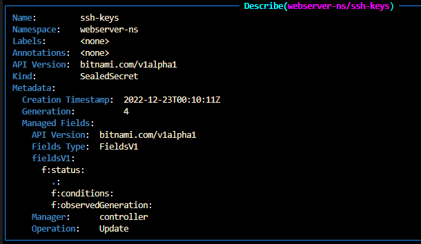
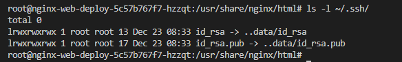

# 12.Kubernetes.Data.Security

## Task 1. Add index.html page as config map

Created config map in same yaml manifest for my app-webserver.

For possible change it - used init Containers.

## Task 2. Displaying hostname of pod as first level header

Used simple sed construction to replace line "hostname" in html data, copied from index.html
configmap to main html nginx catalog and mounted as new index.html file.

## Task 3. Add ssh-keys to the pods used sealsecret object

Install kubeseal to localhost.

Install the sealed secret controller to the cluster.

Generated new pair of keys with __nginxwebs__ name.

Write template yaml and simple bash script to make Manifest for secrets.

### secrets_keys.yaml.tmpl

```yaml
---
apiVersion: v1
kind: Secret
metadata:
     name: ssh-keys
     namespace: webserver-ns
type: Opaque
data:
    id_rsa: PRIVKEYB64
    id_rsa.pub: PUBKEYB64
```

### make_base64_keys.sh

```bash
#!sh
cp secrets_keys.yaml.tmpl secrets_keys.yaml
sed -i "s/PUBKEYB64/`cat ~/.ssh/nginxwebs.pub | base64 -w0 `/g" secrets_keys.yaml
sed -i "s/PRIVKEYB64/`cat ~/.ssh/nginxwebs | base64 -w0 `/g" secrets_keys.yaml
```

Use commands to create sealed secrets, apply it to cluster and restart deployment

```bash
cat secrets_keys.yaml | kubeseal --format yaml > sealed_secrets_keys.yaml
kubsctl apply -f sealed_secrets_keys.yaml
kubsctl apply -f app_webserver.yaml
kubectl rollout restart deployment nginx-web-deploy -n webserver-ns
```

## Manifest app_webserver.yaml

```yaml
---
apiVersion: v1
kind: ConfigMap
metadata:
  namespace: webserver-ns
  name: index-config
data:
  index.html: |
    <!DOCTYPE html><html><body>
    <h3>Hello from Nginx container</h3>
    <h3>Owner: <a href="https://github.com/sgoser">Sergey Harbach</a></h3>
    <h3>and now the line as first level header, that caused so mutch trouble:</h3>
    <h1>__hostname__</h1>
    </body></html>

---
apiVersion: apps/v1
kind: Deployment
metadata:
  namespace: webserver-ns
  name: nginx-web-deploy
  labels:
    app: app-nginx-web
spec:
  replicas: 3
  revisionHistoryLimit: 2
  strategy:
    type: RollingUpdate
    rollingUpdate:
      maxSurge: 1
      maxUnavailable: 1
  selector:
    matchLabels:
      app: app-nginx-web
  template:
    metadata:
      labels:
        app: app-nginx-web
    spec:
      containers:
      - name: nginx-web-container
        image: sgoser/nginx-webserver:v0.5
        imagePullPolicy: IfNotPresent
        ports:
        - containerPort: 22
        - containerPort: 80
        resources:
          requests:
            cpu: 50m
            memory: 50Mi
          limits:
            cpu: 100m
            memory: 100Mi
        volumeMounts:
          - mountPath: /usr/share/nginx/html/
            name: index
          - mountPath: /root/.ssh/
            name: ssh-keys
      initContainers:
      - name: copy
        image: sgoser/nginx-webserver:v0.5
        command: ["bash", "-c"]
        args:
          - cp /tmp/index.html /usr/share/nginx/html/;
            sed -i "s/__hostname__/$HOSTNAME/" index.html;
            echo "initContainer Hostname is > $HOSTNAME";
        volumeMounts:
        - mountPath: /tmp/
          name: config
        - mountPath: /usr/share/nginx/html/
          name: index
      volumes:
      - name: index
        emptyDir: {}
      - name: config
        configMap:
          name: index-config
      - name: ssh-keys
        secret:
          secretName: ssh-keys
          defaultMode: 0400

---
apiVersion: v1
kind: Service
metadata:
  namespace: webserver-ns
  name: nginx-web-service
  labels:
    run: nginx-web-service
spec:
  ports:
  - port: 80
    protocol: TCP
  selector:
    app: app-nginx-web

---
apiVersion: networking.k8s.io/v1
kind: Ingress
metadata:
  namespace: webserver-ns
  name: ingress-sa
  annotations:
    kubernetes.io/ingress.class: nginx
    nginx.ingress.kubernetes.io/server-alias: "web.k8s-4.sa"
spec:
  rules:
    - host: app.k8s-4.sa
      http:
        paths:
          - path: /
            pathType: Prefix
            backend:
              service:
                name: nginx-web-service
                port:
                  number: 80

```

## Validation part

Difference in hostname on webpage.



Secret



Sealed Secret



Mounted to pod


