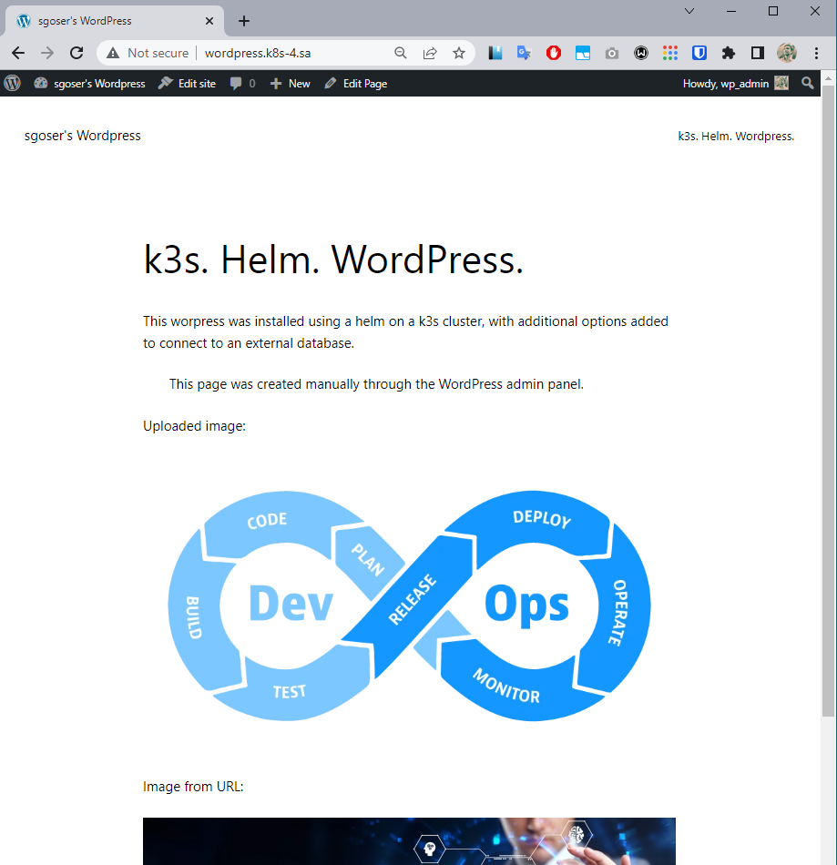

# 13.Kubernetes.Helm

## Preparing to deploy Wordpress using Helm

### Install Helm, add Bitnami repo

```bash
curl -fsSL -o get_helm.sh https://raw.githubusercontent.com/helm/helm/main/scripts/get-helm-3
bash get_helm.sh
helm version
chmod 600 ~/.kube/config
helm repo add bitnami https://charts.bitnami.com/bitnami
helm repo list
```

### Create special namespace, Deploy NFS-provisioner on cluster, Create new StorageClass

nfs-provisioner.yaml

```yaml
---
apiVersion: v1
kind: Namespace
metadata:
  name: nfs-provisioner
  labels:
    name: nfs-provisioner
---
apiVersion: helm.cattle.io/v1
kind: HelmChart
metadata:
  name: nfs
  namespace: nfs-provisioner
spec:
  chart: nfs-subdir-external-provisioner
  repo: https://kubernetes-sigs.github.io/nfs-subdir-external-provisioner
  targetNamespace: nfs-provisioner
  set:
    nfs.server: 192.168.37.105
    nfs.path: /mnt/IT-Academy/nfs-data/sa2-22-22/sharbach/
    storageClass.name: nfs
---
apiVersion: storage.k8s.io/v1
kind: StorageClass
metadata:
  name: nfs-wordpress
provisioner: cluster.local/nfs-nfs-subdir-external-provisioner
parameters:
  onDelete: "retain"
  pathPattern: "/wordpress/"
  ```

### Create database, db user and password using ansible, check

```bash
$ ansible-playbook mariadb.yaml -e "db_name=wordpress db_user=db_wp_admin db_pass=<MY_DB_PASS>"
$ ssh root@192.168.201.4 -o ProxyCommand="ssh -W %h:%p -q jump_sa@178.124.206.53"
$ mysql
> SHOW DATABASES;
+--------------------+
| Database           |
+--------------------+
| first_db           |
| information_schema |
| mysql              |
| performance_schema |
| sys                |
| wordpress          |
+--------------------+
6 rows in set (0.000 sec)
> SELECT User,Host FROM mysql.user;
+-------------+-----------+
| User        | Host      |
+-------------+-----------+
| db_wp_admin | %         |
| first_user  | %         |
| mariadb.sys | localhost |
| mysql       | localhost |
| root        | localhost |
+-------------+-----------+
5 rows in set (0.001 sec)
> exit;
$ logout
```

### Create insgress for wordpress

wordpress_ingress.yaml

```yaml
---
apiVersion: networking.k8s.io/v1
kind: Ingress
metadata:
  name: ingress-wordpress
  namespace: wordpress
  annotations:
    kubernetes.io/ingress.class: nginx
spec:
  rules:
    - host: wordpress.k8s-4.sa
      http:
        paths:
          - path: /
            pathType: Prefix
            backend:
              service:
                name: wordpress
                port:
                  number: 80
```

```bash
kubectl apply -f wordpress_ingress.yaml
```

## Deploy Wordpress using Helm

### Create namespace, Deploy

```bash
kubectl create namespace wordpress
```

```bash
helm install wordpress --namespace wordpress --set \
mariadb.enabled=false,\
externalDatabase.host=192.168.201.4,\
externalDatabase.user=db_wp_admin,\
externalDatabase.password=<MY_DB_PASS>,\
externalDatabase.database=wordpress,\
global.storageClass=nfs-wordpress,\
wordpressUsername=wp_admin,\
wordpressPassword=<MY_WP_PASS>,\
wordpressEmail=sgoser@gmail.com \
bitnami/wordpress
```

## Validation part

Wordpress web page with created unique page



Check that the directory on the nfs server contains my uploaded image to the wordpress page with the correct path.

```bash
ssh root@192.168.203.4  -o ProxyCommand="ssh -W %h:%p -q jump_sa@178.124.206.53"
mount -t nfs -o rw 192.168.37.105:/mnt/IT-Academy/nfs-data/ /mnt/sa-nfs/
ls -la /mnt/sa-nfs/sa2-22-22/sharbach/wordpress/wordpress/wp-content/uploads/2022/12
total 102
drwxr-xr-x 2 1001 root     6 Dec 28 13:17 .
drwxr-xr-x 3 1001 root     3 Dec 28 13:17 ..
-rw-r--r-- 1 1001 root  6370 Dec 28 13:17 DevOpsLoop-150x150.webp
-rw-r--r-- 1 1001 root 11506 Dec 28 13:17 DevOpsLoop-300x169.webp
-rw-r--r-- 1 1001 root 33568 Dec 28 13:17 DevOpsLoop-768x432.webp
-rw-r--r-- 1 1001 root 28386 Dec 28 13:17 DevOpsLoop.webp
```
