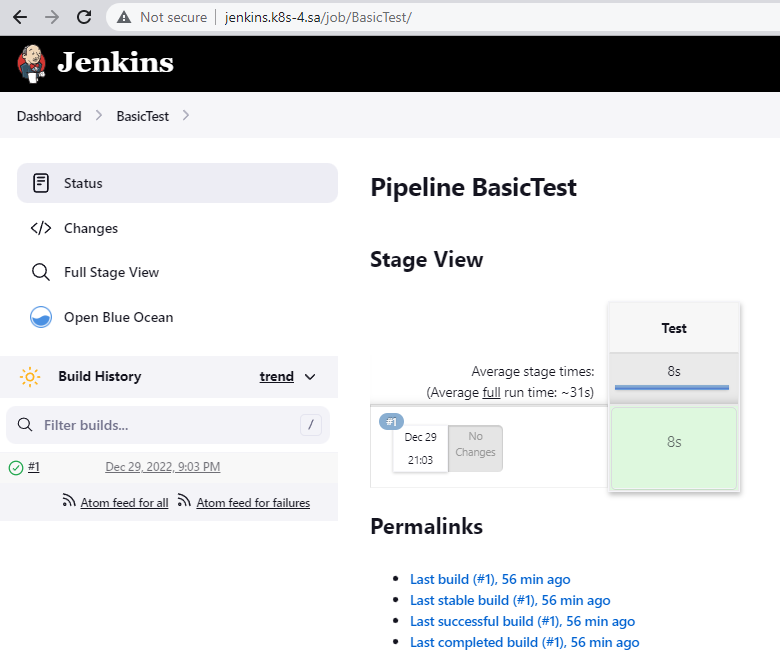

# 14.Kubernetes.AppDeploy

## Preparing

All workshop steps was done.

## Task 1. Create helm package for your Jenkins application

Placed all variables inside the values.yaml file.

Helm template deployment.yaml file and values.yaml file attached with this PR.

## Task 2. Publish helm on your repository

Helm package is published in my GitHub Pages repository.

Link to my repo with helm [>> HERE <<](https://github.com/sgoser/helm)

index.yaml

```yaml
apiVersion: v1
entries:
  jenkins:
  - apiVersion: v2
    appVersion: 1.2.0
    created: "2022-12-29T21:13:01.078326736Z"
    description: A Helm chart for Kubernetes
    digest: a40bdca280be37b48ae06974bcbea0891b2d6e537efafa1c90ab18892bcb7d6c
    maintainers:
    - email: sgoser@gmail.com
      name: Sergey Harbach
    name: jenkins
    type: application
    urls:
    - https://sgoser.github.io/helm/helm-releases/jenkins-0.2.0.tgz
    version: 0.2.0
  - apiVersion: v2
    appVersion: 1.0.0
    created: "2022-12-29T21:13:01.077944498Z"
    description: A Helm chart for Kubernetes
    digest: 385bd8dd4d5c7e9fe89a57b0f0fcf2ccb043dc2db4aac203b35b00e349d88ce2
    maintainers:
    - email: sgoser@gmail.com
      name: Sergey Harbach
    name: jenkins
    type: application
    urls:
    - https://sgoser.github.io/helm/helm-releases/jenkins-0.1.0.tgz
    version: 0.1.0
generated: "2022-12-29T21:13:01.077445375Z"
```

## Additional task: Add as config map your Jenkins tasks to the manifests

Place Jenkins pipline xml inside deployment.yaml as configMap

Used initContainers to properly mount the pipeline in Jenkins.

## Some commands used

```bash
$ kubectl delete -f jenkins.yaml --namespace ci-cd
$ helm install jenkins helm-source/jenkins/
$ helm package helm-source/jenkins/ -d helm-releases/
    Successfully packaged chart and saved it to: helm-releases/jenkins-0.1.0.tgz
$ helm repo index --url https://sgoser.github.io/helm/ .
$ git add --all
$ git commit -m "Helm for Jenkins. v0.1.0"
$ git push --set-upstream origin main 
$ git tag v0.1.0
$ git push origin v0.1.0
$ helm repo add sgoser https://sgoser.github.io/helm/
$ helm repo update
$ helm search repo sgoser -l
    NAME            CHART VERSION   APP VERSION     DESCRIPTION                
    sgoser/jenkins  0.1.0           1.0.0           A Helm chart for Kubernetes
$ helm list
$ helm uninstall jenkins
    release "jenkins" uninstalled
$ helm install jenkins sgoser/jenkins --version 0.1.0
```

After that added new version with Jenkins pipeline inside manifest.

Pushed new version to git, created new version of helm package and deploy it to cluster.

## Check result with my own pipeline inside manifest


