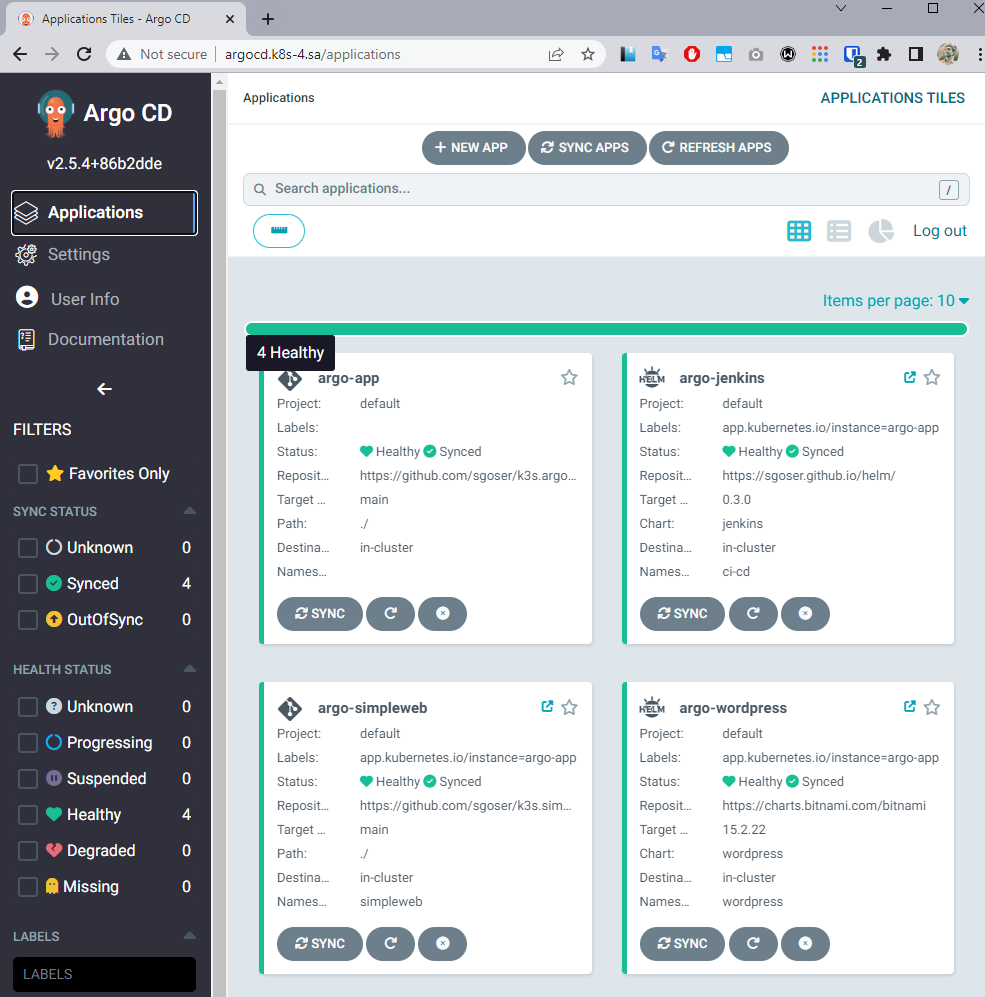

# 15.Kubernetes.CI/CD

## Links

Link to my ArgoCD repo with applications manifests and sealed secrets for them [>> HERE <<](https://github.com/sgoser/k3s.argo)

Helm Repo (contains packages and sourse files for Jenkins deployment) [>> HERE <<](https://github.com/sgoser/helm)

Link to repo for deploy simple nginx web-server (connected to ArgoCD as git) [>> HERE <<](https://github.com/sgoser/k3s.simpleweb)

Wordpress deployed from external helm repo (bitnami/wordpress). All parameters changed in argo-application manifest.

## Screenshots ArgoCD Apps

