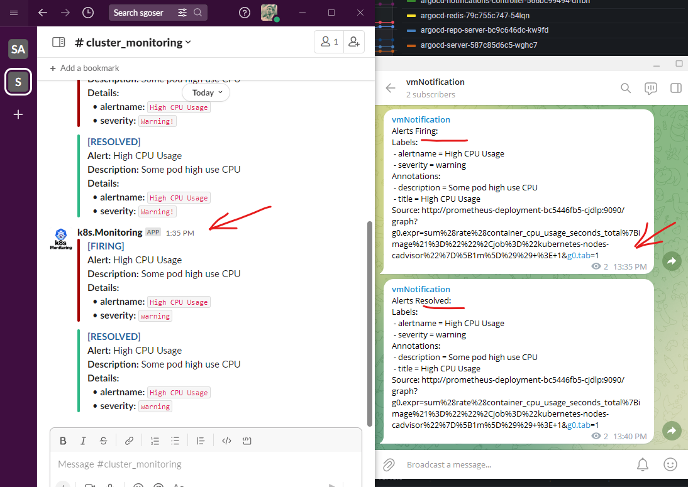
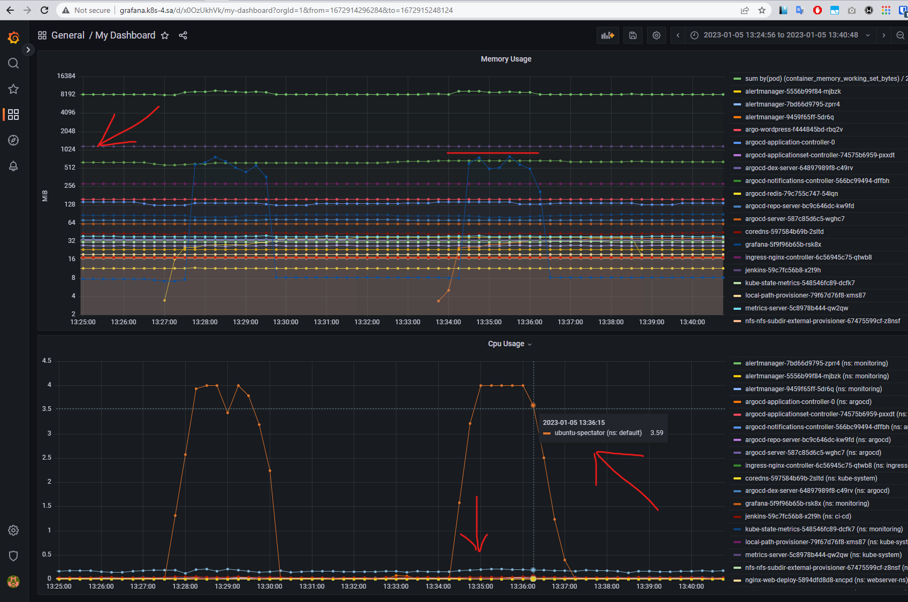

# 16.Monitoring

## Hometask

In your K3s:

- Deploy Prometheus + Alert manager
- Setup slack notification for Alert manager
  - Add alert for CPU overload per pods
  - Emulate payload to test alert
  - Thresholds can be any value as you wish
- Expose Prometheus web UI

- Deploy Grafana
- Add Prometheus as metrics source
- Create dashboard with CPU and memory graphs per pods

Prepare PR with your manifests, config files and screenshots (received notification in slack, Grafana dashboard)

> NOTE: Please remove slack token before create commit

## Preparing

Deployed:

- Prometheus
- Prometheus Alert Manager
- kube-state-metrics
- Grafana

## Info

Manifests of all deployed applications (including configuration files mounted as a configmap inside the manifests) are added as files to this PR.

## Jobs

Previously changed limits for pod ubuntu spectator:

```yaml
    resources:
      requests:
        cpu: 100m
        memory: 128Mi
      limits:
        cpu: 4000m
        memory: 2000Mi
```

To simulate high CPU load, I used the stress utility with the following parameters:

```bash
stress --cpu 4 --io 4 --vm 2 --vm-bytes 512M --timeout 120s
```

Set up sending **FIRING** and **RESOLVED** notifications to Slack and Telegram.

## Screenshots with Results




