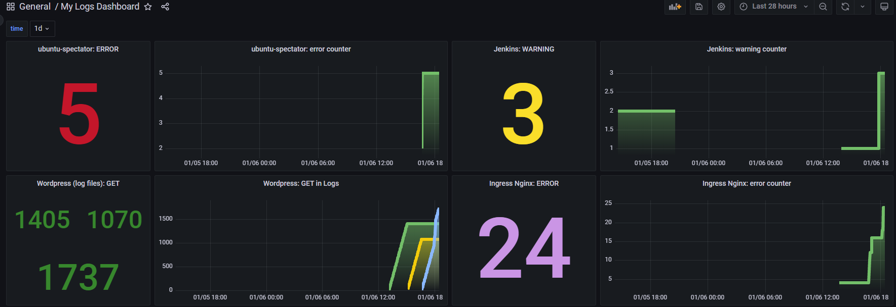

# 16.Logs.Monitoring

## Hometask

- Deploy Grafana loki inside your cluster
- Create Grafana dashboard to monitor counts errors for the following application inside your cluster
  - Jenkins
  - Ingress
  - node-exporter
  - Drupal|Joomla|Wordpress components (these CMS should be deployed from previous home-work)
- Dashboard style can be any of your choice
- Counts of error should be as parameter from list: 5m, 1h, 1d

Create screenshot of your dashboard, and json export add to PR

## Preparing

Deployed:

- Grafana-Loki

## Info

### ubuntu-spectator

To create an ERROR inside my module, I added a small script as ENTRYPOINT to the ubuntu-spectator docker container and redeployed it to the cluster.

Script

```bash
#!/bin/bash

for i in {1..5}
do
   echo "$(date '+%F %T') - Example - $1 ERROR! - in stdout on ubuntu-spectator pod. Runs as script."
   sleep 60
done

sleep 604800
```

This will give me exactly 5 "ERROR" errors in every restart of container or deploy.

### Jenkins

Noone ERROR over all time. Started "Basic Test" build to get come WARNING. Counting WARNING in Grafana.

### Wordpress

Noone ERROR over all time (was redeployed, short live time). Counting Get in Grafana. Showed multi log files.

### Ingress

Shows ERRORS as text inside POST log, where it says that Grafana has such expr. Funny.

### node-exporter

Doesn't have logs.

## Screenshots with Results



