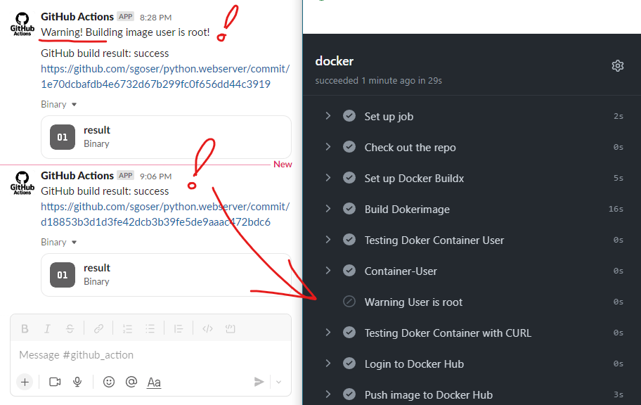
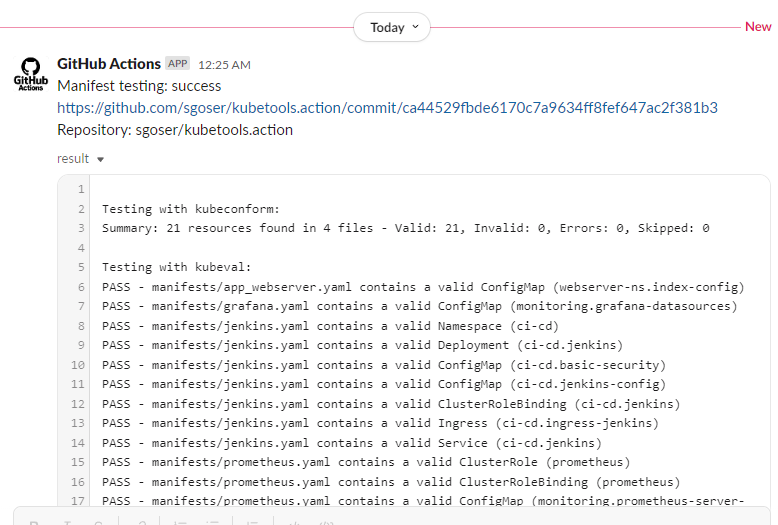

# 18.Testing

## Hometask

### Task 1

Automate Docker images test by github action:

- deploy docker image for test
- test by requesting data from image
- test if image has not root access inside

### Task 2

Create CI for testing Kubernetes manifests using kubeval

- start on push or create PR to manifests repository
- all tools are inside container/pods
- integrate notification about status of validation
- (optional) if you have more then one manifest, you have to implement parallel validation for them

Create PR to with your manifests and short report

## Preparing Task 1 - Docker images test

Made changes to the dockerfile and to the workflow file of the python web server project to check response using curl and check user in container with GitHub Actions.

### Dockerfile

```Dockerfile
FROM python:3.11-slim
LABEL maintainer="sgoser@gmail.com"
RUN useradd -m pywebuser
WORKDIR /home/pywebuser/webserver
COPY index.html ./
COPY server.py ./
EXPOSE 8000
USER pywebuser
ENTRYPOINT ["python", "server.py"]
```

### Workflow to Testing Docker image

```yaml
name: CI. Testing Dockerimage

on:
  release:
    types: [published]
  push:
    tags:
      - "v*.*"
#    branches:
#      - 'main'

env:
    DHUB_USER_NAME: ${{ github.actor }} # used to login dockerhub
    IMAGE_NAME: "python-webserver" # used to set image name in dockerhub
    RESULT_FILE: result.log # used as artifact
    WAITING_TIMER: 5 # used in sleep before checking and collecting stats
    ARTIFACT: result-artifact # name of using acrtifact

jobs:
  docker:
    if: startsWith(github.ref, 'refs/tags/v')
    runs-on: ubuntu-latest
    outputs:
      out-job-status: ${{ job.status }}
    steps:
      - 
        name: Check out the repo
        uses: actions/checkout@v2
      - 
        name: Set up Docker Buildx
        uses: docker/setup-buildx-action@v2
      - 
        name: Build Dokerimage
        run: |
          docker build -f Dockerfile . --network=host -t ${{ env.IMAGE_NAME }}:${{  github.ref_name }}
          docker run -d --rm -p 80:8000 --name ${{ env.IMAGE_NAME }} ${{ env.IMAGE_NAME }}:${{  github.ref_name }}
          echo "Docker list running containers:" >> ${{ env.RESULT_FILE }}
          docker ps >> ${{ env.RESULT_FILE }}
          sleep ${{ env.WAITING_TIMER }}
      - 
        name: Testing Doker Container User
        id: container-user
        run: |
          echo -e "\nContainer User:"  >> ${{ env.RESULT_FILE }}
          docker exec ${{ env.IMAGE_NAME }} whoami >> ${{ env.RESULT_FILE }}
          echo "container-user=$(docker exec ${{ env.IMAGE_NAME }} whoami)" >> $GITHUB_OUTPUT
      -
        name: Container-User
        run: |
          echo "Container user is: ${{ steps.container-user.outputs.container-user }}"
      - 
        name: Warning User is root
        if: ${{ steps.container-user.outputs.container-user == 'root' }}
        uses: slackapi/slack-github-action@v1.23.0
        with:
          channel-id: 'C04EWNX7BT3'
          slack-message: "Warning! Building image user is root!"
        env:
          SLACK_BOT_TOKEN: ${{ secrets.SLACK_TOKEN }}
      - 
        name: Testing Doker Container with CURL
        run: |
          echo -e "\nGet HTTP headers:" >> ${{ env.RESULT_FILE }}
          curl -I http://localhost:80 >> ${{ env.RESULT_FILE }}
          echo "Basic Curl GET request:"  >> ${{ env.RESULT_FILE }}
          curl http://localhost:80 >> ${{ env.RESULT_FILE }}
      - 
        name: Login to Docker Hub
        uses: docker/login-action@v2
        with:
          username: ${{ env.DHUB_USER_NAME }}
          password: ${{ secrets.DOCKERHUB_TOKEN }}
      -
        name: Push image to Docker Hub
        run: |
          docker tag ${{ env.IMAGE_NAME }}:${{  github.ref_name }} ${{ env.DHUB_USER_NAME }}/${{ env.IMAGE_NAME }}:${{  github.ref_name }}
          docker tag ${{ env.IMAGE_NAME }}:${{  github.ref_name }} ${{ env.DHUB_USER_NAME }}/${{ env.IMAGE_NAME }}:latest
          docker push ${{ env.DHUB_USER_NAME }}/${{ env.IMAGE_NAME }}:${{  github.ref_name }}
          docker push ${{ env.DHUB_USER_NAME }}/${{ env.IMAGE_NAME }}:latest
          echo -e "\n\nImage was pushed to DockerHub as:"  >> ${{ env.RESULT_FILE }}
          echo "${{ env.DHUB_USER_NAME }}/${{ env.IMAGE_NAME }}:${{  github.ref_name }}"  >> ${{ env.RESULT_FILE }}
      -
        name: Upload artifacts
        uses: actions/upload-artifact@v3
        with:
          name: ${{ env.ARTIFACT }}
          path: ${{ env.RESULT_FILE }}

  slack:
    needs: [docker]
    if: ${{ always() }}
    runs-on: ubuntu-latest
    steps:
      - 
        name: Post to a Slack channel
        id: slack
        uses: slackapi/slack-github-action@v1.23.0
        with:
          channel-id: 'C04EWNX7BT3'
          slack-message: "GitHub build result: ${{ needs.docker.outputs.out-job-status }}\n${{ github.event.pull_request.html_url || github.event.head_commit.url }}"
        env:
          SLACK_BOT_TOKEN: ${{ secrets.SLACK_TOKEN }}

      - 
        name: Check out the repo
        uses: actions/checkout@v3
      -
        name: Download artifact
        uses: actions/download-artifact@v3
        with:
          name: ${{ env.ARTIFACT }}
      -
        name: Upload to slack artifact file
        uses: adrey/slack-file-upload-action@master
        with:
          token: ${{ secrets.SLACK_TOKEN }}
          path: ${{ env.RESULT_FILE }}
          channel: github_action
```

## Results Task 1

### Slack Notification for Task 1



### Result.log (user is not root)

```log
Docker list running containers:
CONTAINER ID   IMAGE                           COMMAND                  CREATED                  STATUS                  PORTS                                   NAMES
2756c26531d8   python-webserver:v0.5           "python server.py"       Less than a second ago   Up Less than a second   0.0.0.0:80->8000/tcp, :::80->8000/tcp   python-webserver
3e59dc3d9dc9   moby/buildkit:buildx-stable-1   "buildkitd --allow-i…"   12 seconds ago           Up 11 seconds                                                   buildx_buildkit_builder-0b887a8c-60cd-4348-b877-2eb989ae181c0

Container User:
pywebuser

Get HTTP headers:
HTTP/1.0 200 OK
Server: BaseHTTP/0.6 Python/3.11.1
Date: Tue, 10 Jan 2023 18:05:50 GMT
Content-type: text/html

Basic Curl GET request:
<!DOCTYPE html>
<html>
<body>
<h1>Welcome to Docker container.</h1>
<h2>This is personal index.html running in python module http.server.</h2>
<h2>Image was builded and pushed using GitHub Actions.</h2>
</body>
</html>

Image was pushed to DockerHub as:
sgoser/python-webserver:v0.5
```

## Preparing Task 2 - Testing Kubernetes manifests

Created a new repository for testing manifests.

I use a prepared container with installed utilities for testing: *deck15/kubeval-tools:latest*.

Added various manifest files to the repository to test them: app_webserver.yaml, grafana.yaml, jenkins.yaml, prometheus.yaml.

Link to repo: [>> HERE <<](https://github.com/sgoser/kubetools.action)

### Workflow to Testing Manifests

```yaml
name: CI. Manifest Testing

on:
  push:
    branches:
      - 'main'

env:
    RESULT_FILE: result.log # used as artifact
    ARTIFACT: result-artifact # name of using acrtifact
    TESTING_PATH: ./manifests/ # path to testing manifests

jobs:
  kubetools:
    runs-on: ubuntu-latest
    container: deck15/kubeval-tools:latest
    outputs:
      out-job-status: ${{ job.status }}
    steps:
      - 
        name: Check out the repo
        uses: actions/checkout@v3
      - 
        name: Testing Tools Runs -- kubeconform
        continue-on-error: true
        run: |
          echo -e "\nTesting with kubeconform:" >> ${{ env.RESULT_FILE }}
          kubeconform -summary ${{ env.TESTING_PATH }} >> ${{ env.RESULT_FILE }}
      - 
        name: Testing Tools Runs -- kubeval
        continue-on-error: true
        run: |
          echo -e "\nTesting with kubeval:" >> ${{ env.RESULT_FILE }}
          kubeval --schema-location https://raw.githubusercontent.com/yannh/kubernetes-json-schema/master -d ${{ env.TESTING_PATH }} >> ${{ env.RESULT_FILE }}
      - 
        name: Testing Tools Runs -- kube-linter
        continue-on-error: true
        run: |
          echo -e "\nTesting with kube-linter:" >> ${{ env.RESULT_FILE }}
          kube-linter lint ${{ env.TESTING_PATH }} >> ${{ env.RESULT_FILE }}
      -
        name: Upload artifacts
        uses: actions/upload-artifact@v3
        with:
          name: ${{ env.ARTIFACT }}
          path: ${{ env.RESULT_FILE }}

  slack:
    needs: [kubetools]
    if: ${{ always() }}
    runs-on: ubuntu-latest
    steps:
      - 
        name: Post to a Slack channel
        id: slack
        uses: slackapi/slack-github-action@v1.23.0
        with:
          channel-id: 'C04EWNX7BT3'
          slack-message: |
            Manifest testing: ${{ needs.kubetools.outputs.out-job-status }}
            ${{ github.event.pull_request.html_url || github.event.head_commit.url }}
            Repository: ${{ github.repository }}
        env:
          SLACK_BOT_TOKEN: ${{ secrets.SLACK_TOKEN }}

      - 
        name: Check out the repo
        uses: actions/checkout@v3
      -
        name: Download artifact
        uses: actions/download-artifact@v3
        with:
          name: ${{ env.ARTIFACT }}
      -
        name: Upload to slack artifact file
        uses: adrey/slack-file-upload-action@master
        with:
          token: ${{ secrets.SLACK_TOKEN }}
          path: ${{ env.RESULT_FILE }}
          channel: github_action
```

## Results Task 2



### Result.log (Tests and Kube Linter recommendations)

Attached to this PR as Result.log file.
