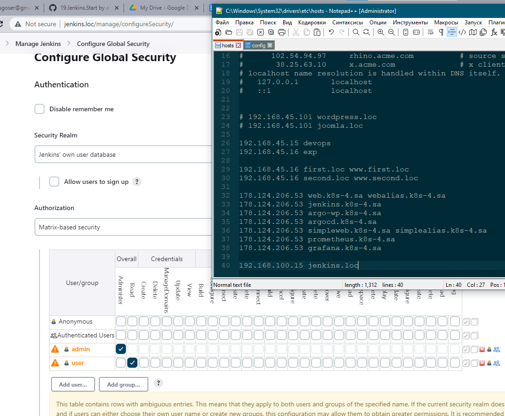
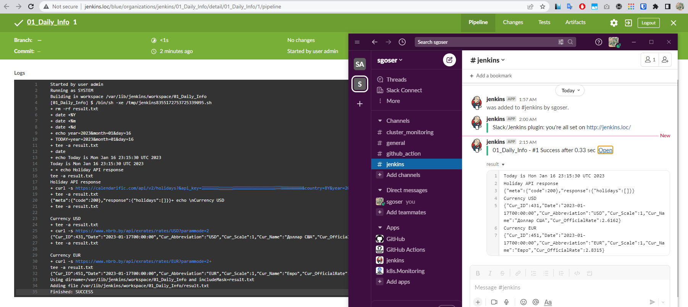

# 19. Jenkins. Start

## Hometask

Deploy Jenkins inside your home environment

- Install Jenkins
- Setup the following
  - install plugins: Ansible, slack notification
  - add restricted user to view Jobs, without any changes inside Jobs and Jenkins settings
- Hide Jenkins behind the web server (Nginx, Apache)

Create Job

- Create job to run each day and collect data and send as artefacts to the slack:
  - Check if today holiday in Belarus: [LINK](https://holidayapi.com/countries/by/2023)
  - Inform about exchange rates for current day (please find any)
  - Can be included in one file-artefacts or simple message in slack

Config files with Jenkins proxing on Web server and xml file for job add PR

## Solution

 all the following steps are done with Vagrantfile

- Install Jenkins
- Install Jenkins plugins
- Create user with only read permissions
- Hide Jenkins behind the Nginx

For Check "if today holiday in Belarus" I use API on [calendarific.com](https://calendarific.com/)

For inform about exchange rates - [nbrb.by](https://www.nbrb.by/apihelp/exrates)

### Vagrantfile

```Vagrantfile
$script = <<-SCRIPT
#####################################
echo "Installation part"
apt update && apt upgrade -yqq && apt install -yqq openjdk-11-jdk wget git curl nginx
wget -q -O - https://pkg.jenkins.io/debian-stable/jenkins.io.key | sudo apt-key add -
echo deb https://pkg.jenkins.io/debian binary/ | sudo tee /etc/apt/sources.list.d/jenkins.list
apt update && apt install -yqq jenkins
service jenkins stop
echo "Installation part -- Done."
#####################################
echo "Jenkins behind the NGINX"
cp -v /vagrant/nginx.config /etc/nginx/sites-available/default
systemctl restart nginx
echo "Jenkins behind the NGINX -- Done."
#####################################
echo "Change Jenkins Auth Strategy. Create Users"
echo 'JAVA_ARGS="-Djenkins.install.runSetupWizard=false"' >> /etc/default/jenkins
rm -rf /var/lib/jenkins/init.groovy.d && mkdir /var/lib/jenkins/init.groovy.d
cp -v /vagrant/01_AuthorizationStrategy.groovy /var/lib/jenkins/init.groovy.d/
cp -v /vagrant/02_addAdmin.groovy /var/lib/jenkins/init.groovy.d/
cp -v /vagrant/03_addUser.groovy /var/lib/jenkins/init.groovy.d/
service jenkins start
sleep 2m
echo "Change Jenkins Auth Strategy. Create Users -- Done."
####################################
echo "Install plugins part"
JENKINSPWD=$(sudo cat /var/lib/jenkins/secrets/initialAdminPassword)
rm -f jenkins_cli.jar.*
wget -q http://localhost:8080/jnlpJars/jenkins-cli.jar
while IFS= read -r line
do
  list=$list' '$line
done < /vagrant/jenkinsPlugins.txt
java -jar ./jenkins-cli.jar -auth admin:$JENKINSPWD -s http://localhost:8080 install-plugin $list
service jenkins restart
sleep 1m
echo "Install plugins part -- Done."
####################################
echo "Generate SSH keys"
runuser -l jenkins -c 'echo -e "\n\n\n" | ssh-keygen -t rsa'
runuser -l jenkins -c 'cat ~/.ssh/id_rsa'
runuser -l jenkins -c 'cat ~/.ssh/id_rsa.pub'
echo "Generate SSH keys -- Done."
####################################
echo "Master ready!"
SCRIPT

Vagrant.configure("2") do |config|
  config.vm.box = "ubuntu/focal64"
  config.vm.define "Jenkins"
  config.vm.network "public_network", ip: "192.168.100.15",  bridge: "Intel(R) Ethernet Connection (7) I219-V" ## TO CHANGE
  config.vm.provider "virtualbox" do |v|
    v.memory = 4096
    v.cpus = 4
  end    
  config.vm.provision "shell", inline: $script
end
```

### 03_addUser.groovy

```groovy
def instance = Jenkins.getInstance()

def hudsonRealm = new HudsonPrivateSecurityRealm(false)
hudsonRealm.createAccount("user", "<<MY_PASS>>")
instance.setSecurityRealm(hudsonRealm)

def strategy = (GlobalMatrixAuthorizationStrategy) instance.getAuthorizationStrategy()
strategy.add(Jenkins.READ, "user")
instance.setAuthorizationStrategy(strategy)

instance.save()
```

### nginx.config

```conf
upstream jenkins {
  server 127.0.0.1:8080; # jenkins ip and port
}

server {
  listen        80; # Listen on port 80 for IPv4 requests
  server_name   jenkins.loc; # your server domain name
  access_log    /var/log/nginx/jenkins.access.log; # logfile

  # pass through headers from Jenkins that Nginx considers invalid
  ignore_invalid_headers off;

  location / {
    proxy_set_header        Host              $host:$server_port;
    proxy_set_header        X-Real-IP         $remote_addr;
    proxy_set_header        X-Forwarded-For   $proxy_add_x_forwarded_for;
    proxy_set_header        X-Forwarded-Proto $scheme;

    # Fix the “It appears that your reverse proxy set up is broken" error.
    proxy_redirect          http://127.0.0.1:8080 http://jenkins.loc;
    proxy_pass              http://127.0.0.1:8080;
  }
}
```

Job config.xml

```xml
<?xml version='1.1' encoding='UTF-8'?>
<project>
  <description></description>
  <keepDependencies>false</keepDependencies>
  <properties>
    <com.sonyericsson.rebuild.RebuildSettings plugin="rebuild@1.34">
      <autoRebuild>false</autoRebuild>
      <rebuildDisabled>false</rebuildDisabled>
    </com.sonyericsson.rebuild.RebuildSettings>
  </properties>
  <scm class="hudson.scm.NullSCM"/>
  <canRoam>true</canRoam>
  <disabled>false</disabled>
  <blockBuildWhenDownstreamBuilding>false</blockBuildWhenDownstreamBuilding>
  <blockBuildWhenUpstreamBuilding>false</blockBuildWhenUpstreamBuilding>
  <triggers>
    <hudson.triggers.TimerTrigger>
      <spec>TZ=Europe/Minsk
H(0-20) 7 * * *</spec>
    </hudson.triggers.TimerTrigger>
  </triggers>
  <concurrentBuild>false</concurrentBuild>
  <builders>
    <hudson.tasks.Shell>
      <command>rm -rf result.txt
TODAY=$(echo year=$(date +%Y)\&amp;month=$(date +%m)\&amp;day=$(date +%d))
echo &quot;Today is $(date)&quot; | tee -a result.txt
echo &quot;Holiday API response&quot; | tee -a result.txt
curl -s &quot;https://calendarific.com/api/v2/holidays?&amp;api_key=<<MY_API_TOKEN>>&amp;country=BY&amp;${TODAY}&quot; | tee -a result.txt
echo &quot;\nCurrency USD&quot;  | tee -a result.txt
curl -s &apos;https://www.nbrb.by/api/exrates/rates/USD?parammode=2&apos;  | tee -a result.txt
echo &quot;\nCurrency EUR&quot;  | tee -a result.txt
curl -s &apos;https://www.nbrb.by/api/exrates/rates/EUR?parammode=2&apos;  | tee -a result.txt</command>
      <configuredLocalRules/>
    </hudson.tasks.Shell>
  </builders>
  <publishers>
    <jenkins.plugins.slack.SlackNotifier plugin="slack@631.v40deea_40323b">
      <baseUrl></baseUrl>
      <teamDomain>sgoser</teamDomain>
      <authToken></authToken>
      <tokenCredentialId>slack_myjenkins_token</tokenCredentialId>
      <botUser>true</botUser>
      <room></room>
      <sendAsText>false</sendAsText>
      <iconEmoji></iconEmoji>
      <username></username>
      <startNotification>false</startNotification>
      <notifySuccess>true</notifySuccess>
      <notifyAborted>false</notifyAborted>
      <notifyNotBuilt>false</notifyNotBuilt>
      <notifyUnstable>false</notifyUnstable>
      <notifyRegression>false</notifyRegression>
      <notifyFailure>false</notifyFailure>
      <notifyEveryFailure>true</notifyEveryFailure>
      <notifyBackToNormal>false</notifyBackToNormal>
      <notifyRepeatedFailure>false</notifyRepeatedFailure>
      <includeTestSummary>false</includeTestSummary>
      <includeFailedTests>false</includeFailedTests>
      <uploadFiles>true</uploadFiles>
      <artifactIncludes>result.txt</artifactIncludes>
      <commitInfoChoice>NONE</commitInfoChoice>
      <includeCustomMessage>false</includeCustomMessage>
      <customMessage></customMessage>
      <customMessageSuccess></customMessageSuccess>
      <customMessageAborted></customMessageAborted>
      <customMessageNotBuilt></customMessageNotBuilt>
      <customMessageUnstable></customMessageUnstable>
      <customMessageFailure></customMessageFailure>
    </jenkins.plugins.slack.SlackNotifier>
  </publishers>
  <buildWrappers/>
```

## Web, Job Result, Notifications




