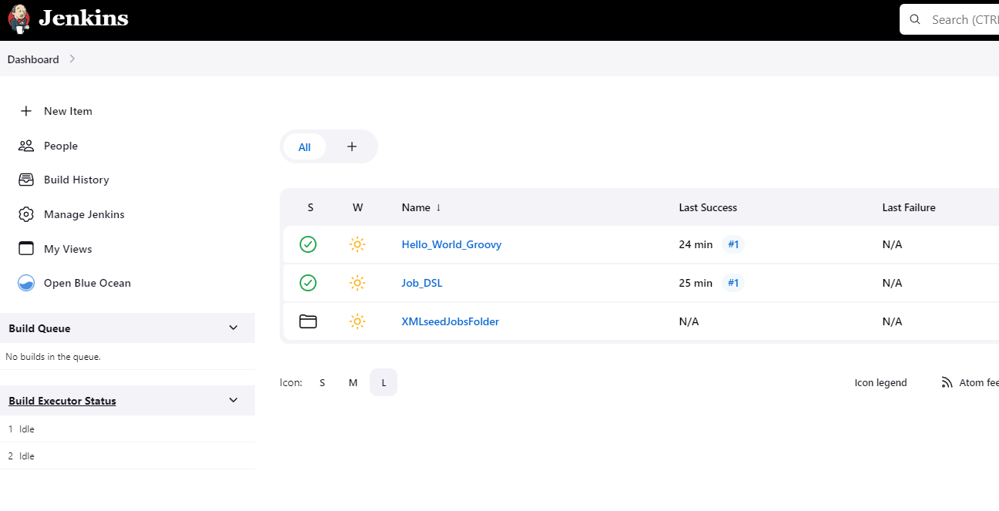
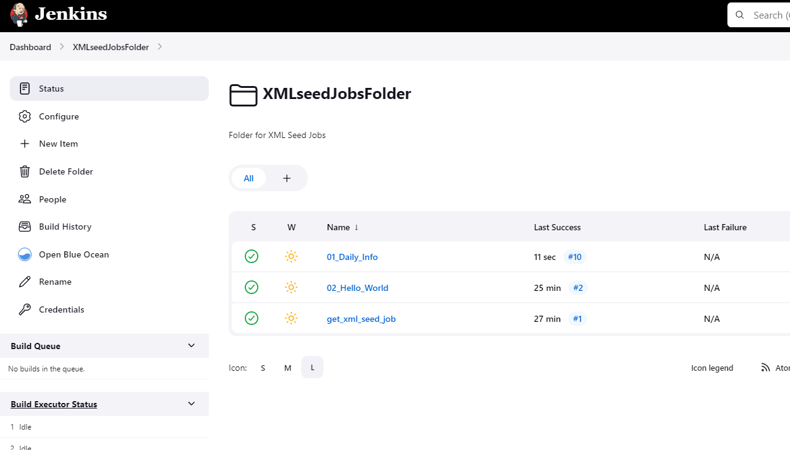

# 20. Jenkins. Routine

## Hometask

- [x] Add to your Jenkins job-dsl plugin
- [x] Create repository with jobs from the Jenkins (simple add there folder jobs from Jenkins server)
- [x] Seed job:
  - [x] Included in Jenkins configuration as code file
  - [x] Task steps:
    - [x] Create folder for jobs
    - [x] Clone repository with jobs folders and xml files into created folder
- [x] Run this job on webui and check result, jobs should be created and are visible

## Jobs

### Create repo with Jenkins XML jobs and scripts

GitHub REPO: [>> THERE <<](https://github.com/sgoser/jenkins.casc.git)

### Changes in my Jenkins CASC

```yaml
  globalJobDslSecurityConfiguration:
    useScriptSecurity: false
```

```yaml
jobs:
  - script: >
        job('Job_DSL') {
            scm {
                git {
                    remote {
                        url 'https://github.com/sgoser/jenkins.casc.git'
                    }
                branch('main')
                }
            }
            steps {
                dsl {
                    external('*.groovy')
                }
            }
        }

```

## Scripts for Jenkins DSL Jobs

### dsl_seed.groovy

```groovy
folder('XMLseedJobsFolder') {
    displayName('XMLseedJobsFolder')
    description('Folder for XML Seed Jobs')
}

job("XMLseedJobsFolder/get_xml_seed_job"){
    scm {
        github('sgoser/jenkins.casc', 'main')
    }
    steps {
        shell("""
            ls -l /var/lib/jenkins/jobs/XMLseedJobsFolder/jobs/
            rm -rf /var/lib/jenkins/jobs/XMLseedJobsFolder/jobs/0*
            pwd
            ls -l
            mv /var/lib/jenkins/workspace/XMLseedJobsFolder/get_xml_seed_job/jobs/* /var/lib/jenkins/jobs/XMLseedJobsFolder/jobs/
            ls -l /var/lib/jenkins/jobs/XMLseedJobsFolder/jobs/
        """)
    }
}
```

### hello_world_seed.groovy

```groovy
job('Hello_World_Groovy') {
  steps {
    shell('echo "Hello World!"')
  }
}
```

## Results

### Jenkins: Folder and DSL Jobs



### Jenkins: Loaded and working XML jobs


