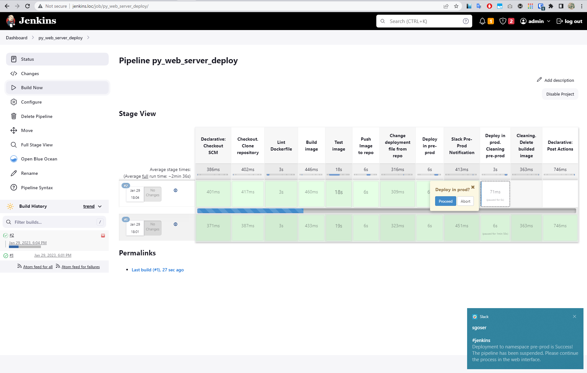
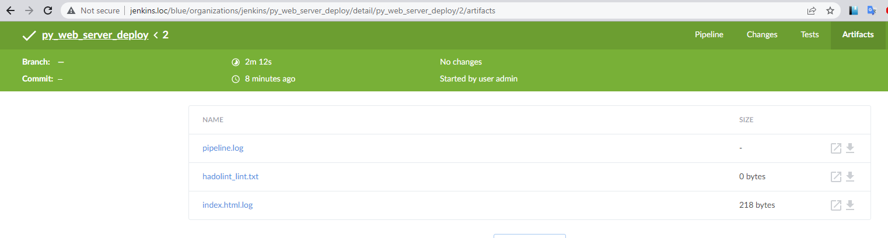
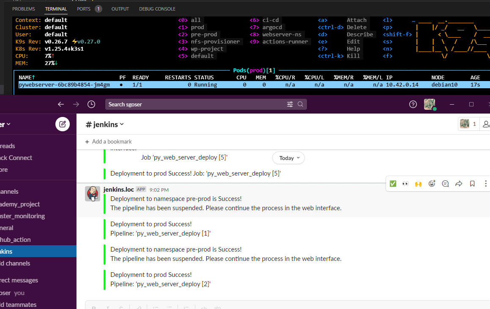

# 21.Jenkins. Docker and Pod

- [x] Repository content:
  - [x] Dockerfiles with application inside
  - [x] Jenkinsfile with pipeline code
- [x] Pipeline steps are:
  - [x] Checkout code
  - [x] Validate Dockerfile [link](https://github.com/hadolint/hadolint)
  - [x] Build image
  - [x] Test image (run and check if webUI of application is accessible)
  - [x] Push image to register (any)
- [x] Deployment in two namespaces in sequence with manual approve from Jenkins WebUI
  - [x] Deploy in namespace pre-prod
  - [x] Test if deployment done
  - [x] Display message about status of deployment and approve interface on Jenkins WebUI
  - [x] deploy in namespace prod
  - [x] cleaning: remove deployment from pre-prod
- [x] Notification

## Links

GitHub REPO: [>> THERE <<](https://github.com/sgoser/python.webserver.git)

DockerHub: [>> THERE <<](https://hub.docker.com/r/sgoser/python-webserver/tags)

## Pipeline

### Jenkinsfile

```groovy
pipeline {
    agent any
    environment {
        imagename = "sgoser/python-webserver"
        registry = "registry.hub.docker.com"
        registryCredential = 'dockerhub'
    }        
    options {
        buildDiscarder(logRotator(numToKeepStr:'5'))
    }
    stages {
        stage('Checkout. Clone repository') {
            steps {
                git url: 'https://github.com/sgoser/python.webserver', branch: 'main'
            }
        }
        stage ("Lint Dockerfile") {
            agent {
                docker {
                    image 'hadolint/hadolint:latest-debian'
                }
            }
            steps {
                sh 'hadolint Dockerfile | tee -a hadolint_lint.txt'
            }
            post {
                always {
                    archiveArtifacts 'hadolint_lint.txt'
                }
            }
        }
        stage("Build image") {
            steps {
                script {
                    my_app = docker.build("$imagename:jv${env.BUILD_ID}", "--network=host -f Dockerfile .")
                }
            }
        }
        stage('Test image') {
            steps {
                sh "docker run -d --rm -p 8000:8000 --name test_image $imagename:jv${env.BUILD_ID}"
                sh "sleep 5"
                sh 'wget http://localhost:8000 -O index.html.log'
                archiveArtifacts artifacts: 'index.html.log'
                sh "docker stop test_image"
            }
        }
        stage('Push Image to repo') {
            steps {
                script {
                    docker.withRegistry( '', registryCredential ) {
                    my_app.push("jv${env.BUILD_ID}")
                    }
                }
            }
        }
        stage('Change deployment file from repo') {
            steps {
                sh "sed -i 's/will_change_in_pipeline/jv${env.BUILD_ID}/' deployment.yaml"
            }
        }
        stage('Deploy in pre-prod') {
            steps {
                withKubeConfig([credentialsId: 'k3skubeconfig']) {
                sh "kubectl get pods -n pre-prod"
                sh "kubectl apply -f deployment.yaml -n pre-prod"
                sleep 5
                sh "kubectl get pods -n pre-prod"
                }
            }
        }
        stage('Slack Pre-Prod Notification') {
            steps {
                slackSend (color: '#00FF00', message: """Deployment to namespace pre-prod is Success!
The pipeline has been suspended. Please continue the process in the web interface.""")
            }
        }
        stage('Deploy in prod. Cleaning pre-prod') {
            steps{
                script {
                    catchError(buildResult: 'SUCCESS', stageResult: 'FAILURE'){
                        def check_depl = true
                        try{
                            input("Deploy in prod?")
                        }
                        catch(err){
                            check_depl = false
                        }
                        try{
                            if(check_depl){
                                withKubeConfig([credentialsId: 'k3skubeconfig']) {
                                sh 'kubectl delete -f deployment.yaml -n pre-prod'
                                sh 'kubectl apply -f deployment.yaml -n prod'
                                sleep 5
                                sh 'kubectl get pods -n prod'
                                }
                            }
                        }
                        catch(Exception err){
                            error "Deployment filed"
                        }
                    }
                }
            }
        }
        stage('Cleaning. Delete builded image') {
            steps {
                script {
                sh "docker rmi $imagename:jv${env.BUILD_ID}"
                }
            }
        }
    }
    post {
        success {
            slackSend (color: '#00FF00', message: "Deployment to prod Success! \nPipeline: '${env.JOB_NAME} [${env.BUILD_NUMBER}]'")
        }
        failure {
            slackSend (color: '#FF0000', message: "Deployment to prod Failed! \nPipeline: '${env.JOB_NAME} [${env.BUILD_NUMBER}]'")
        }
    }
}
```

### deployment.yaml

```yaml
---
apiVersion: v1
kind: Service
metadata:
  name: pywebserver
  labels:
    app: pywebserver
spec:
  ports:
    - port: 8000
  selector:
    app: pywebserver
---
apiVersion: apps/v1
kind: Deployment
metadata:
  name: pywebserver
  labels:
    app: pywebserver
spec:
  selector:
    matchLabels:
      app: pywebserver
  strategy:
    type: Recreate
  template:
    metadata:
      labels:
        app: pywebserver
    spec:
      containers:
        - image: sgoser/python-webserver:will_change_in_pipeline
          name: pywebserver
          env:
          ports:
            - containerPort: 8000
              name: pywebserver
```

## Results






