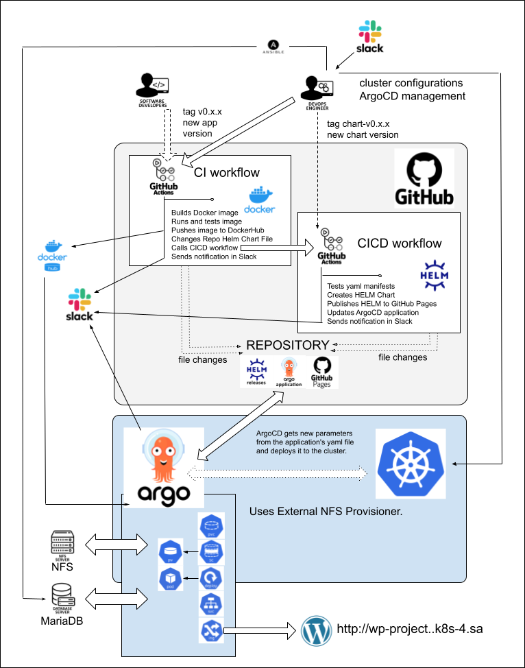

# Project report

**Project's reporter:** Sergey Harbach

**Group number:** md-sa2-22-22

## Description of application for deployment

- **Application:**  wp-project

"wp-project" is a Wordpress application deployment with versioning, changes inside content catalog, themes.

- **Programming language:** PHP

My "wp-project" is the version of the Wordpress application - programming language is PHP.

- **Database:** Mariadb

Mariadb database is used on an external server.

## Pipeline. High Level Design

## Technologies which were used in project

**Orchestration:** Kubernetes

**Automation tools:** Github Actions, ArgoCD, Ansible

**Other used technologies**: HELM, Docker, MariaDB

**SCM:** GitHub

**Notifications:** Slack

## CI/CD description

**General description:**

By pushing tag with application version CI Github Action was triggered.  CI Github Action starts build and test image from Dockerfile, changes files inside HELM chart and autocalls CI/CD Action (by pushing new tag "chart-" to this repo).

CI/CD Action tests yaml manifests, creates and publishes HELM chart to GitHub Pages, changes ArgoCD Application yaml file.

Each versions of application is placed in own catalog on NFS server.

To make changes in deployment and create new chart we can push only "chart-" tag to trigger only CI/CD Action.

**Deployment:**

ArgoCD checks ArgoCD Apllication yaml on GitHub Repo by timer and upgrades all changed manifests to be the new helm chart version.

**Rollback:**

We can use ArgoCD for manual rollback to previous application version. External database contains all user data which will remain.

### Links

[Project Repository](https://github.com/sgoser/academy.project)

[DockerHub Registry](https://hub.docker.com/repository/docker/sgoser/academy-wordpress/tags)

[Git Wordpress Docker library](https://github.com/docker-library/wordpress)
