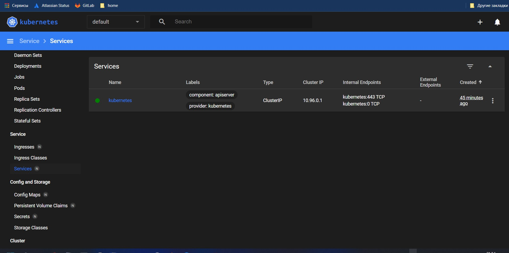

# Kubernetes
## minikube
### $ minikube addons list
```bash
PS C:\Windows\system32> minikube addons list
|-----------------------------|----------|--------------|--------------------------------|
|         ADDON NAME          | PROFILE  |    STATUS    |           MAINTAINER           |
|-----------------------------|----------|--------------|--------------------------------|
| ambassador                  | minikube | disabled     | 3rd party (Ambassador)         |
| auto-pause                  | minikube | disabled     | Google                         |
| csi-hostpath-driver         | minikube | disabled     | Kubernetes                     |
| dashboard                   | minikube | enabled ✅   | Kubernetes                     |
| default-storageclass        | minikube | enabled ✅   | Kubernetes                     |
| efk                         | minikube | disabled     | 3rd party (Elastic)            |
| freshpod                    | minikube | disabled     | Google                         |
| gcp-auth                    | minikube | disabled     | Google                         |
| gvisor                      | minikube | disabled     | Google                         |
| headlamp                    | minikube | disabled     | 3rd party (kinvolk.io)         |
| helm-tiller                 | minikube | disabled     | 3rd party (Helm)               |
| inaccel                     | minikube | disabled     | 3rd party (InAccel             |
|                             |          |              | [info@inaccel.com])            |
| ingress                     | minikube | enabled ✅   | Kubernetes                     |
| ingress-dns                 | minikube | disabled     | Google                         |
| istio                       | minikube | disabled     | 3rd party (Istio)              |
| istio-provisioner           | minikube | disabled     | 3rd party (Istio)              |
| kong                        | minikube | disabled     | 3rd party (Kong HQ)            |
| kubevirt                    | minikube | disabled     | 3rd party (KubeVirt)           |
| logviewer                   | minikube | disabled     | 3rd party (unknown)            |
| metallb                     | minikube | disabled     | 3rd party (MetalLB)            |
| metrics-server              | minikube | disabled     | Kubernetes                     |
| nvidia-driver-installer     | minikube | disabled     | Google                         |
| nvidia-gpu-device-plugin    | minikube | disabled     | 3rd party (Nvidia)             |
| olm                         | minikube | disabled     | 3rd party (Operator Framework) |
| pod-security-policy         | minikube | disabled     | 3rd party (unknown)            |
| portainer                   | minikube | disabled     | 3rd party (Portainer.io)       |
| registry                    | minikube | disabled     | Google                         |
| registry-aliases            | minikube | disabled     | 3rd party (unknown)            |
| registry-creds              | minikube | disabled     | 3rd party (UPMC Enterprises)   |
| storage-provisioner         | minikube | enabled ✅   | Google                         |
| storage-provisioner-gluster | minikube | disabled     | 3rd party (Gluster)            |
| volumesnapshots             | minikube | disabled     | Kubernetes                     |
|-----------------------------|----------|--------------|--------------------------------|
```
## Run minikube with different HW options (RAM/CPU)
### $ minikube start --memory 2048 --cpus 2
```bash
PS C:\Windows\system32> minikube start --memory 2048 --cpus 2
* minikube v1.26.1 на Microsoft Windows 11 Pro 10.0.22000 Build 22000
* Используется драйвер docker на основе существующего профиля
! You cannot change the memory size for an existing minikube cluster. Please first delete the cluster.
* Запускается control plane узел minikube в кластере minikube
* Скачивается базовый образ ...
* Перезагружается существующий docker container для "minikube" ...
* Подготавливается Kubernetes v1.24.3 на Docker 20.10.17 ...
* Компоненты Kubernetes проверяются ...

* After the addon is enabled, please run "minikube tunnel" and your ingress resources would be available at "127.0.0.1"

  - Используется образ gcr.io/k8s-minikube/storage-provisioner:v5

  - Используется образ kubernetesui/dashboard:v2.6.0
  - Используется образ kubernetesui/metrics-scraper:v1.0.8
  - Используется образ k8s.gcr.io/ingress-nginx/controller:v1.2.1
  - Используется образ k8s.gcr.io/ingress-nginx/kube-webhook-certgen:v1.1.1
  - Используется образ k8s.gcr.io/ingress-nginx/kube-webhook-certgen:v1.1.1
* Verifying ingress addon...
* Включенные дополнения: default-storageclass, storage-provisioner, ingress, dashboard
* Готово! kubectl настроен для использования кластера "minikube" и "default" пространства имён по умолчанию
```
## Dashboard screen:
(https://prnt.sc/pOn1bF77hFyV)

## Final stage of deployment k8s
```bash
PLAY RECAP **************************************************************************************************************************************************
localhost                  : ok=3    changed=0    unreachable=0    failed=0    skipped=0    rescued=0    ignored=0   
node1                      : ok=728  changed=20   unreachable=0    failed=0    skipped=1255 rescued=0    ignored=2   
node2                      : ok=480  changed=8    unreachable=0    failed=0    skipped=733  rescued=0    ignored=2   

Sunday 21 August 2022  15:51:45 +0300 (0:00:00.081)       0:22:56.780 ********* 
=============================================================================== 
download : download_file | Validate mirrors --------------------------------------------------------------------------------------------------------- 69.95s
kubernetes-apps/ansible : Kubernetes Apps | Lay Down CoreDNS templates ------------------------------------------------------------------------------ 37.08s
kubernetes-apps/ansible : Kubernetes Apps | Start Resources ----------------------------------------------------------------------------------------- 32.57s
network_plugin/calico : Calico | Create calico manifests -------------------------------------------------------------------------------------------- 21.86s
network_plugin/calico : Start Calico resources ------------------------------------------------------------------------------------------------------ 14.89s
kubernetes/control-plane : Backup old certs and keys ------------------------------------------------------------------------------------------------ 14.28s
kubernetes/preinstall : Ensure kube-bench parameters are set ---------------------------------------------------------------------------------------- 14.17s
container-engine/containerd : download_file | Validate mirrors -------------------------------------------------------------------------------------- 13.36s
kubernetes/preinstall : Create kubernetes directories ----------------------------------------------------------------------------------------------- 12.05s
container-engine/nerdctl : download_file | Validate mirrors ----------------------------------------------------------------------------------------- 11.87s
container-engine/containerd : containerd | Remove orphaned binary ----------------------------------------------------------------------------------- 11.53s
etcd : Check certs | Register ca and etcd admin/member certs on etcd hosts -------------------------------------------------------------------------- 11.44s
etcd : Check certs | Register ca and etcd admin/member certs on etcd hosts -------------------------------------------------------------------------- 11.38s
kubernetes-apps/ansible : Kubernetes Apps | Lay Down nodelocaldns Template -------------------------------------------------------------------------- 11.20s
container-engine/runc : download_file | Validate mirrors -------------------------------------------------------------------------------------------- 11.14s
container-engine/crictl : download_file | Validate mirrors ------------------------------------------------------------------------------------------ 11.04s
download : download_file | Validate mirrors --------------------------------------------------------------------------------------------------------- 10.43s
download : download_file | Validate mirrors --------------------------------------------------------------------------------------------------------- 10.41s
download : download_file | Validate mirrors --------------------------------------------------------------------------------------------------------- 10.38s
download : download_file | Validate mirrors --------------------------------------------------------------------------------------------------------- 10.32s
```
