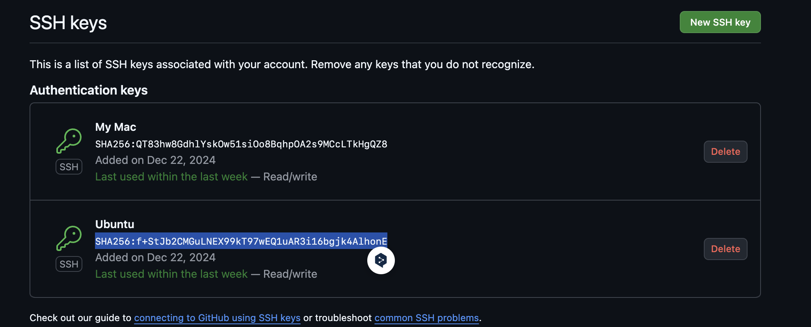
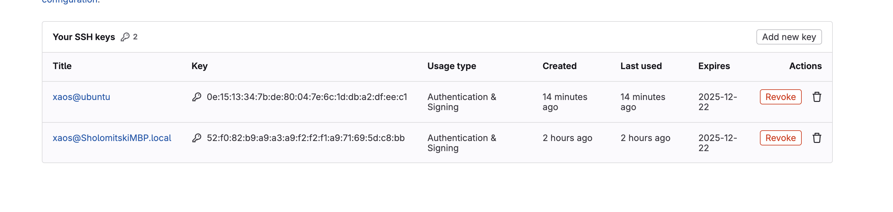
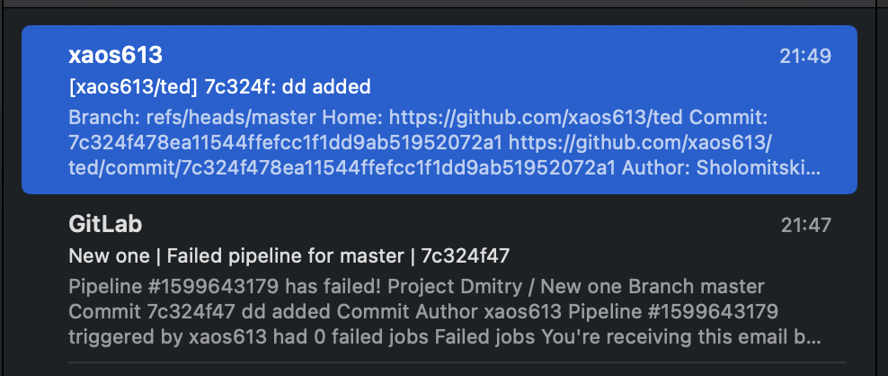
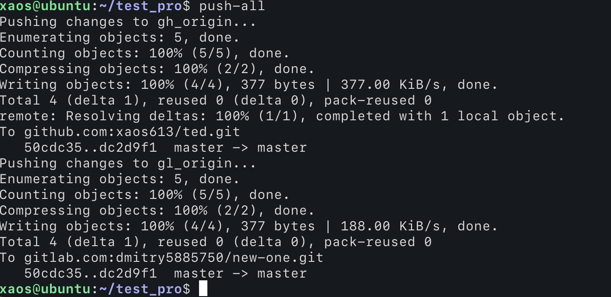

  [link to repo on github](https://github.com/xaos613/ted)
  [link to repo on gitlab](https://gitlab.com/dmitry5885750/new-one)

* SSH github  


* SSH gitlab

 
 * email notifacation

  
  
  
  # Script
```
#!/bin/bash


# Loop through each remote and push the changes
for remote in $(git remote); do
  echo "Pushing changes to $remote..."
  git push "$remote" $(git branch --show-current) || { echo "Failed to push to $remote"; exit 1; }
done
```


## Alias
alias push-all="/home/xaos/test_pro/push-all-remotes.sh"

