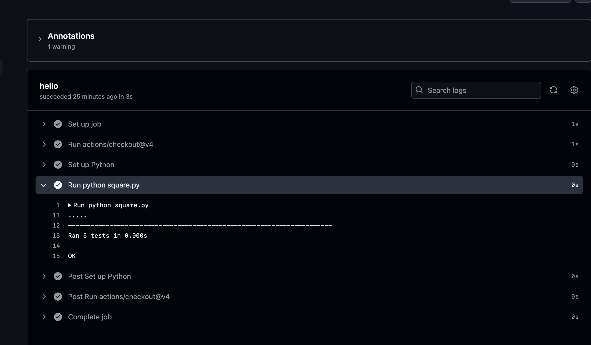

## Homework Assignment 1: Setting up a Basic GitHub Action

Created repository - [GitHub](https://github.com/xaos613/gitaction)

Created python script

``` python 
print("Hello, GitHub Actions!")
```
Created python githab action

``` yaml
name: Check remote host and push report

on:
  push:
    branches:
    - master
jobs:
  hello:
    runs-on: ubuntu-latest
    steps:
    - uses: actions/checkout@v4
    - name: Set up Python
      uses: actions/setup-python@v4
      with:
        python-version: '3.13'

    - run: python hello.py
```
Result on github action

[Link to action](https://github.com/xaos613/gitaction/actions/workflows/hello.yml)


## Homework Assignment 2: Building and Testing with GitHub Actions

Created python script

``` python 
def square_number(number: float) -> float:
    """
    Squares a number (second degree).

    Args:
        number (float): The number to square

    Returns:
        Float: The result of squaring

    Raises:
        TypeError: If the input parameter is not a number
    """
    if not isinstance(number, (int, float)):
        raise TypeError("The input parameter must be a number")
    return number ** 2

import unittest

class TestSquareNumber(unittest.TestCase):
    def test_positive_numbers(self):
        self.assertEqual(square_number(2), 4)
        self.assertEqual(square_number(5), 25)
        self.assertEqual(square_number(10), 100)

    def test_negative_numbers(self):
        self.assertEqual(square_number(-2), 4)
        self.assertEqual(square_number(-5), 25)

    def test_zero(self):
        self.assertEqual(square_number(0), 0)

    def test_float_numbers(self):
        self.assertAlmostEqual(square_number(1.5), 2.25)
        self.assertAlmostEqual(square_number(-1.5), 2.25)

    def test_invalid_types(self):
        # Check that the function calls TypeError for invalid types
        with self.assertRaises(TypeError):
            square_number("2")
        with self.assertRaises(TypeError):
            square_number([1, 2, 3])
        with self.assertRaises(TypeError):
            square_number(None)
        with self.assertRaises(TypeError):
            square_number({"number": 2})

if __name__ == '__main__':
    unittest.main()
```
Created python githab action

``` yaml
name: Test py file
on:
  push:
    branches:
    - master
jobs:
  hello:
    runs-on: ubuntu-latest
    steps:
    - uses: actions/checkout@v4
    - name: Set up Python
      uses: actions/setup-python@v4
      with:
        python-version: '3.10'

    - run: python square.py
```
Result on github action 

[Link to action](https://github.com/xaos613/gitaction/actions/workflows/test_py.yml)




## Homework Assignment 3: Continuous Deployment with GitHub Actions (Optional)


Created static page

``` html 
<!DOCTYPE html>
<html lang="en">
<head>
  <meta charset="UTF-8">
  <meta name="viewport" content="width=device-width, initial-scale=1.0">
  <title>My Static Website</title>
  <link rel="stylesheet" href="style.css">
</head>
<body>
  <h1>Welcome to My Static Website!</h1>
  <p>This website is automatically deployed using GitHub Actions.</p>

</body>
</html>
```

style.css
``` css
body {
  font-family: Arial, sans-serif;
  background-color: #f4f4f4;
  margin: 0;
  padding: 0;
}

h1 {
  text-align: center;
  margin-top: 50px;
}

p {
  text-align: center;
  font-size: 18px;
}
```


``` yaml
# Simple workflow for deploying static content to GitHub Pages
name: Deploy static content to Pages

on:
  # Runs on pushes targeting the default branch
  push:
    branches: ["master"]

  # Allows you to run this workflow manually from the Actions tab
  workflow_dispatch:

# Sets permissions of the GITHUB_TOKEN to allow deployment to GitHub Pages
permissions:
  contents: read
  pages: write
  id-token: write

# Allow only one concurrent deployment, skipping runs queued between the run in-progress and latest queued.
# However, do NOT cancel in-progress runs as we want to allow these production deployments to complete.
concurrency:
  group: "pages"
  cancel-in-progress: false

jobs:
  # Single deploy job since we're just deploying
  deploy:
    environment:
      name: github-pages
      url: ${{ steps.deployment.outputs.page_url }}
    runs-on: ubuntu-latest
    steps:
      - name: Checkout
        uses: actions/checkout@v4
      - name: Setup Pages
        uses: actions/configure-pages@v5
      - name: Upload artifact
        uses: actions/upload-pages-artifact@v3
        with:
          # Upload entire repository
          path: './my-static-website/'
      - name: Deploy to GitHub Pages
        id: deployment
        uses: actions/deploy-pages@v4

```
Link to page - [click](https://xaos613.github.io/gitaction/)


Result on github action


Added string on page
**Added some info**
``` html
<!DOCTYPE html>
<html lang="en">
<head>
  <meta charset="UTF-8">
  <meta name="viewport" content="width=device-width, initial-scale=1.0">
  <title>My Static Website</title>
  <link rel="stylesheet" href="style.css">
</head>
<body>
  <h1>Welcome to My Static Website!</h1>
  <p>This website is automatically deployed using GitHub Actions.</p>
 Added some info

</body>
</html>
```

After commit and push to origin static website deployng