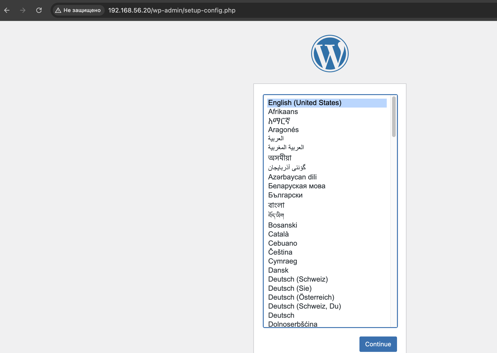
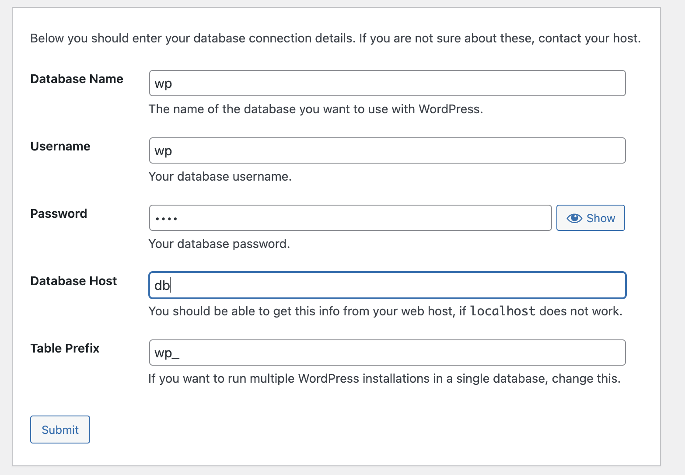
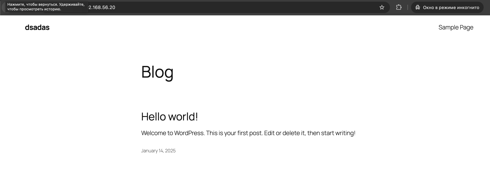
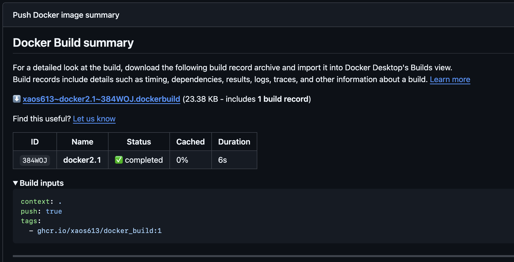
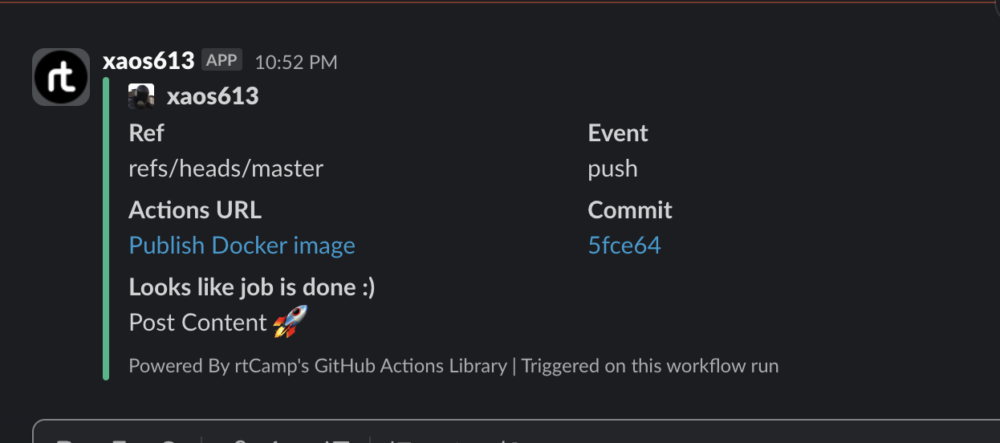

# 08. Docker. Docker compose

## Homework Assignment 1: Docker Compose for Application Stacks

Docker compose file

```yaml
services:
  db:
    image: mariadb:latest
    volumes:
      - db_data:/var/lib/mariadb
    restart: always
    env_file:
      - .env
    environment:
      MYSQL_ROOT_PASSWORD: ${ROOT_PASS}
      MYSQL_DATABASE: ${DB_NAME}
      MYSQL_USER: ${DB_USER}
      MYSQL_PASSWORD: ${DB_PASS}
  wordpress:
    depends_on:
      - db
    image: wordpress:latest
    ports:
      - "80:80"
    volumes:
      - wp-content:/var/www/html/wp-content
    restart: always
volumes:
  db_data:
  wp-content:
```

File .env

```yaml
ROOT_PASS=147
DB_NAME=wp
DB_USER=wp
DB_PASS=1234
```

```bash
docker compose up -d
[+] Running 3/3
 ✔ Network 2docker_default        Created                                                                                                             0.1s
 ✔ Container 2docker-db-1         Started                                                                                                             0.5s
 ✔ Container 2docker-wordpress-1  Started                                                                                                             0.7s

 xaos@ancible20:~/2docker$ docker ps
CONTAINER ID   IMAGE              COMMAND                  CREATED         STATUS         PORTS                               NAMES
b712fdc2403c   wordpress:latest   "docker-entrypoint.s…"   4 seconds ago   Up 3 seconds   0.0.0.0:80->80/tcp, :::80->80/tcp   2docker-wordpress-1
8e418fdeb955   mariadb:latest     "docker-entrypoint.s…"   4 seconds ago   Up 3 seconds   3306/tcp                            2docker-db-1

```







## Homework Assignment 2: Docker build automation (github action)

build application

```python
# app.py
from flask import Flask

app = Flask(__name__)

@app.route('/')
def hello_world():
    return "Hello, Docker World!"

if __name__ == '__main__':
    app.run(host='0.0.0.0', port=5000)
```

create github action

```yaml
name: Publish Docker image

on:
  push

jobs:
  push_to_registries:
    name: Push Docker image
    runs-on: ubuntu-latest
    permissions:
      packages: write
      contents: read
    steps:
      - name: Check out the repo
        uses: actions/checkout@v4

      - name: Log in to the Container registry
        uses: docker/login-action@v3
        with:
          registry: ghcr.io
          username: ${{ github.actor }}
          password: ${{ secrets.DOCKER2 }}

      - name: Build and push Docker images
        uses: docker/build-push-action@v6
        with:
          context: .
          push: true
          tags: ghcr.io/xaos613/docker_build:1
  slack:
    name: Slack Notification
    runs-on: ubuntu-latest
    steps:
    - name: Slack Notification
      uses: rtCamp/action-slack-notify@v2
      env:
       SLACK_CHANNEL: general
       SLACK_COLOR: ${{ job.status }}
       SLACK_ICON: https://github.com/rtCamp.png?size=48
       SLACK_MESSAGE: 'Post Content :rocket:'
       SLACK_TITLE: 'Looks like job is done :)'
       SLACK_USERNAME: xaos613
       SLACK_WEBHOOK: ${{ secrets.SLACK_WEBHOOK }} ### full address with h>
```

Result work on push



slask notification


