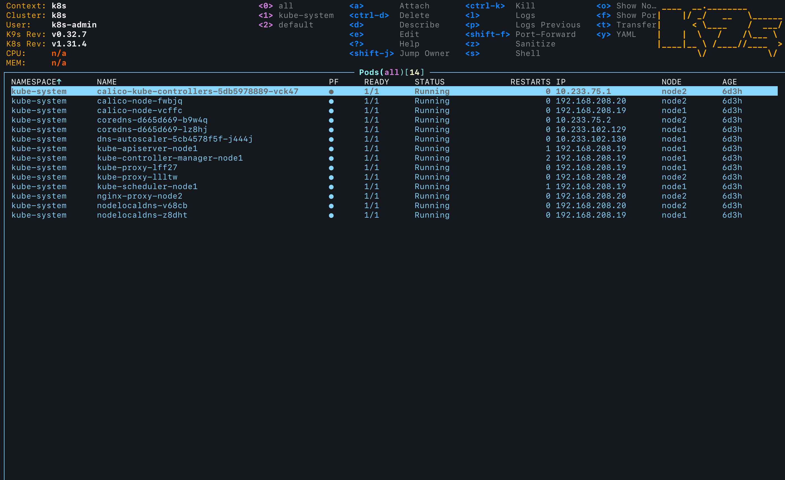
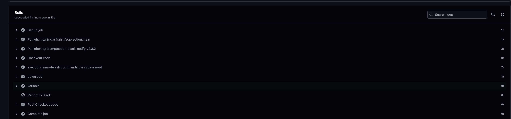
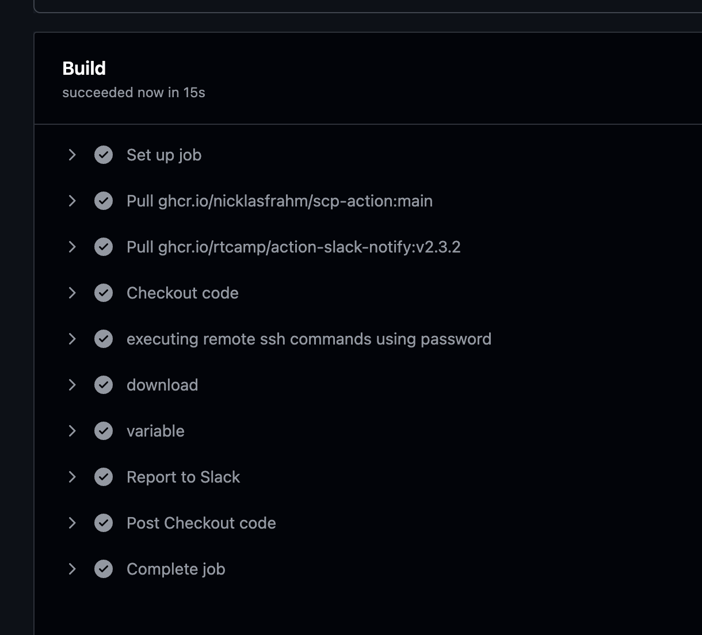
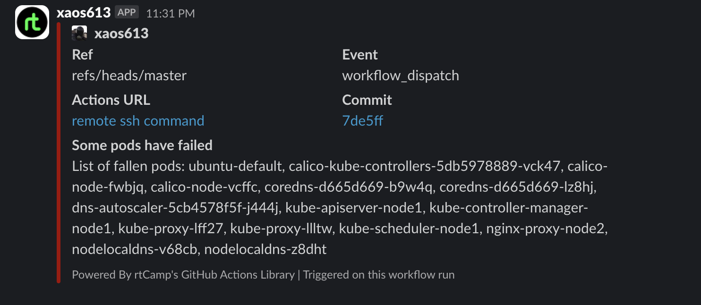

# Homework Assignment 1. K8s Installation

## Install kubectl for local run

```bash
xaos@ancible20:~$ kubectl get pods -A
NAMESPACE     NAME                                       READY   STATUS    RESTARTS   AGE
kube-system   calico-kube-controllers-5db5978889-vck47   1/1     Running   0          6d3h
kube-system   calico-node-fwbjq                          1/1     Running   0          6d3h
kube-system   calico-node-vcffc                          1/1     Running   0          6d3h
kube-system   coredns-d665d669-b9w4q                     1/1     Running   0          6d3h
kube-system   coredns-d665d669-lz8hj                     1/1     Running   0          6d3h
kube-system   dns-autoscaler-5cb4578f5f-j444j            1/1     Running   0          6d3h
kube-system   kube-apiserver-node1                       1/1     Running   1          6d3h
kube-system   kube-controller-manager-node1              1/1     Running   2          6d3h
kube-system   kube-proxy-lff27                           1/1     Running   0          6d3h
kube-system   kube-proxy-llltw                           1/1     Running   0          6d3h
kube-system   kube-scheduler-node1                       1/1     Running   1          6d3h
kube-system   nginx-proxy-node2                          1/1     Running   0          6d3h
kube-system   nodelocaldns-v68cb                         1/1     Running   0          6d3h
kube-system   nodelocaldns-z8dht                         1/1     Running   0          6d3h
```

## Install k9s to maintain cluster



## first pod

```yaml
apiVersion: v1
kind: Pod
metadata:
  name: ubuntu-default
  labels:
    app: ubuntu
spec:
  containers:
  - image: ghcr.io/pluhin/busy-box:latest
    command:
      - "sleep"
      - "604800"
    imagePullPolicy: IfNotPresent
    name: ubuntu-default
```

```bash
xaos@ancible20:~/09.Kuber$ kubectl get pods
NAME             READY   STATUS    RESTARTS   AGE
ubuntu-default   1/1     Running   0          78s
```

## Create GitHub action to check status of pods

```yaml
name: remote ssh command
on:
  schedule:
    - cron: '0 * * * *'
  workflow_dispatch: 


jobs:
  build:
    name: Build
    runs-on: ubuntu-latest
    steps:
      - name: Checkout code
        uses: actions/checkout@v4
      
      
      - name: executing remote ssh commands using password
        uses: appleboy/ssh-action@v1.2.0
        with:
          host: 192.168.208.19
          username: root
          password: QwertY_13
          proxy_host: ${{ secrets.JUMP_IP }}
          proxy_port: ${{ secrets.JUMP_PORT }}
          proxy_username: jump_sa
          proxy_password: ${{ secrets.JUMP_PW }}
          script: kubectl get pods -A| grep -v NAME | awk '{ print $2 }'> failed_pods.txt
      
      - name: download
        uses: nicklasfrahm/scp-action@main
        with:
          direction: download
          insecure_ignore_fingerprint: true
          host: 192.168.208.19
          insecure_password: QwertY_13
          username: root
          proxy_host: ${{ secrets.JUMP_IP }}
          proxy_port: ${{ secrets.JUMP_PORT }}
          proxy_username: jump_sa
          insecure_proxy_password: ${{ secrets.JUMP_PW }}
          insecure_proxy_ignore_fingerprint: true
          source: /root/failed_pods.txt
          target: ./failed_pods.txt

      - name: variable
        id: result
        run: |
          CONTENT=$(cat failed_pods.txt)
          CONTENT="${CONTENT//$'\n'/', '}"
          echo "file_content=$CONTENT" >> $GITHUB_OUTPUT
          echo $GITHUB_OUTPUT
                
      
      - name: Report to Slack
        if: steps.result.outputs.file_content != ''
        uses: rtCamp/action-slack-notify@v2
        env:
          SLACK_CHANNEL: general
          SLACK_COLOR: failure
          SLACK_MESSAGE: "List of fallen pods: ${{ steps.result.outputs.file_content }}"
          SLACK_TITLE: Some pods have failed
          SLACK_USERNAME: xaos613
          SLACK_WEBHOOK: ${{ secrets.SLACK_WEBHOOK }}
```



For checking made mistake in Running




