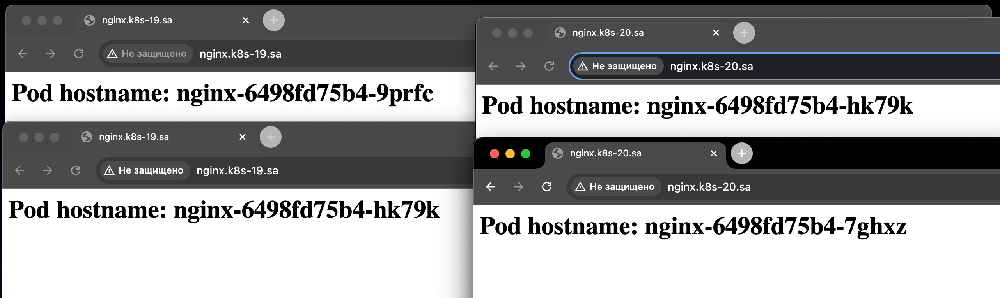
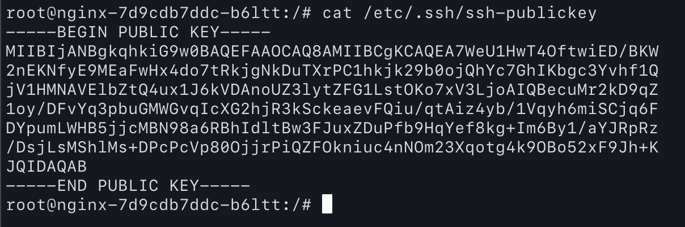

# 12. Kubernetes. Data. Security

## index.html page as config map, which displays hostname of pod as first level header generated inside init container

```yaml
apiVersion: v1
kind: ConfigMap
metadata:
  name: test-config
data:
  test.txt: |
    Hi!!!!!!!!!!!!!!!!!!!!
    I'm here!!!
  test-2.txt: |
    Hi!!!!!!!!!!!!!!!!!!!!!
    I'm here!!!

---

apiVersion: apps/v1
kind: Deployment
metadata:
  name: nginx
  labels:
    app: nginx-server
spec:
  replicas: 4
  strategy:
    type: RollingUpdate
    rollingUpdate:
      maxSurge: 25%
      maxUnavailable: 25%
  selector:
    matchLabels:
      app: nginx-server
  template:
    metadata:
      labels:
        app: nginx-server
    spec:
      initContainers:
        - name: busybox
          image: busybox
          command: ['sh', '-c', 'echo "<html><body><h1>Pod hostname: $(hostname)</h1></body></html>" > /usr/share/nginx/html/index.html']
          volumeMounts:
            - name: index-nginx
              mountPath: /usr/share/nginx/html
      containers:
        - name: nginx
          image: nginx:latest
          ports:
            - containerPort: 80
          resources:
            requests:
              cpu: 50m
              memory: 50Mi
            limits:
              cpu: 100m
              memory: 100Mi
          volumeMounts:
          - name: test-config-mount
            mountPath: /tmp/test.txt
            subPath: test.txt
          - name: index-nginx
            mountPath: /usr/share/nginx/html
          - name: ssh-keys
            mountPath: /etc/.ssh/
      volumes:
      - name: test-config-mount
        configMap:
          name: test-config
      - name: index-nginx
        emptyDir: {}
      - name: ssh-keys
        secret:
          secretName: ssh-secret

---
apiVersion: v1
kind: Service
metadata:
  name: nginx-service
  labels:
    run: nginx-service
spec:
  type: LoadBalancer
  ports:
    - port: 80
      protocol: TCP
      nodePort: 30001
  selector:
    app: nginx-server
---
apiVersion: networking.k8s.io/v1
kind: Ingress
metadata:
  name: ingress-sa
  annotations:
    nginx.ingress.kubernetes.io/server-alias: "nginx.k8s-20.sa"
spec:
  ingressClassName: nginx
  rules:
    - host: nginx.k8s-19.sa
      http:
        paths:
          - path: /
            pathType: Prefix
            backend:
              service:
                name: nginx-service
                port:
                  number: 80
```
### nginx from different pods



## sealed_secret yaml
```yaml
apiVersion: bitnami.com/v1alpha1
kind: SealedSecret
metadata:
  creationTimestamp: null
  name: ssh-secret
  namespace: default
spec:
  encryptedData:
    ssh-privatekey: AgB/qBnM3K2dl9FgoJ+T7mh3QMPt4bMv2lJYmjkGJ/YsD7pwj9H+fb/oLV4kLUmmilBZh3HFV6jKKZyhnbedvEeLE7H6WJWS44KW8EcNugBr+Ib12WotTfLpJpC7j28xfIlCCDSxx6T6jZn+sArNuUCcSl3agxXyql2jGuatAYpNV4gfR6s5UXz+SB0Mb++6PeXs/JazVKoHHERn+JOkmfJtNTmPM7OdGN5aD/dN3wd5Uy0J/sIqKJ4wwnNBO1W0X6d06I8lQFPANFeVS39RewaiUBncaE9iCiygzAA/6PliWHMRT89hd9H/aPOyD/MI+9VtWbgSXLQ2eRYoyamOBnnJzZSOnNSgOgoYYAOm4sxI9d2U1NvoUggTDGkGOxz826F90wZLtsOFRyWvbQb/zGsMgP5cEWEWbQOjFKznNBEnzZ07xO5ionXTCewDsrJ94aMnNLJxVZjKj3MdpOFWaWugbPJd99HbhcNQS8I9Cv9LHi8C5qhMiRdBY6us3WZFOaHRhYZYRJHiT+S4I7t9GRLNyn1sIETt4K7rWHc3eRXMKx0BZMjKi25kb/a3DAzA5hL7pOHFNZirXXacn6bMBsQfGW5W8lOkvDC81K9bXwLRSYARxvj37S+7lbrAwBYnS5SShKQQYDLDsyi7X+/D1Ojp2bMaa9SPgQctgYqrO/+YSkhalWt449e3DIf6i3/5hTdUwm8M/06RWGy+kunUVV+5vLhmnkcoVwI3zcO9vF7MTmY6/xOOz51lXBiV+zVCF3t8I7DXhj3GwNiVP8JGsho9dpXUQsL6E8PRpdK4uekGD4zmgIGGsPEPcgjo677PnqS9OYlw3XWvhH7KKN6MKbG35N3wW0GxwGYuVGJX7Ibo5FMW7cudT8aZ+ReTbUGh0okDHr2GApfFI+xSarkZPcZdLx71DffudCwdI4QjRD5+GLLLjDX22561+4kDvLeqVw4bkOX2Q41VKYH6achBVSFAiiq0PkjuQicAhWbsRn2b9Dj1hjYjv6oWJ9GUwNEoWVXzEUgiE3F0Fgyy6xm0g1mVzMh7axRcDKSOD6+/h5Jm+cRWMwMW5//N2/JFuMHZOWgwUJRU6hgjCYNfcB9+L7dp23f99phK0EDJG81zXEBj1yxlTpvxS7UYiKkY2MPq8jPvpgSNNjFMM3+vnJ7qOxP6H8AnR9kDZMcJ3NDs5YBZL9xympF8kroHrBPUTGCeNjcWUMiPrP2FwdZQ9KIXxyzYBq5x6y3vniXEGcXsQLZKaIYmVGcsojlGeP/kU6yuRbQ3XoSdPaCaaeSstuRL7m1v5xmG/xXBYmeO0WxTSgEuKSQRWn+YI+HHRowPJW3dXfsYnxYOzJIfXojcevXcque7iSZcBsWYbFbTUlY34veUZhmRIcPOxcB9nHeCauOKelrc9WHJY7FEqa5/grQGjQPQ6Ovk5PEFM8QofS/UFrYjKo6RG5fkIjUKftEtIHU1w7vRhlhky1qHIsjNyHS5HpDlaL2BAPbfOvdxVMFmT+BjnRCZVTSucQpvENZYpO5uXvKpa400/m3iCHliHcEucypoKHbkDvN6g0DTe13XoFrsdn2mLOpBJr3SBb3dL0g+x2W8XKjovrVwL3d5VJYlOTa1gphIf2oznjn/r3PWfMkMlJlGaDxPXzoMKL6wnRfJmbbnhZLGSDrLNypixZTM/ElSuVNAOedrcxg88m14sIZ3d/kbVfnQ7H3WYPSXStZB9uavT2MHA++ZVvg6neshx7AFRsNzfUBhqHHKupT6SLSwoFl2mBxRP5q3JG/zd2KFYfZ5lotToYtn1wy2da7kmYWysnCYhriDsEdc+Pqs82cwwg9Aam/AtFkLy5Eonh+PzbdnlHt5xJNv14Yetp2fR0IZQrtKNgCSPirYuAhrI7W5U1Y+09Z8POtl/p098iy2UciaKqLu2YMF79qYVM0Q9ujaBUVu9Rz254FRGKcDTm132chA9J6vyiKs89YQwfbZU/8YpwSV0jEDnkMyoDX2LmtUHRxroUgeXDxdYvhhky4VsdxLCLSDapGPm8pa4ECBgNfyTtIN4pzjqRwhpzQt6L3i7BOinzAtnvw+sfll5L6GTkrk2Q7IoTxOQQBUiYrHTB50wVIGo3/VceWi8AFNF+kL6eL6IfrcypkDqp/ZNXdN2yEghsqrXxnemQPlciWRUS3DJgBi+K7HuBMYF8dJO862iwz1RFs1R7UK/iurhy8ZzCrfDUlFux4oSN+ve4V2uQErRvrLeEXOxUJ1pRuhURf2/KEXfO5+O/DKa+X0F5hOvSGFavwhhY9YofMGDdh/MU0FYgA8cUQiZkjj6wsTqCvTBjg5L1CZVn/Ziv1xwEeLDz0Gw/Y64XgPZHSv5nqBgg1y53xYO/+6Pvw4Y8fQ3GZQeapH0juAHfdua+BhCJgrTmk77nvjYZv0TcRKw33qUkgYVDgTKCmcy8gi9imm0E7zEkd6F4mKMT8c/1Oi77NA32ZU23l2vNd449X9TmSEq4g18e2Fca1+AYmn3jKBq8LRUeBqFBPs0eCPux9YB6+7ZQubUmxa6XavMB8oK/e5CZk1iEzBZRPQrsgXAmFP1/qokEfTjrT6g8xiq6jRIg2aMEGq2pF/5gNNUEhVeHAuks22I7dGnlZz0vBEgG1kAa8HUDSIWKYUqFWIhSTbCVEBkUd4CUSz4Z/BST9GCF4joVuXZ7Da5jokJjM3v3kMgKNHMldBinAHJfSrnXiHKn1z9ZRNstjMUuEDqpSdxfxAKP4MPntFaX5W1DxE1yIGhGNTkkl4nfSZ+RY8YNhTpVlIgvTPg069iiuU4+X3n/1HzeaIWY7uuIGVrEMfvpWRgEx7lZnAimZ3VHhAy+++TnnlLaIUtCS35FxlvUMT646uC5DO7Ox6zWhwhccv2+GS9r5E7T9Nly+fGPbmuYBTu1b/PL7rnVkR0U4We9LbQHdMMbNDVWULCuhh9AepRXbXLcpxQpp1IRaYXVU=
    ssh-publickey: AgCcMFbbLKITKu/D8zvKmWe7mzN+Os7Dp5jw+WCLk+mTW0NNclm+5V9i/DKnnfzSLhS8YX3qLbmZ5ldBxKABaHGXMTsRvO9fdLxRAk+J/+djpDUd0q3zvEwwAzyv45ggmvB8X6YbOmEjKPcj67fvz7R+qG32DTwtRqKsox6prXhsls7QfYu3MNFOe8RoYJFTGs4UrXYUX3yP9fumavzuGw7P1omd/TGDr/sruRtCa7k7eCdvfjJhSRnEDsotRJXtlqBE0J2MNQsc1Yw6KLGfGUXEeN+75cpS2e9YnYw3vQjPfuMmBbc2jBJsy3LdXqb+YH7KRwkAr56Aba1pO12bOH/OvA+CPMb6ODH95MQ709FO3VvHugsGsCe2E+mClarDIgMrdW6oWZww7dHCevm/N8auwKhw6b+IQPaoioRs7MHkQjyFYF0uAvBWktZFT+ybbO0/0R1ZBKs6OHw7Mro0UcLRg2C9Agz8KCGyVIQIEM8Az/WPOcTgO46YcE+UztqxU40FS6LGDD6hPQ0WjT5p4eKuqjAq593RV/LjqRzXVEGnayD4dpczXg5yzzWWz1nfWgDQWI5RC/njfoSNGTWeche8DE5DOtjkBHPCsjtbder8lIoPtUXhrZsIAk3SxXDeNgmt5gOdxPLLNvhPeXfGXvI4Yrwt6EuiJ5pz0Joi3DmoH5d+ENwUDU2QO29k1PhpQZnlRENUG690VGJ6OuUcoBvInXlg8VdA/20iPiRV6IFHK6LRQEXC0uMjlcMID38HIYIC1v1JJ0ZfzkrU87ifLArPzqrPSC2SE3txbr7r+jKiT16Y4Wspy34EhPQEw53nkc9NGusC1XiN9Dl4pjSAeDZlnY4phbuuCTbpvatGEFaL0X/gdupvU6rwEGWj3nE0sSIO5nj3Gd6uOlFKB9XiALGNl8psS66eJywYE7VTvel9zAzp09+dTfHcmpRdg6QXV5VrGIaZa0+DvL/FlMpmsC94A5Qwx79sIEZQ002727aYjx0zcH3n86E8pWA3m3ypbfU/VRZC1rGv+LvGTtOyglKZ/WflHDlgv7uceQrem4RxO5hZ7/canS6x8eshTwD7KjBsW4ji7E5leCWZDM9vzwnAGDQIvJebwChVrOpxkC1Nq78T2rCgaQuFMv532DRR232uEIFjmfahkeV4VdTMYORjASQVUufdilNWXtPD0UpRJfkidEUm3U12wmjN/wt9M1KFioAL0JF4FRQeXN0zgteOJnPyzII60qnjt+V7q2y5I8d0EJ4AkHb2hhtRdnRUXmFgMJeZbAgjfRXEf2a1xn9QfcSd
  template:
    metadata:
      creationTimestamp: null
      name: ssh-secret
      namespace: default
    type: Opaque
```

### Public key on pod


