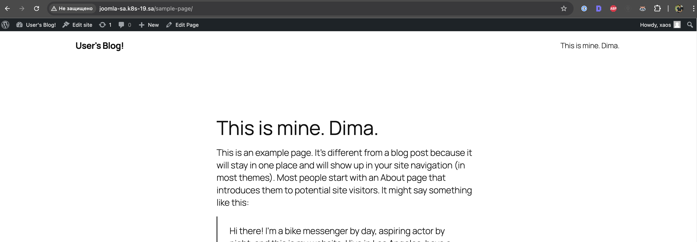
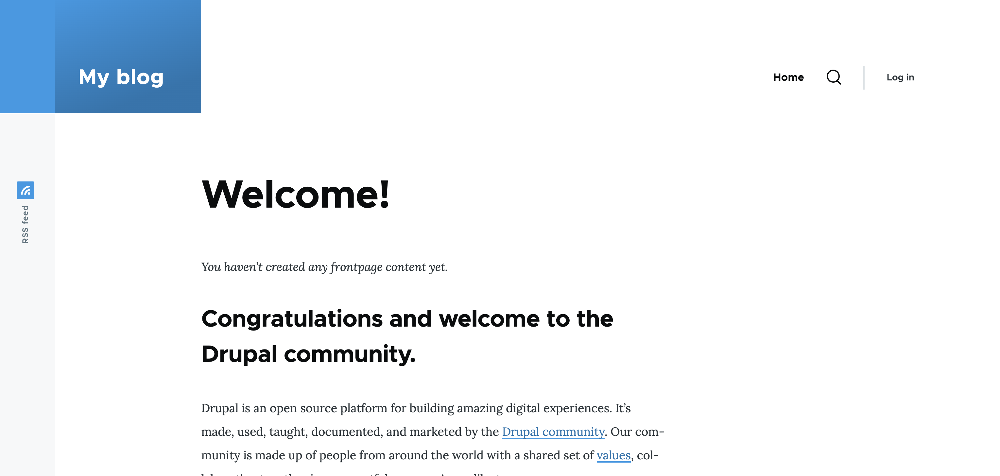
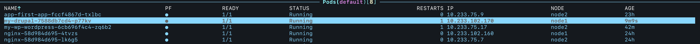

# Homework Assignment 1. Application deployment by Helm
## Wordpress

### Ansible code for connect to external database

```bash
ansible-playbook -i inv.yaml mysql.yaml -u root -e "user_db=wp_user pass_db=password name_db=wp_base"
```
### Helm command

```bash
helm install my-wp --set global.defaultStorageClass=nfs-client,wordpressUsername=xaos,wordpressPassword=password123,mariadb.enabled=false,externalDatabase.host=192.168.201.10,externalDatabase.database=wp_base,externalDatabase.user=wp_user,externalDatabase.password=password,ingress.enabled=true,ingress.hostname=joomla-sa.k8s-19.sa,ingress.ingressClassName=nginx  oci://registry-1.docker.io/bitnamicharts/wordpress
```
### Result



## Drupal

### Ansible code for connect to external database

```bash
ansible-playbook -i inv.yaml mysql.yaml -u root -e "user_db=drupal_user pass_db=password name_db=drupal_base"
```
### Helm command

```bash
helm install my-drupal --set persistence.storageClass=nfs-client,persistence.accessMode=ReadWriteMany,mariadb.enabled=false,externalDatabase.host=192.168.201.10,externalDatabase.database=drupal_base,externalDatabase.user=drupal_user,externalDatabase.password=password,ingress.enabled=true,ingress.hostname=drupal.k8s-19.sa,ingress.ingressClassName=nginx,drupalUsername=xaos,drupalPassword=password123 oci://registry-1.docker.io/bitnamicharts/drupal
```
### Result




K9s 

