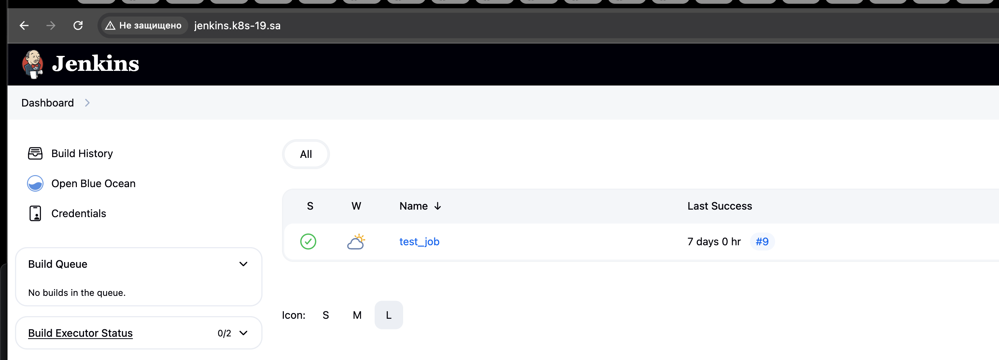

# Transform Jenkins deployment to Helm

**links:** 
- [Helm Chart Index(https://github.com/xaos613/helm-rep/blob/master/index.yaml)
- [Helm Repository](https://github.com/xaos613/helm-rep)

## Homework Assignment 1. Transform Jenkins deployment to Helm

**1. Creating a Helm Chart for Jenkins**
```shell
$ helm create jenkins
```
**2. Packaging the Helm Chart after Template and Values Configuration**
```shell
$ helm package jenkins
```
**3. Installing the Helm Chart**
```shell
$ helm install jenkins . --namespace ci-cd --dry-run
$ helm install jenkins . --namespace ci-cd --create-namespace
```
**4. Adding a Helm Repository**
```shell
  746  helm package jenkins-helm jenkins/
  747  helm package jenkins jenkins-helm
  748  git status
  749  git add .
  750  git status  751  git commit -m "helm v2"
  752  git push
  753  helm repo index --url https://github.com/xaos613/helm-rep --merge index.yaml .
  754  cat index.yaml
  755  git add .
  756  git commit -m "index updated"
  757  git push
  758  helm repo update
  759  helm search repo

xaos@home-ubuntu:~/14.k8s$ helm search repo
NAME                  	CHART VERSION	APP VERSION	DESCRIPTION
helm-repo/first-app   	0.2.0        	1.16.0     	A Helm chart for Kubernetes
helm-repo/jenkins-helm	0.1.0        	1.0.0      	A Helm chart for Jenkins CI/CD
```


**Checking jenkins in the browser**
