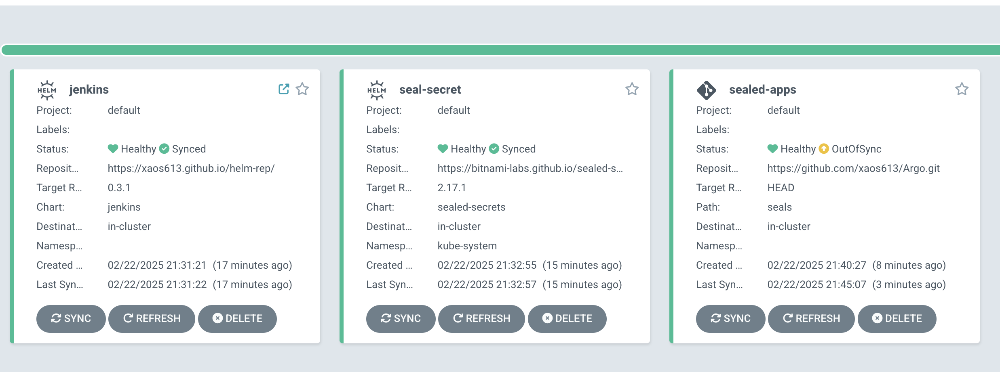
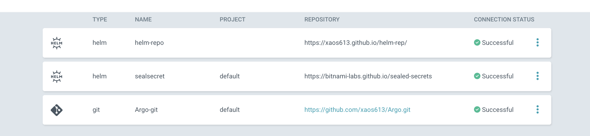

# 14.k8s.Argocd

create namespace argocd

```bash 
kubectl create namespace argocd
wget https://raw.githubusercontent.com/argoproj/argo-cd/stable/manifests/install.yaml -O install.yaml
```


added to install.yaml

```yaml
spec:
  type: NodePort
  ports:
    - name: http
      nodePort: 30007
```
and

```yaml
- args:
  - /usr/local/bin/argocd-server
  - --insecure
```

Get password to argocd

```bash
kubectl -n argocd get secret argocd-initial-admin-secret -o jsonpath="{.data.password}" | base64 -d
```

repo for argocd - link (https://github.com/xaos613/Argo)

Copy app files to the yaml-files and push it to the argocd git repository

``` bash
kubectl get application sealsecret -n argocd -o yaml > sealsecret.yaml
kubectl get application sealsecret -n argocd -o yaml > sealsecret.yaml
```

Create git-app

```bash
kubectl get secret repo-3475683247 -n argocd -o yaml > argo-repo.yaml
kubectl get secret repo-3947450314 -n argocd -o yaml > seal-repo.yaml
```

convert to sealsecret

```bash 
kubeseal < argo-repo.yaml -o yaml > seal-argo-repo.yaml
kubeseal < helm-repo.yaml -o yaml > seal-helm-repo.yaml 
kubeseal < seal-repo.yaml -o yaml > seal-seal-repo.yaml
```

commit to github and installation new versions of app



