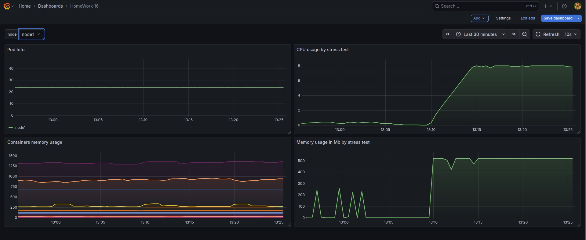
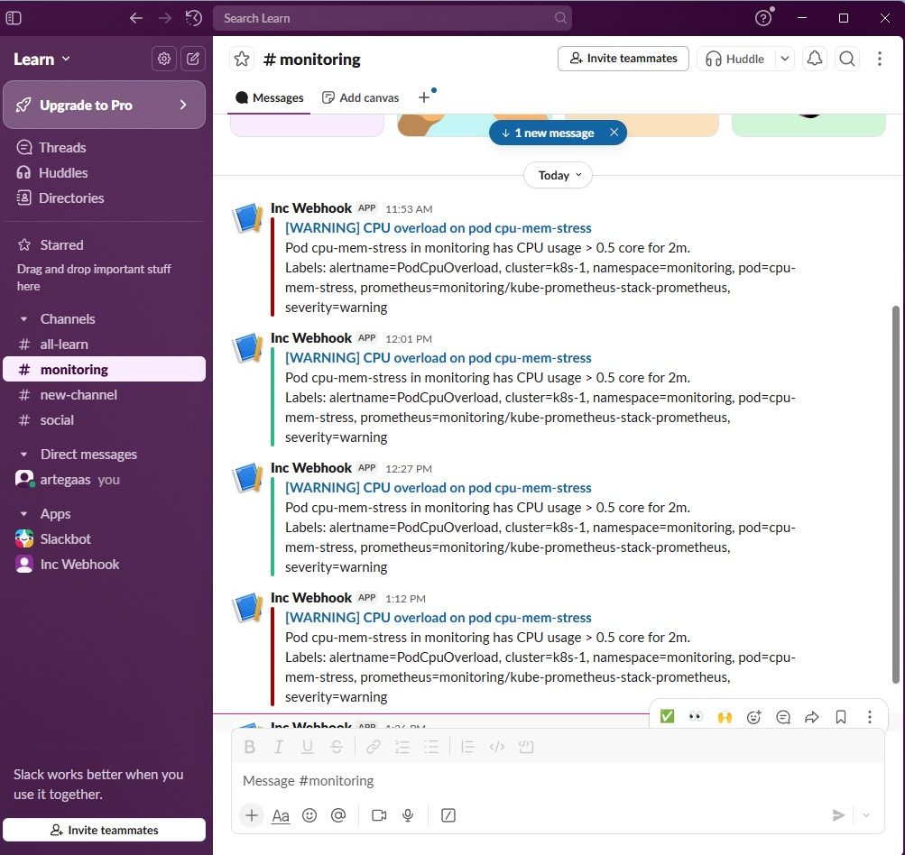

# 16. Technical and service monitoring

## Install

```
helm upgrade kube-prometheus-stack prometheus-community/kube-prometheus-stack -n monitoring -f values.yaml
kubectl apply -f ingress.yaml
kubectl apply -f alert-rules-cpu.yaml
kubectl apply -f cpu-mem-stress.yaml
```

## Screenshot



