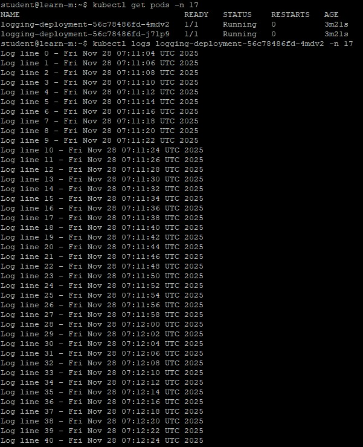
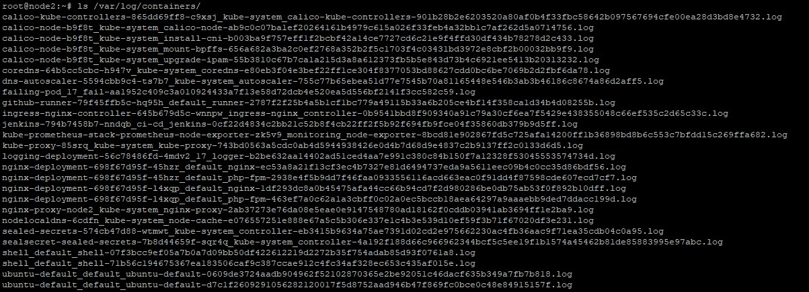
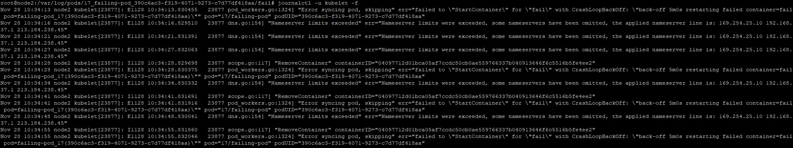

# 17. Log monitoring

## Homework Assignment 1:

### 1. Create a Pod/Deployment with logs

__Input__

```
kubectl creaate namespace 17
kubectl config set-context --current --namespace=17
sudo nano logging-deploy.yaml
kubectl apply -f logging-deploy.yaml -n 17
```
### 2. Collect logs with kubectl

__Input__
```
kubectl get pods -n 17
```
__Output__
```
NAME                                  READY   STATUS    RESTARTS   AGE
logging-deployment-56c78486fd-4mdv2   1/1     Running   0          34s
logging-deployment-56c78486fd-j7lp9   1/1     Running   0          34s
```

__Input__
```
kubectl logs logging-deployment-56c78486fd-4mdv2 -n 17
```
__Output__
```
Log line 0 - Fri Nov 28 07:11:04 UTC 2025
Log line 1 - Fri Nov 28 07:11:06 UTC 2025
Log line 2 - Fri Nov 28 07:11:08 UTC 2025
Log line 3 - Fri Nov 28 07:11:10 UTC 2025
Log line 4 - Fri Nov 28 07:11:12 UTC 2025
Log line 5 - Fri Nov 28 07:11:14 UTC 2025
Log line 6 - Fri Nov 28 07:11:16 UTC 2025
Log line 7 - Fri Nov 28 07:11:18 UTC 2025
Log line 8 - Fri Nov 28 07:11:20 UTC 2025
Log line 9 - Fri Nov 28 07:11:22 UTC 2025
Log line 10 - Fri Nov 28 07:11:24 UTC 2025
```
__Input__
```
 kubectl logs -l app=logger --all-containers=true
```
__Output__
```
Log line 52 - Fri Nov 28 07:12:48 UTC 2025
Log line 53 - Fri Nov 28 07:12:50 UTC 2025
Log line 54 - Fri Nov 28 07:12:52 UTC 2025
Log line 55 - Fri Nov 28 07:12:54 UTC 2025
Log line 56 - Fri Nov 28 07:12:56 UTC 2025
Log line 57 - Fri Nov 28 07:12:58 UTC 2025
Log line 58 - Fri Nov 28 07:13:00 UTC 2025
Log line 59 - Fri Nov 28 07:13:02 UTC 2025
Log line 60 - Fri Nov 28 07:13:04 UTC 2025
Log line 61 - Fri Nov 28 07:13:06 UTC 2025
Log line 52 - Fri Nov 28 07:12:48 UTC 2025
Log line 53 - Fri Nov 28 07:12:50 UTC 2025
Log line 54 - Fri Nov 28 07:12:52 UTC 2025
Log line 55 - Fri Nov 28 07:12:54 UTC 2025
Log line 56 - Fri Nov 28 07:12:56 UTC 2025
Log line 57 - Fri Nov 28 07:12:58 UTC 2025
Log line 58 - Fri Nov 28 07:13:00 UTC 2025
Log line 59 - Fri Nov 28 07:13:02 UTC 2025
Log line 60 - Fri Nov 28 07:13:04 UTC 2025
Log line 61 - Fri Nov 28 07:13:06 UTC 2025
```

3. Investigate logs from a failing Pod

__Input__
```
sudo nano falling-deploy.yaml
kubectl apply -f falling-deploy.yaml -n 17
kubectl get pod failing-pod
```
__Output__
```
NAME          READY   STATUS             RESTARTS      AGE
failing-pod   0/1     CrashLoopBackOff   2 (15s ago)   33s
```
__Input__
```
 kubectl logs failing-pod --previous
```
__Output__
```
This pod will fail
```
## 4. Explore node-level logs

__Input__
```
ssh root@192.168.208.2
ls /var/log/containers/
```
__Output__
```
calico-kube-controllers-865dd69ff8-c9xsj_kube-system_calico-kube-controllers-901b28b2e6203520a80af0b4f33fbc58642b097567694cfe00ea28d3bd8e4732.log
calico-node-b9f8t_kube-system_calico-node-ab9c0c07ba1ef20264161b4979c615a026f33feb4a32bb1c7af262d5a0714756.log
calico-node-b9f8t_kube-system_install-cni-b003ba9f757eff1f2bcbf42a14ce7727cd6c21e9f4ffd30df434b78278d2c433.log
calico-node-b9f8t_kube-system_mount-bpffs-656a682a3ba2c0ef2768a352b2f5c1703f4c03431bd3972e8cbf2b00032bb9f9.log
calico-node-b9f8t_kube-system_upgrade-ipam-55b3810c67b7ca1a215d3a8a612373fb5b5e843d73b4c6921ee5413b20313232.log
coredns-64b5cc5cbc-h947v_kube-system_coredns-e80eb3f04e3bef22ff1ce304f8377053bd88627cdd0bc6be7069b2d2fbf6da78.log
dns-autoscaler-5594cbb9c4-ts7b7_kube-system_autoscaler-755c77b65ebea51d77e7545b70a81165448e546b3ab3b46186c8674a86d2aff5.log
failing-pod_17_fail-aa1952c409c3a010924433a7f13e58d72dcb4e520ea5d556bf2141f3cc582c59.log
github-runner-79f45ffb5c-hq95h_default_runner-2787f2f25b4a5b1cf1bc779a49115b33a6b205ce4bf14f358ca1d34b4d08255b.log
ingress-nginx-controller-645b679d5c-wnnpw_ingress-nginx_controller-0b9541bbd8f909340a91c79a30cf6ea7f5429e438355048c66ef535c2d65c33c.log
jenkins-794b7458b7-nndqb_ci-cd_jenkins-0cf22d4834c2bb21c52b8f4cb22ff2f5b92f694fb9fce04f35860db379b9d5ff.log
kube-prometheus-stack-prometheus-node-exporter-zk5v9_monitoring_node-exporter-8bcd81e902867fd5c725afa14200ff1b36898bd8b6c553c7bfdd15c269ffa682.log
kube-proxy-85srq_kube-system_kube-proxy-743bd0563a5cdc0ab4d5944938426e0d4b7d68d9e4837c2b9137ff2c0133d6d5.log
logging-deployment-56c78486fd-4mdv2_17_logger-b2be632aa14402ad51ced4aa7e991c380c84b150f7a12328f53045553574734d.log
nginx-deployment-698f67d95f-45hzr_default_nginx-ec53a8a21f13cf3ec4b7327e81d6494737eda9a5611eec09b4c0cc35d86bdf56.log
nginx-deployment-698f67d95f-45hzr_default_php-fpm-2938e4f5b9dd7f46faa0933556116acd663eac0f91dd4f87598cde607ecd7cf7.log
nginx-deployment-698f67d95f-l4xqp_default_nginx-1df293dc8a0b45475afa44cc66b94cd7f2d980286be0db75ab53f0f892b10dff.log
nginx-deployment-698f67d95f-l4xqp_default_php-fpm-463ef7a0c62a1a3cbff0c02a0ec5bccb18aea64297a9aaaebb9ded7ddacc199d.log
nginx-proxy-node2_kube-system_nginx-proxy-2ab37273e76da08e5eae0e9147548780ad18162f0cddb03941ab3694ff1e2ba9.log
nodelocaldns-6cdfn_kube-system_node-cache-e076557251e888e67a5c5b306e337e1c4b3e539d10ef59f3b71f67020df3e231.log
sealed-secrets-574cb47d88-wtmwt_kube-system_controller-eb3415b9634a75ae7391d02cd2e975662230ac4fb36aac9f71ea35cdb04c0a95.log
sealsecret-sealed-secrets-7b8d44659f-sqr4q_kube-system_controller-4a192f188d66c966962344bcf5c5ee19f1b1574a45462b81de85883995e97abc.log
shell_default_shell-07f3bcc9ef05a7b0a7d09bb50df422612219d2272b35f754adab85d93f0761a8.log
shell_default_shell-71b56c194675367ea183506caf9c387ccae912c4fc34af328ec653c435af015e.log
ubuntu-default_default_ubuntu-default-0609de3724aadb904962f52102870365e2be92051c46dacf635b349a7fb7b818.log
ubuntu-default_default_ubuntu-default-d7c1f2609291056282120017f5d8752aad946b47f869fc0bce0c48e84915157f.log
```
__Input__
 ```
 tail -f /var/log/containers/logging-deployment-56c78486fd-4mdv2_17_logger-b2be632aa14402ad51ced4aa7e991c380c84b150f7a12328f53045553574734d.log
```
__Output__
```
2025-11-28T10:28:30.232691496+03:00 stdout F Log line 522 - Fri Nov 28 07:28:30 UTC 2025
2025-11-28T10:28:32.23642673+03:00 stdout F Log line 523 - Fri Nov 28 07:28:32 UTC 2025
2025-11-28T10:28:34.240053241+03:00 stdout F Log line 524 - Fri Nov 28 07:28:34 UTC 2025
2025-11-28T10:28:36.244379179+03:00 stdout F Log line 525 - Fri Nov 28 07:28:36 UTC 2025
2025-11-28T10:28:38.247967534+03:00 stdout F Log line 526 - Fri Nov 28 07:28:38 UTC 2025
2025-11-28T10:28:40.251373023+03:00 stdout F Log line 527 - Fri Nov 28 07:28:40 UTC 2025
2025-11-28T10:28:42.255242456+03:00 stdout F Log line 528 - Fri Nov 28 07:28:42 UTC 2025
2025-11-28T10:28:44.25884123+03:00 stdout F Log line 529 - Fri Nov 28 07:28:44 UTC 2025
2025-11-28T10:28:46.262372463+03:00 stdout F Log line 530 - Fri Nov 28 07:28:46 UTC 2025
2025-11-28T10:28:48.266355557+03:00 stdout F Log line 531 - Fri Nov 28 07:28:48 UTC 2025
2025-11-28T10:28:50.269733493+03:00 stdout F Log line 532 - Fri Nov 28 07:28:50 UTC 2025
2025-11-28T10:28:52.273394642+03:00 stdout F Log line 533 - Fri Nov 28 07:28:52 UTC 2025
2025-11-28T10:28:54.276881502+03:00 stdout F Log line 534 - Fri Nov 28 07:28:54 UTC 2025
2025-11-28T10:28:56.280651555+03:00 stdout F Log line 535 - Fri Nov 28 07:28:56 UTC 2025
2025-11-28T10:28:58.284415692+03:00 stdout F Log line 536 - Fri Nov 28 07:28:58 UTC 2025
2025-11-28T10:29:00.287602871+03:00 stdout F Log line 537 - Fri Nov 28 07:29:00 UTC 2025
2025-11-28T10:29:02.291133134+03:00 stdout F Log line 538 - Fri Nov 28 07:29:02 UTC 2025
2025-11-28T10:29:04.294442471+03:00 stdout F Log line 539 - Fri Nov 28 07:29:04 UTC 2025
2025-11-28T10:29:06.297926239+03:00 stdout F Log line 540 - Fri Nov 28 07:29:06 UTC 2025
```
__Input__
```
ls /var/log/pods/
```
__Output__
```
17_failing-pod_390c6ac3-f319-4071-9273-c7d77df418aa                                           kube-system_calico-node-b9f8t_451c4fc4-335f-4b29-afcd-2c1d0d0d0f9f
17_logging-deployment-56c78486fd-4mdv2_8e05071b-8aad-4bde-b775-981c5ef7cf9f                   kube-system_coredns-64b5cc5cbc-h947v_937cd470-ff12-416f-9ffe-620a46c52b9d
ci-cd_jenkins-794b7458b7-nndqb_e0b508e9-b469-4d5b-8977-bfa1c44c5298                           kube-system_dns-autoscaler-5594cbb9c4-ts7b7_a07161ca-9f95-49cc-9d28-5464912f9ee9
default_github-runner-79f45ffb5c-hq95h_d78b9fd3-998d-4872-a704-442b2b6f1f05                   kube-system_kube-proxy-85srq_52d4dfb4-9843-4b9d-a214-4fc1c6e7af23
default_nginx-deployment-698f67d95f-45hzr_ec5be4be-2431-4451-b474-bb4d4d7cdf4a                kube-system_nginx-proxy-node2_d7626aa7eed70d4e4bf9de8d91a690d1
default_nginx-deployment-698f67d95f-l4xqp_70849fa2-133b-4cde-ac2e-0b452066cd61                kube-system_nodelocaldns-6cdfn_baabb5f9-a34b-4aa8-9c05-124043ea8262
default_shell_8884f30c-7c66-47de-b565-5e0d1926973c                                            kube-system_sealed-secrets-574cb47d88-wtmwt_55556ef9-ef7f-4036-87a1-92c52fd3be67
default_ubuntu-default_d4b025d9-f88a-4f4d-a603-1f588c28d2f7                                   kube-system_sealsecret-sealed-secrets-7b8d44659f-sqr4q_9c4f50c1-e177-4960-9bda-69658dbee9d8
ingress-nginx_ingress-nginx-controller-645b679d5c-wnnpw_0475b289-94ac-44e8-9936-fd9b1cffae90  monitoring_kube-prometheus-stack-prometheus-node-exporter-zk5v9_7d51566c-913a-4946-9e34-e44fa002d934
kube-system_calico-kube-controllers-865dd69ff8-c9xsj_7c613b42-ef8e-4624-83ab-71a450aad01b
```

__Input__
```
tree /var/log/pods/17_failing-pod_390c6ac3-f319-4071-9273-c7d77df418aa/
cat 7.log
```
__Output__
```
/var/log/pods/17_failing-pod_390c6ac3-f319-4071-9273-c7d77df418aa/
└── fail
    └── 7.log


2025-11-28T10:31:25.798804388+03:00 stdout F This pod will fail
```
__Input__
```
journalctl -u kubelet -f
```
__Output__
```
Nov 28 10:34:13 node2 kubelet[23877]: E1128 10:34:13.830455   23877 pod_workers.go:1324] "Error syncing pod, skipping" err="failed to \"StartContainer\" for \"fail\" with CrashLoopBackOff: \"back-off 5m0s restarting failed container=fail pod=failing-pod_17(390c6ac3-f319-4071-9273-c7d77df418aa)\"" pod="17/failing-pod" podUID="390c6ac3-f319-4071-9273-c7d77df418aa"
Nov 28 10:34:16 node2 kubelet[23877]: E1128 10:34:16.829510   23877 dns.go:154] "Nameserver limits exceeded" err="Nameserver limits were exceeded, some nameservers have been omitted, the applied nameserver line is: 169.254.25.10 192.168.37.1 213.184.238.45"
Nov 28 10:34:21 node2 kubelet[23877]: E1128 10:34:21.831391   23877 dns.go:154] "Nameserver limits exceeded" err="Nameserver limits were exceeded, some nameservers have been omitted, the applied nameserver line is: 169.254.25.10 192.168.37.1 213.184.238.45"
Nov 28 10:34:27 node2 kubelet[23877]: E1128 10:34:27.832063   23877 dns.go:154] "Nameserver limits exceeded" err="Nameserver limits were exceeded, some nameservers have been omitted, the applied nameserver line is: 169.254.25.10 192.168.37.1 213.184.238.45"
Nov 28 10:34:28 node2 kubelet[23877]: I1128 10:34:28.829698   23877 scope.go:117] "RemoveContainer" containerID="04097712d01bca05af7ccdc50cb0ae559766337b040913646f6c5516b5fe4ee2"
Nov 28 10:34:28 node2 kubelet[23877]: E1128 10:34:28.830375   23877 pod_workers.go:1324] "Error syncing pod, skipping" err="failed to \"StartContainer\" for \"fail\" with CrashLoopBackOff: \"back-off 5m0s restarting failed container=fail pod=failing-pod_17(390c6ac3-f319-4071-9273-c7d77df418aa)\"" pod="17/failing-pod" podUID="390c6ac3-f319-4071-9273-c7d77df418aa"
Nov 28 10:34:34 node2 kubelet[23877]: E1128 10:34:34.830332   23877 dns.go:154] "Nameserver limits exceeded" err="Nameserver limits were exceeded, some nameservers have been omitted, the applied nameserver line is: 169.254.25.10 192.168.37.1 213.184.238.45"
Nov 28 10:34:41 node2 kubelet[23877]: I1128 10:34:41.831691   23877 scope.go:117] "RemoveContainer" containerID="04097712d01bca05af7ccdc50cb0ae559766337b040913646f6c5516b5fe4ee2"
Nov 28 10:34:41 node2 kubelet[23877]: E1128 10:34:41.831916   23877 pod_workers.go:1324] "Error syncing pod, skipping" err="failed to \"StartContainer\" for \"fail\" with CrashLoopBackOff: \"back-off 5m0s restarting failed container=fail pod=failing-pod_17(390c6ac3-f319-4071-9273-c7d77df418aa)\"" pod="17/failing-pod" podUID="390c6ac3-f319-4071-9273-c7d77df418aa"
Nov 28 10:34:48 node2 kubelet[23877]: E1128 10:34:48.830041   23877 dns.go:154] "Nameserver limits exceeded" err="Nameserver limits were exceeded, some nameservers have been omitted, the applied nameserver line is: 169.254.25.10 192.168.37.1 213.184.238.45"
Nov 28 10:34:55 node2 kubelet[23877]: I1128 10:34:55.831860   23877 scope.go:117] "RemoveContainer" containerID="04097712d01bca05af7ccdc50cb0ae559766337b040913646f6c5516b5fe4ee2"
Nov 28 10:34:55 node2 kubelet[23877]: E1128 10:34:55.832046   23877 pod_workers.go:1324] "Error syncing pod, skipping" err="failed to \"StartContainer\" for \"fail\" with CrashLoopBackOff: \"back-off 5m0s restarting failed container=fail pod=failing-pod_17(390c6ac3-f319-4071-9273-c7d77df418aa)\"" pod="17/failing-pod" podUID="390c6ac3-f319-4071-9273-c7d77df418aa"
```

## Screenshot







