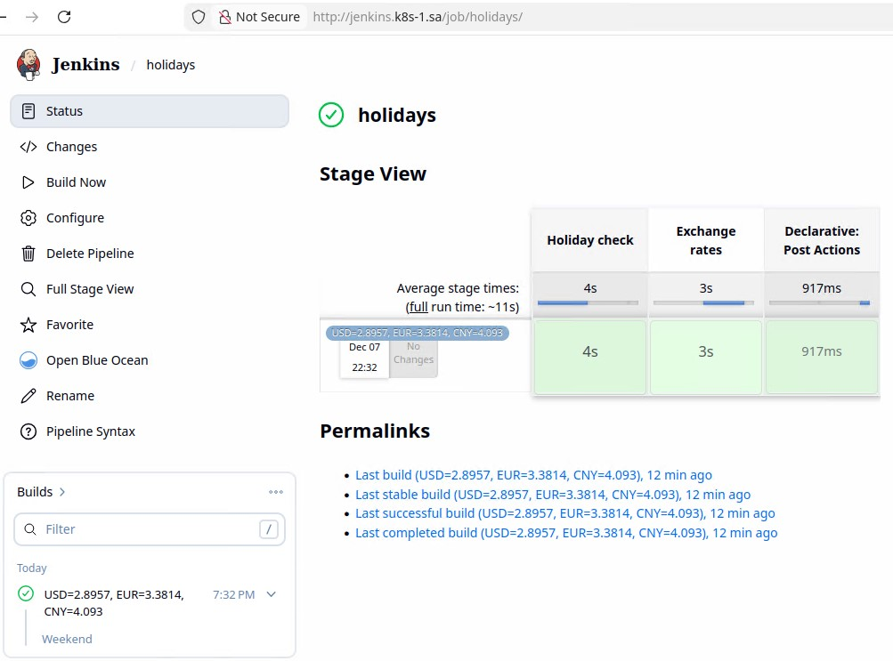

# Home Work 19.Jenkins.Start

## Screenshots

Jenkins stability issues were observed when using the "Matrix Authorization Strategy" plugin. The "Role-based Authorization Strategy" plugin was used to perform the task.

