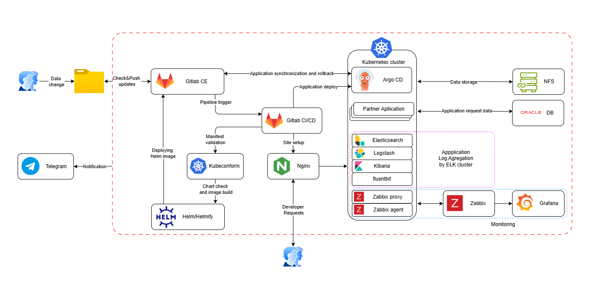

# Project Report: Automated assembly of manifests for application deployment, conversion to a Helm graph, creation of a Helm image, and deployment of the application with the resulting settings.

### Project's reporter: Siarhei Auсhynnik
### Group number: md-sa2-33-25

### Description of Application for Deployment

__Name of Application:__ InfoStream

__Programming language(s):__ Bash

__Database type:__ OracleDB

Repository / site / package link: 

 - Pipeline\&Scripts https://github.com/ArtegaAS/project-src

### Pipeline. High-Level Design

### Technologies Used in the Project

- GitLab CE - version control system, container&image registry, automation
- Kubernetes - runtime environment
- Kubeconform - manifest syntax validator
- Helm - package installer
- Helmify - manifest to chart converter
- ArgoCD - CD automation
- Monitoring: Zabbix, Grafana
- Notifications: Telegramm

### CI description

The main branch contains the application's source code. The project uses the ci-cd branch, which serves as a testing environment. There is no additional branch for automated production. The company's specific requirements prevent automatic deployment of changes to the production environment.

The public folder contains 4 files for each of the partners.

#####_secret.yaml - secrets file

#####_top.yaml - manifest portion before the SQL query

#####_sql.yaml - SQL query

#####_srv.yaml - service description

1. The interested department makes changes to any file
2. GitLab Action starts a new pipeline on a timer.

    - checks for changes in files for each partner
    - forms a unified manifest
    - checks the generated manifest (kubeconform)
    - converts a manifest to a Helm chart (helmify)
    - creates a Helm image and places it in the repository
    - hosts the application through ArgoCD
    - generates the Nginx site configuration and applies it
    - logs into the application using the login and password from the manifest
    - receives an authorization token

Notifications are sent to Telegram at all stages.

If the application has already been deployed, Argo CD polls the repository for changes every time and applies them.

## Deployment flows short description:

New versions of application parameters are placed in the ci-cd branch for testing by developers.

After successful testing, developers notify administrators of the version that will be applied in the production environment.

The company's specific prevents automated deployment of changes, as they require approval from regulators or partners. After receiving all necessary approvals, administrators deploy the application with the approved settings to the production environment.

During the testing phase, deployment is managed using ArgoCD. ArgoCD monitors the Helm image repository. When new versions are released, ArgoCD automatically updates the application.

## Rollback flow description and implementation

Rollback is done through the ArgoCD UI.
Before rolling back, automatic synchronization must be disabled in the ArgoCD application settings. After disabling auto-sync, the previous stable version is selected and deployed.

## Data Persistence

The Oracle database and ELK files are preserved during a rollback because they are stored in a Persistent Volume Claim (PVC) backed by an NFS storage. This ensures that rollbacks do not result in data loss, allowing previously published content and media files to remain intact.

