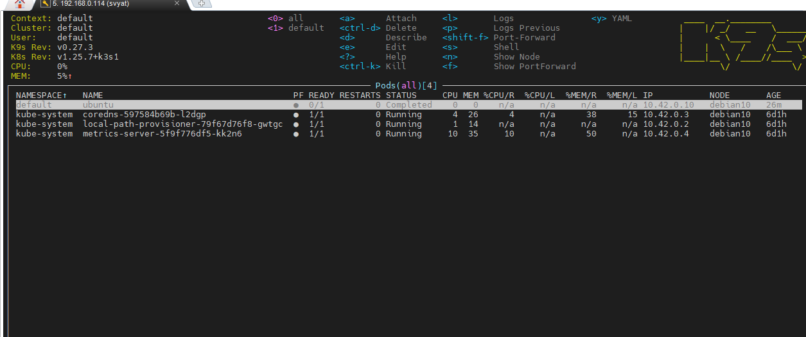
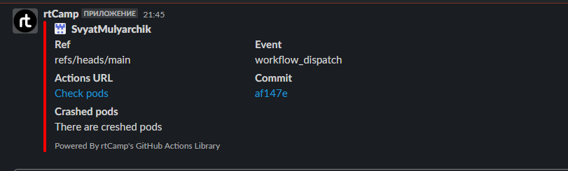

# 10.KubernetesWS


### Workflow 10HW.yaml
```bash
name: Check pods

on:
  workflow_dispatch

jobs:
  build:
    name: Check pods kubectl
    runs-on: ubuntu-latest

    steps:
    - name: Connect to k3s
      run: |
        mkdir ~/.ssh
        eval `ssh-agent -s`
        ssh-add - <<< "${{ secrets.SSH_KEY }}"
        ssh-keyscan -H ${{ secrets.BASTION }} >> ~/.ssh/known_hosts
        ssh ${{ secrets.BASTION_USER }}@${{ secrets.BASTION}} ssh-keyscan ${{ secrets.HOST }} >> ~/.ssh/known_hosts
        ssh -o ProxyCommand="ssh -W %h:%p ${{ secrets.BASTION_USER }}@${{ secrets.BASTION }}" ${{ secrets.HOST_USER }}@${{ secrets.HOST }} \
        kubectl get pods -A >> report.log

    - name: check pods
      id: check-pods
      run: |
        echo "pods-failed=$(cat report.log | grep -v Running | wc -l)" >> $GITHUB_OUTPUT

    - name: Check crashed pod's list
      uses: actions/upload-artifact@v3
      with:
        path: report.log

    - name: Slack notification
      uses: rtCamp/action-slack-notify@v2
      env:
        SLACK_CHANEL: SvyatApp
        SLACK_COLOR: '#FF0000'
        SLACK_ICON: https://github.com/rtCamp.png?size=48
        SLACK_MESSAGE: 'There are creshed pods'
        SLACK_TITLE: 'Crashed pods'
        SLACK_USERNAME: rtCamp
        SLACK_WEBHOOK: ${{ secrets.SLACK_WEBHOOK }}

```
### k9s screen


### Slack screen



### Link to Action

[GitAction](https://github.com/SvyatMulyarchik/my.repository.GH/actions/runs/4493391739)
