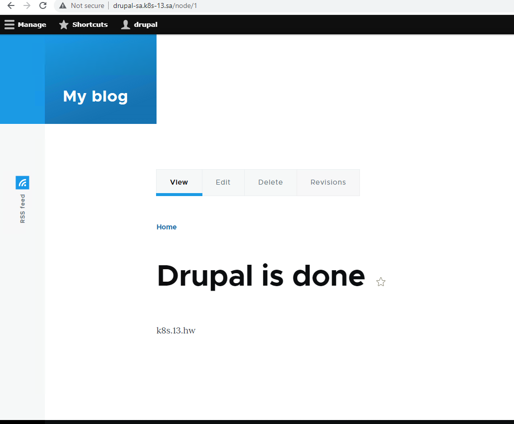
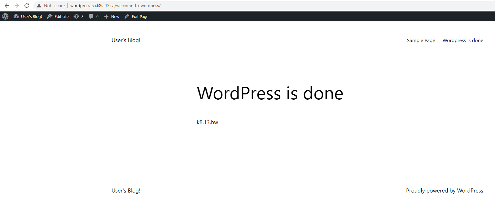

# 13.Kubernetes.Helm.HW


### Create databases for our applications
```bash
ansible-playbook -i mariainv.yaml maria.yaml -e name_db=wpress -e user_db=wpress -e pass_db=wpress
ansible-playbook -i mariainv.yaml maria.yaml -e name_db=drupal -e user_db=drupal -e pass_db=drupal
```
### Create ingress.yaml for applications and apply it
```
---
apiVersion: networking.k8s.io/v1
kind: Ingress
metadata:
  name: ingress-drupal
  annotations:
    kubernetes.io/ingress.class: nginx
spec:
  rules:
    - host: drupal-sa.k8s-13.sa
      http:
        paths:
          - path: /
            pathType: Prefix
            backend:
              service:
                name: sa-drupal
                port:
                  number: 80

---
apiVersion: networking.k8s.io/v1
kind: Ingress
metadata:
  name: ingress-wordpress
  annotations:
    kubernetes.io/ingress.class: nginx
spec:
  rules:
    - host: wordpress-sa.k8s-13.sa
      http:
        paths:
          - path: /
            pathType: Prefix
            backend:
              service:
                name: sa-wordpress
                port:
                  number: 80

```
```
kubectl-apply -f ingress.yaml
```
###  Create storage.yaml for applications and apply it
```
---
apiVersion: helm.cattle.io/v1
kind: HelmChart
metadata:
  name: nfs
  namespace: default
spec:
  chart: nfs-subdir-external-provisioner
  repo: https://kubernetes-sigs.github.io/nfs-subdir-external-provisioner
  targetNamespace: default
  set:
    nfs.server: 192.168.37.105
    nfs.path: /mnt/IT-Academy/nfs-data/sa2-23-23/S.Muliarchyk
    storageClass.name: nfs

---
apiVersion: storage.k8s.io/v1
kind: StorageClass
metadata:
  name: nfs-wordpress
provisioner: cluster.local/nfs-nfs-subdir-external-provisioner
parameters:
  onDelete: "retain"
  pathPattern: "/wordpress/"

---
apiVersion: storage.k8s.io/v1
kind: StorageClass
metadata:
  name: nfs-drupal
provisioner: cluster.local/nfs-nfs-subdir-external-provisioner
parameters:
  onDelete: "retain"
  pathPattern: "/drupal/"
```
```
kubectl-apply -f storage.yaml
```
### Add bitnami repo for helm and install our apps
```
helm repo add bitnami https://charts.bitnami.com/bitnami

helm install sa-wordpress --set mariadb.enabled=false,externalDatabase.host=192.168.201.13,externalDatabase.user=wpress,externalDatabase.password=wpress,externalDatabase.database=wpress,global.storageClass=nfs-wordpress,wordpressUsername=wpress,wordpressPassword=wpress,livenessProbe.initialDelaySeconds=1200,readinessProbe.initialDelaySeconds=120 bitnami/wordpress

helm install sa-drupal --set mariadb.enabled=false,externalDatabase.host=192.168.201.13,externalDatabase.user=drupal,externalDatabase.password=drupal,externalDatabase.database=drupal,global.storageClass=nfs-drupal,drupalUsername=drupal,drupalPassword=drupal bitnami/drupal

```


### Drupal page


### Wordpress screen



