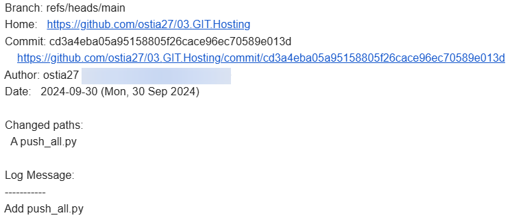
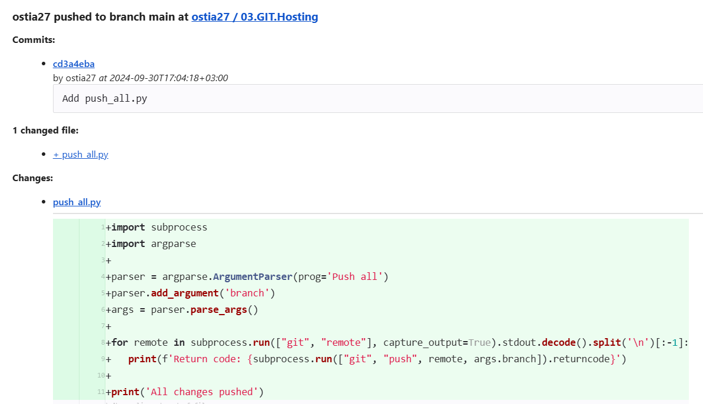

## Homework Assignment 1: Initializing a Remote Repository

### 1. Create remote empty repositories (GitHub and GitLab)

[GitHub repo](https://github.com/ostia27/03.GIT.Hosting)

[GitLab repo](https://gitlab.com/ostia27/03.git.hosting)

### 2. Add ssh key(s) to use ssh authentication
```Bash
ssh-keygen
cd /data/data/com.termux/files/home/.ssh/id_ed25519.pub
cat /data/data/com.termux/files/home/.ssh/id_ed25519.pub
```
### 3. Push your local repository into remote repositories each all, one by one
```Bash
mkdir 03.git.hosting
cd 03.git.hosting
git init --initial-branch=main

git remote add gitl git@gitlab.com:ostia27/03.git.hosting.git #github repo
git remote add gith git@github.com:ostia27/03.GIT.Hosting.git #gitlab repo

echo readme > README.md
git add --all
git commit -m "Init"

git push gith main
git push gitl main
```
### 4. Create email integration push/commit events
Create email integrations using web interface on repos

_GitHub mail_


_GitLab mail_


### 5. Automate pushing your changes to all remote repositories (bash/python/go.. scripts
[_push_all.py_](https://github.com/ostia27/03.GIT.Hosting/blob/main/push_all.py)
```Python
import subprocess
import argparse

parser = argparse.ArgumentParser(prog='Push all')
parser.add_argument('branch')
args = parser.parse_args()

for remote in subprocess.run(["git", "remote"], capture_output=True).stdout.decode().split('\n')[:-1]:
   print(f'Return code: {subprocess.run(["git", "push", remote, args.branch]).returncode}')

print('All changes pushed')
```

```Bash
python push_all.py main
```