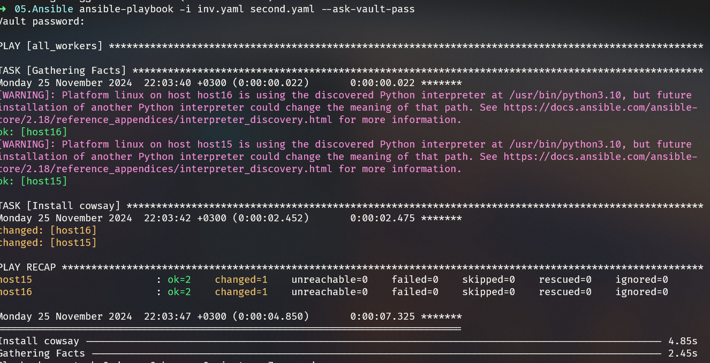
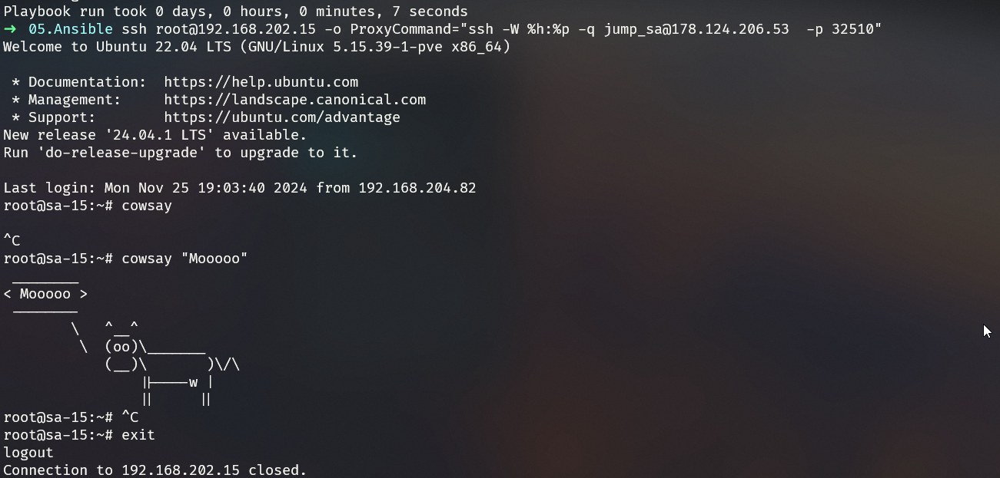
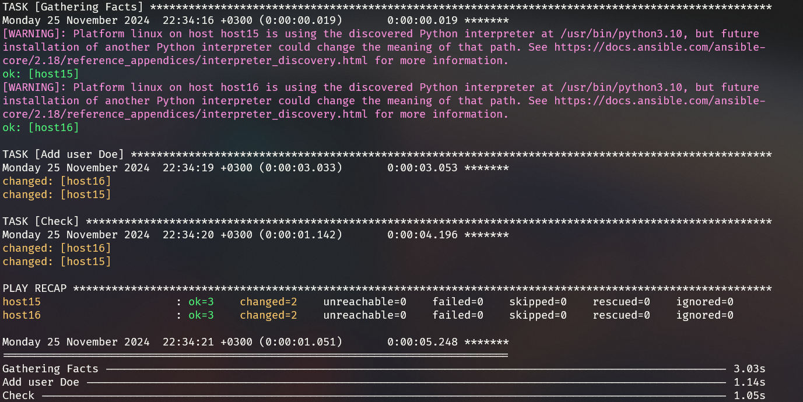
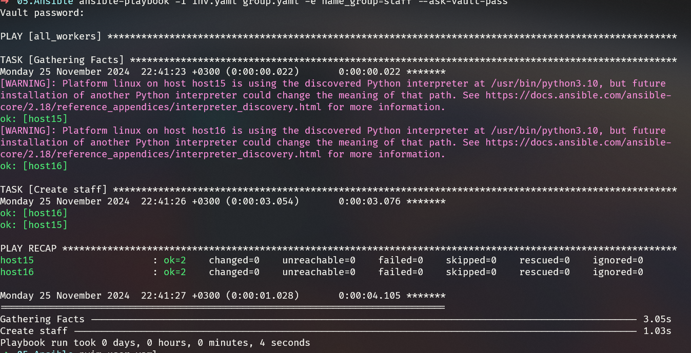
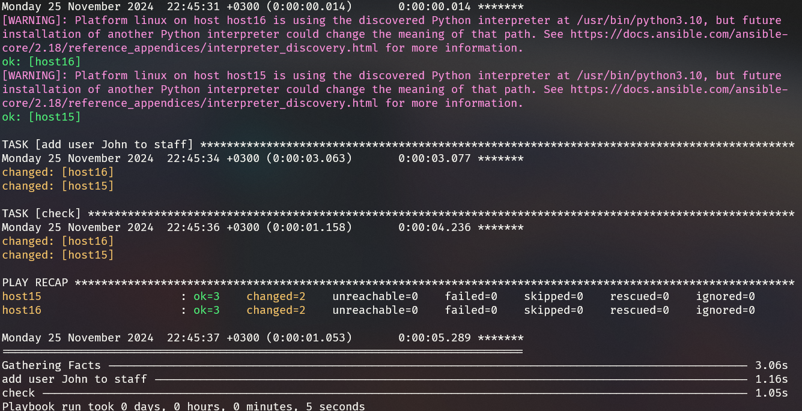

## Homework Assignment 1: Setting Up Ansible
#### 1. Install ansible
```bash
pipx install --include-deps ansible
```
#### 3. Write ansible playbook
* [first.yaml](first.yaml) 
```YAML
- hosts: all_workers
  #gather_facts: False
  #strategy: free
  #serial: 1
  tasks:
    - name: Hello World
      debug:
      msg: "Hello World!"
      tags:
        - no_facts
        - always

```
* [inv.yaml](inv.yaml)
```YAML
all_workers:
  children:
    work_sa:
      hosts:
        host15:
          ansible_host: 192.168.202.15
        host16:
          ansible_host: 192.168.202.16
jump_sa:
  vars:
    env: "it-academy"
  hosts:
    bastion:
      ansible_host: 178.124.206.53
      ansible_user: jump_sa

```
#### 4. Run playbook
```Bash
ansible-playbook -i inv.yaml first.yaml --ask-vault-pass
```


## Homework Assignment 2: Managing Remote Hosts
#### 2. SSH access
```bash
ansible -i inv.yaml -m authorized_key -a "user=root key=\"{{lookup('file', '~/.ssh/id_ed25519.pub') }}\"" -u root all_workers --ask-pass
```
#### 3. Write an Ansible playbook
* [second.yaml](second.yaml)
```yaml
- hosts: all_workers
  #gather_facts: False

  tasks:
    - name: Install cowsay
      ansible.builtin.package:
        name: cowsay
        state: present
```
* Run playbook
```Bash
ansible-playbook -i inv.yaml second.yaml --ask-vault-pass
```



* Check if cowsay installed



## Homework Assignment 3: Managing Users and Groups
#### 1. Create a playbook to manage users and groups on a remote host.
* [user.yaml](user.yaml)
```yaml
- hosts: all_workers
  #gather_facts: false
  #strategy: free
  #serial: 1

  tasks:
    - name: add user {{ user_to_add }}
      user:
        name: "{{ user_to_add }}"

    - name: check
      shell: |
        grep "{{ user_to_add }}" /etc/passwd
        date
      register: out
```

* [group.yaml](group.yaml)
```yaml
- hosts: all_workers
  tasks:
    - name: Create {{ name_group }}
      ansible.builtin.group:
        name: "{{ name_group }}"
```

* [user_group.yaml](user_group.yaml)
```yaml
- hosts: all_workers
  #gather_facts: false
  #strategy: free
  #serial: 1

  tasks:
    - name: add user {{ user_to_add }} to {{ group_to_add }}
      user:
        name: "{{ user_to_add }}"
        group: "{{ group_to_add }}"

    - name: check
      shell: |
        grep "{{ user_to_add }}" /etc/passwd
        date
      register: out
```

#### 4. Execute the playbook and verify that the user and group configurations are applied.
1. Create user
```Bash
ansible-playbook -i inv.yaml user.yaml -e user_to_add=John --ask-vault-pass
```



2. Create group
```Bash
ansible-playbook -i inv.yaml group.yaml -e name_group=staff --ask-vault-pass
```



3. Add user to group
```Bash
ansible-playbook -i inv.yaml user_group.yaml -e user_to_add=John -e group_to_add=staff --ask-vault-pass
```


