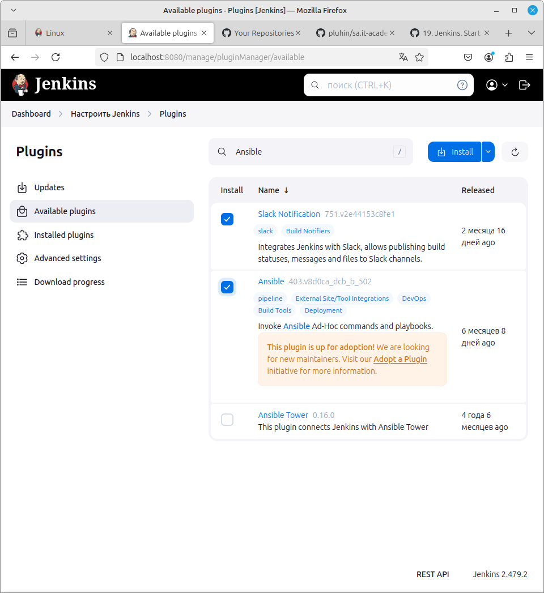

# 19. Jenkins. Start

## Homework Assignment 1: Deploy Jenkins

```bash
sudo apt update
sudo apt install fontconfig openjdk-17-jre
java -version
```

```bash
sudo wget -O /usr/share/keyrings/jenkins-keyring.asc \
  https://pkg.jenkins.io/debian-stable/jenkins.io-2023.key
echo "deb [signed-by=/usr/share/keyrings/jenkins-keyring.asc]" \
  https://pkg.jenkins.io/debian-stable binary/ | sudo tee \
  /etc/apt/sources.list.d/jenkins.list > /dev/null
sudo apt-get update
sudo apt-get install jenkins
```




## Homework Assignment 2: Create Job

1. Check if today holiday in Belarus
   
   ```Groovy
   pipeline {
    agent any
   
    environment {
        HOLIDAY_URL = 'https://date.nager.at/api/v3/IsTodayPublicHoliday/BY?offset=0'
    }
   
    stages {
        stage('Fetch Holiday') {
            steps {
                script {
                    def response = httpRequest env.HOLIDAY_URL
                    def status = response.getStatus()
   
                    if (status == 204)
                    {
                        slackSend(
                            channel: '#timur-github-package',
                            color: 'danger',
                            message: '💔There is no holiday today',
                            tokenCredentialId: 'Slack2',
                            botUser: true
                        )
                    }
                    if (status == 200)
                    {
                        slackSend(
                            channel: '#timur-github-package',
                            color: 'good',
                            message: '🎉There is holiday today',
                            tokenCredentialId: 'Slack2',
                            botUser: true
                        )
                    }
   
                }
            }
        }
    }
   }
   ```

2. Inform about exchange rates for current day
   
   ```Groovy
   pipeline {
    agent any
   
    environment {
        CURRENCY_URL = 'https://cdn.jsdelivr.net/npm/@fawazahmed0/currency-api@latest/v1/currencies/byn.json'
    }
   
    stages {
        stage('Fetch Exchange Rate') {
            steps {
                script {
                    try {
                        def response = httpRequest url: env.CURRENCY_URL
                        def json = readJSON text: response.content
                        def usdExchangeRate = json.byn.usd
                        echo response.content
                        if (json) {
                            env.EXCHANGE_RATE = usdExchangeRate
                            echo "Exchange rate found: ${usdExchangeRate}"
                        } else {
                             error """Failed to extract exchange rate from JSON"""
                        }
                    } catch (Exception e) {
                        currentBuild.result = 'FAILURE'
                        throw e
                    }
                }
            }
        }
   
        stage('Send Notification') {
            steps {
                script {
                    try {
                        def message = "The current exchange rate from BYN to USD is: ${env.EXCHANGE_RATE}"
   
                        slackSend(
                            channel: '#timur-github-package',
                            color: 'good',
                            message: message,
                            tokenCredentialId: 'Slack2',
                            botUser: true
                        )
   
                        echo "Notification sent to Slack: ${message}"
                    } catch (Exception e) {
                        currentBuild.result = 'FAILURE'
                        throw e
                    }
                }
            }
        }
    }
   
    post {
        failure {
            slackSend(
                channel: '#timur-github-package',
                color: 'danger',
                message: "Pipeline failed: ${env.JOB_NAME} - ${env.BUILD_NUMBER}",
                tokenCredentialId: 'Slack2',
                botUser: true
            )
        }
    }
   }
   ```

 


   
