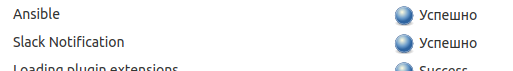
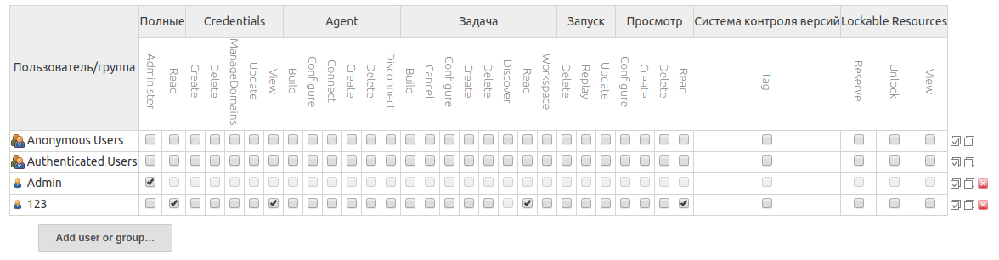

# 10. Jenkins. Start
## Setup Vagrant file

```ruby
$masterSetup = <<-SCRIPT
echo "##### app installation"

yum check-update
yum -y install nano
sudo yum -y install epel-release
sudo yum -y install nginx
sudo systemctl start nginx
sudo systemctl enable nginx

echo "##### jenkins preparation"

yum install java wget git -y --nogpgcheck -q
wget -O /etc/yum.repos.d/jenkins.repo http://pkg.jenkins-ci.org/redhat/jenkins.repo
rpm --import https://jenkins-ci.org/redhat/jenkins-ci.org.key
yum install jenkins -y --nogpgcheck -q
usermod -s /bin/bash jenkins
systemctl enable jenkins
systemctl start jenkins

echo "##### Waiting for secret"

while [ ! -f /var/lib/jenkins/secrets/initialAdminPassword ]
do
    sleep 2
done

echo "##### ssh preparation"

cat /tmp/pub_key.pub >> /home/vagrant/.ssh/authorized_keys
chown vagrant:vagrant /home/vagrant/.ssh/authorized_keys
chmod 600 /home/vagrant/.ssh/authorized_keys

echo "##### Secret here"
cat /var/lib/jenkins/secrets/initialAdminPassword
SCRIPT


PUB_KEY_PATH = "~/.ssh/id_rsa.pub"


MACHINES = {
  'master'  =>  { vcpu: '1', ram: '1024', ip: '10.20.30.40'},
}


INSTANCES = MACHINES.flat_map do |server_name, server|
    server.merge({
      :vagrant_name => "#{server_name}",
    })
end


Vagrant.configure("2") do |config|
  config.vm.synced_folder ".", "/vagrant", disabled: true

  INSTANCES.each do |instance|
    config.vm.define instance[:vagrant_name] do |node|
      node.vm.box = "centos/7"
      node.vm.hostname = instance[:vagrant_name]
      node.vm.network "private_network", ip: instance[:ip]


      node.vm.provider "virtualbox" do |vb|
        vb.gui = false
        vb.memory = instance[:ram]
        vb.cpus = instance[:vcpu]
      end


      node.vm.provision "file", source: PUB_KEY_PATH, destination: "/tmp/pub_key.pub"


      if instance[:vagrant_name] == "master"
        node.vm.network "public_network", ip: "192.168.55.80", bridge: "enp3s0"
        node.vm.provision "shell", inline: $masterSetup
      end


    end
  end
end
```

If you wont to use separate file to host provision then put your provision script to the file and add next row in vagrant file in end of block "Vagrant.configure..."

```ruby
config.vm.provision :shell, :path => "<filename>.sh"
```

## Install plugins: Ansible, slack notification
Go to http://<Jenkin adress>/pluginManager/available, then choice Ansible and slack notification plugin, then press install button.



## Add restricted user to view Jobs, without any changes inside Jobs and Jenkins settings
1. Manage Jenkins ->  Manage Users -> Create User
2. Manage Jenkins ->  Manage Users -> Configure Global Security -> Matrix-based security

Choice:
* Overall Read
* Credentials View
* Job Read
* View Read



## Hide Jenkins behind the web server (Apache, Nginx)

```c
server {
    listen 80;
    server_name jenkins.domain.tld;
    return 301 https://$host$request_uri;
}

server {
    listen 80;
    server_name jenkins.domain.tld;

    location / {
      proxy_set_header        Host $host:$server_port;
      proxy_set_header        X-Real-IP $remote_addr;
      proxy_set_header        X-Forwarded-For $proxy_add_x_forwarded_for;
      proxy_set_header        X-Forwarded-Proto $scheme;

      # Fix the "It appears that your reverse proxy set up is broken" error.
      proxy_pass          http://127.0.0.1:8080;
      proxy_read_timeout  90;

      proxy_redirect      http://127.0.0.1:8080 https://jenkins.domain.tld;

      # Required for new HTTP-based CLI
      proxy_http_version 1.1;
      proxy_request_buffering off;
      # workaround for https://issues.jenkins-ci.org/browse/JENKINS-45651
      add_header 'X-SSH-Endpoint' 'jenkins.domain.tld:50022' always;
    }
  }
  ```
