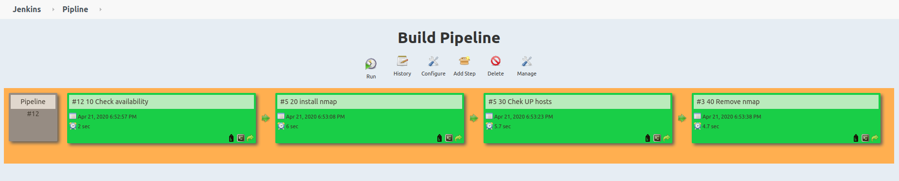

# 11. Jenkins. Routine

### Items output is under the spoilers
The scan range was intentionally limited to the first 254 addresses.
<details>
  <summary>LOG 10 Check availability</summary>

```
Started by user unknown or anonymous
Running as SYSTEM
Building in workspace /var/lib/jenkins/workspace/10 Check availability
[10 Check availability] $ /bin/bash /tmp/jenkins6175348767755084558.sh
[DEPRECATION WARNING]: Distribution Ubuntu 18.04 on host 192.168.203.18 should
use /usr/bin/python3, but is using /usr/bin/python for backward compatibility
with prior Ansible releases. A future Ansible release will default to using the
 discovered platform python for this host. See https://docs.ansible.com/ansible
/2.9/reference_appendices/interpreter_discovery.html for more information. This
 feature will be removed in version 2.12. Deprecation warnings can be disabled
by setting deprecation_warnings=False in ansible.cfg.
192.168.203.18 | SUCCESS => {
    "ansible_facts": {
        "discovered_interpreter_python": "/usr/bin/python"
    },
    "changed": false,
    "ping": "pong"
}
Triggering a new build of 20 install nmap
Finished: SUCCESS
```

</details>

<details>
  <summary>LOG 20 install nmap</summary>

```
Started by upstream project "10 Check availability" build number 12
originally caused by:
 Started by user unknown or anonymous
Running as SYSTEM
Building in workspace /var/lib/jenkins/workspace/20 install nmap
[20 install nmap] $ /bin/bash /tmp/jenkins4588267148151027276.sh
[DEPRECATION WARNING]: Distribution Ubuntu 18.04 on host 192.168.203.18 should
use /usr/bin/python3, but is using /usr/bin/python for backward compatibility
with prior Ansible releases. A future Ansible release will default to using the
 discovered platform python for this host. See https://docs.ansible.com/ansible
/2.9/reference_appendices/interpreter_discovery.html for more information. This
 feature will be removed in version 2.12. Deprecation warnings can be disabled
by setting deprecation_warnings=False in ansible.cfg.
192.168.203.18 | CHANGED => {
    "ansible_facts": {
        "discovered_interpreter_python": "/usr/bin/python"
    },
    "cache_update_time": 1587483319,
    "cache_updated": false,
    "changed": true,
    "stderr": "",
    "stderr_lines": [],
    "stdout": "Reading package lists...\nBuilding dependency tree...\nReading state information...\nSuggested packages:\n  ndiff\nThe following NEW packages will be installed:\n  nmap\n0 upgraded, 1 newly installed, 0 to remove and 183 not upgraded.\nNeed to get 0 B/5174 kB of archives.\nAfter this operation, 24.0 MB of additional disk space will be used.\nSelecting previously unselected package nmap.\r\n(Reading database ... \r(Reading database ... 5%\r(Reading database ... 10%\r(Reading database ... 15%\r(Reading database ... 20%\r(Reading database ... 25%\r(Reading database ... 30%\r(Reading database ... 35%\r(Reading database ... 40%\r(Reading database ... 45%\r(Reading database ... 50%\r(Reading database ... 55%\r(Reading database ... 60%\r(Reading database ... 65%\r(Reading database ... 70%\r(Reading database ... 75%\r(Reading database ... 80%\r(Reading database ... 85%\r(Reading database ... 90%\r(Reading database ... 95%\r(Reading database ... 100%\r(Reading database ... 23032 files and directories currently installed.)\r\nPreparing to unpack .../nmap_7.60-1ubuntu5_amd64.deb ...\r\nUnpacking nmap (7.60-1ubuntu5) ...\r\nSetting up nmap (7.60-1ubuntu5) ...\r\nProcessing triggers for man-db (2.8.3-2ubuntu0.1) ...\r\n",
    "stdout_lines": [
        "Reading package lists...",
        "Building dependency tree...",
        "Reading state information...",
        "Suggested packages:",
        "  ndiff",
        "The following NEW packages will be installed:",
        "  nmap",
        "0 upgraded, 1 newly installed, 0 to remove and 183 not upgraded.",
        "Need to get 0 B/5174 kB of archives.",
        "After this operation, 24.0 MB of additional disk space will be used.",
        "Selecting previously unselected package nmap.",
        "(Reading database ... ",
        "(Reading database ... 5%",
        "(Reading database ... 10%",
        "(Reading database ... 15%",
        "(Reading database ... 20%",
        "(Reading database ... 25%",
        "(Reading database ... 30%",
        "(Reading database ... 35%",
        "(Reading database ... 40%",
        "(Reading database ... 45%",
        "(Reading database ... 50%",
        "(Reading database ... 55%",
        "(Reading database ... 60%",
        "(Reading database ... 65%",
        "(Reading database ... 70%",
        "(Reading database ... 75%",
        "(Reading database ... 80%",
        "(Reading database ... 85%",
        "(Reading database ... 90%",
        "(Reading database ... 95%",
        "(Reading database ... 100%",
        "(Reading database ... 23032 files and directories currently installed.)",
        "Preparing to unpack .../nmap_7.60-1ubuntu5_amd64.deb ...",
        "Unpacking nmap (7.60-1ubuntu5) ...",
        "Setting up nmap (7.60-1ubuntu5) ...",
        "Processing triggers for man-db (2.8.3-2ubuntu0.1) ..."
    ]
}
Triggering a new build of 30 Chek UP hosts
Finished: SUCCESS
```

</details>

<details>
  <summary>LOG 30 Chek UP hosts</summary>

```
Started by upstream project "20 install nmap" build number 5
originally caused by:
 Started by upstream project "10 Check availability" build number 12
 originally caused by:
  Started by user unknown or anonymous
Running as SYSTEM
Building in workspace /var/lib/jenkins/workspace/30 Chek UP hosts
[30 Chek UP hosts] $ /bin/bash /tmp/jenkins6138522703749112110.sh
[DEPRECATION WARNING]: Distribution Ubuntu 18.04 on host 192.168.203.18 should
use /usr/bin/python3, but is using /usr/bin/python for backward compatibility
with prior Ansible releases. A future Ansible release will default to using the
 discovered platform python for this host. See https://docs.ansible.com/ansible
/2.9/reference_appendices/interpreter_discovery.html for more information. This
 feature will be removed in version 2.12. Deprecation warnings can be disabled
by setting deprecation_warnings=False in ansible.cfg.
192.168.203.18 | CHANGED | rc=0 >>
# Nmap 7.60 scan initiated Tue Apr 21 18:53:25 2020 as: nmap -n -sn -oG - 192.168.203.1-254
Host: 192.168.203.1 ()	Status: Up
Host: 192.168.203.2 ()	Status: Up
Host: 192.168.203.3 ()	Status: Up
Host: 192.168.203.4 ()	Status: Up
Host: 192.168.203.5 ()	Status: Up
Host: 192.168.203.6 ()	Status: Up
Host: 192.168.203.7 ()	Status: Up
Host: 192.168.203.8 ()	Status: Up
Host: 192.168.203.9 ()	Status: Up
Host: 192.168.203.10 ()	Status: Up
Host: 192.168.203.11 ()	Status: Up
Host: 192.168.203.12 ()	Status: Up
Host: 192.168.203.13 ()	Status: Up
Host: 192.168.203.14 ()	Status: Up
Host: 192.168.203.15 ()	Status: Up
Host: 192.168.203.16 ()	Status: Up
Host: 192.168.203.17 ()	Status: Up
Host: 192.168.203.19 ()	Status: Up
Host: 192.168.203.20 ()	Status: Up
Host: 192.168.203.21 ()	Status: Up
Host: 192.168.203.22 ()	Status: Up
Host: 192.168.203.23 ()	Status: Up
Host: 192.168.203.24 ()	Status: Up
Host: 192.168.203.25 ()	Status: Up
Host: 192.168.203.26 ()	Status: Up
Host: 192.168.203.27 ()	Status: Up
Host: 192.168.203.28 ()	Status: Up
Host: 192.168.203.29 ()	Status: Up
Host: 192.168.203.30 ()	Status: Up
Host: 192.168.203.31 ()	Status: Up
Host: 192.168.203.32 ()	Status: Up
Host: 192.168.203.33 ()	Status: Up
Host: 192.168.203.34 ()	Status: Up
Host: 192.168.203.35 ()	Status: Up
Host: 192.168.203.36 ()	Status: Up
Host: 192.168.203.37 ()	Status: Up
Host: 192.168.203.38 ()	Status: Up
Host: 192.168.203.39 ()	Status: Up
Host: 192.168.203.40 ()	Status: Up
Host: 192.168.203.41 ()	Status: Up
Host: 192.168.203.42 ()	Status: Up
Host: 192.168.203.43 ()	Status: Up
Host: 192.168.203.44 ()	Status: Up
Host: 192.168.203.45 ()	Status: Up
Host: 192.168.203.46 ()	Status: Up
Host: 192.168.203.47 ()	Status: Up
Host: 192.168.203.48 ()	Status: Up
Host: 192.168.203.49 ()	Status: Up
Host: 192.168.203.50 ()	Status: Up
Host: 192.168.203.51 ()	Status: Up
Host: 192.168.203.52 ()	Status: Up
Host: 192.168.203.53 ()	Status: Up
Host: 192.168.203.54 ()	Status: Up
Host: 192.168.203.55 ()	Status: Up
Host: 192.168.203.56 ()	Status: Up
Host: 192.168.203.57 ()	Status: Up
Host: 192.168.203.58 ()	Status: Up
Host: 192.168.203.59 ()	Status: Up
Host: 192.168.203.60 ()	Status: Up
Host: 192.168.203.18 ()	Status: Up
# Nmap done at Tue Apr 21 18:53:29 2020 -- 254 IP addresses (60 hosts up) scanned in 3.58 seconds
Triggering a new build of 40 Remove nmap
Finished: SUCCESS
```

</details>

<details>
  <summary>LOG 40 Remove nmap</summary>

```
Started by upstream project "30 Chek UP hosts" build number 5
originally caused by:
 Started by upstream project "20 install nmap" build number 5
 originally caused by:
  Started by upstream project "10 Check availability" build number 12
  originally caused by:
   Started by user unknown or anonymous
Running as SYSTEM
Building in workspace /var/lib/jenkins/workspace/40 Remove nmap
[40 Remove nmap] $ /bin/bash /tmp/jenkins4463852286445445231.sh
[DEPRECATION WARNING]: Distribution Ubuntu 18.04 on host 192.168.203.18 should
use /usr/bin/python3, but is using /usr/bin/python for backward compatibility
with prior Ansible releases. A future Ansible release will default to using the
 discovered platform python for this host. See https://docs.ansible.com/ansible
/2.9/reference_appendices/interpreter_discovery.html for more information. This
 feature will be removed in version 2.12. Deprecation warnings can be disabled
by setting deprecation_warnings=False in ansible.cfg.
192.168.203.18 | CHANGED => {
    "ansible_facts": {
        "discovered_interpreter_python": "/usr/bin/python"
    },
    "changed": true,
    "stderr": "",
    "stderr_lines": [],
    "stdout": "Reading package lists...\nBuilding dependency tree...\nReading state information...\nThe following packages were automatically installed and are no longer required:\n  libblas3 liblinear3 liblua5.3-0\nUse 'apt autoremove' to remove them.\nThe following packages will be REMOVED:\n  nmap\n0 upgraded, 0 newly installed, 1 to remove and 183 not upgraded.\nAfter this operation, 24.0 MB disk space will be freed.\n(Reading database ... \r(Reading database ... 5%\r(Reading database ... 10%\r(Reading database ... 15%\r(Reading database ... 20%\r(Reading database ... 25%\r(Reading database ... 30%\r(Reading database ... 35%\r(Reading database ... 40%\r(Reading database ... 45%\r(Reading database ... 50%\r(Reading database ... 55%\r(Reading database ... 60%\r(Reading database ... 65%\r(Reading database ... 70%\r(Reading database ... 75%\r(Reading database ... 80%\r(Reading database ... 85%\r(Reading database ... 90%\r(Reading database ... 95%\r(Reading database ... 100%\r(Reading database ... 23842 files and directories currently installed.)\r\nRemoving nmap (7.60-1ubuntu5) ...\r\nProcessing triggers for man-db (2.8.3-2ubuntu0.1) ...\r\n",
    "stdout_lines": [
        "Reading package lists...",
        "Building dependency tree...",
        "Reading state information...",
        "The following packages were automatically installed and are no longer required:",
        "  libblas3 liblinear3 liblua5.3-0",
        "Use 'apt autoremove' to remove them.",
        "The following packages will be REMOVED:",
        "  nmap",
        "0 upgraded, 0 newly installed, 1 to remove and 183 not upgraded.",
        "After this operation, 24.0 MB disk space will be freed.",
        "(Reading database ... ",
        "(Reading database ... 5%",
        "(Reading database ... 10%",
        "(Reading database ... 15%",
        "(Reading database ... 20%",
        "(Reading database ... 25%",
        "(Reading database ... 30%",
        "(Reading database ... 35%",
        "(Reading database ... 40%",
        "(Reading database ... 45%",
        "(Reading database ... 50%",
        "(Reading database ... 55%",
        "(Reading database ... 60%",
        "(Reading database ... 65%",
        "(Reading database ... 70%",
        "(Reading database ... 75%",
        "(Reading database ... 80%",
        "(Reading database ... 85%",
        "(Reading database ... 90%",
        "(Reading database ... 95%",
        "(Reading database ... 100%",
        "(Reading database ... 23842 files and directories currently installed.)",
        "Removing nmap (7.60-1ubuntu5) ...",
        "Processing triggers for man-db (2.8.3-2ubuntu0.1) ..."
    ]
}
Finished: SUCCESS
```

</details>

### Pipeline Screenshot


