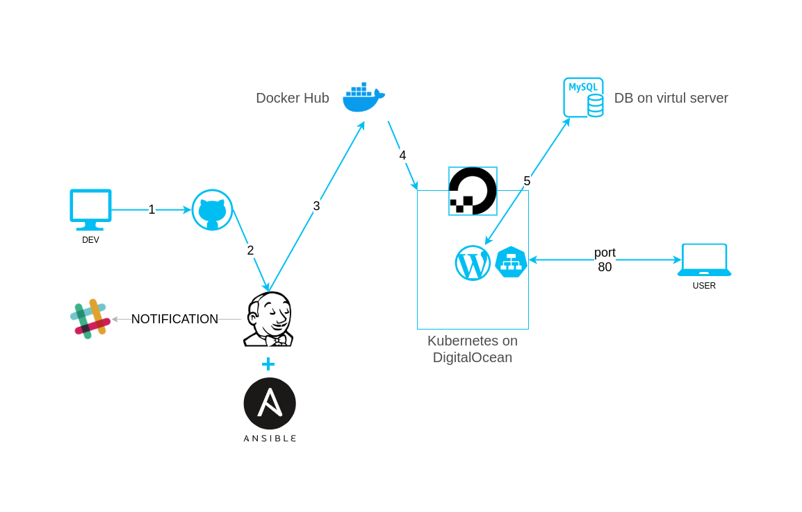

###### Project's reporter: Tsimur, Mindarau

###### Group number: m-sa2-12-20

### Description of application for deployment
WordPress (WordPress.org) is a free and open-source content management system (CMS) written in PHP[4] and paired with a MySQL or MariaDB database. Features include a plugin architecture and a template system, referred to within WordPress as Themes. WordPress was originally created as a blog-publishing system but has evolved to support other types of web content including more traditional mailing lists and forums, media galleries, membership sites, learning management systems (LMS) and online stores.

### Name of application
Wordpress

### Which programming language is this application written in
PHP
### What kind of DB
MySQL

### Link on git repository/site/package repository
https://wordpress.org/download/

### Scheme here

### Technologies which were used in project

* Orchestration: **Kubernetes**
* Automation tools: **Ansible, Jenkins**
* Containerization tool: **Docker**
* Release versioning tool: **DockerHub**
* Code storage and versioning tool: **Git**
* Notification: **slack**

### Deployment flows short description
**New deploy**. Run manually from jenkins. Pipeline code is entered in the corresponding Jenkins Job field. Launched pipeline download [2] the application code, and the files needed to build and deploy the container. The assembled container is pushed onto the docker hub [3] with the assignment of the container version tag. Then ansible deploy the container to the Kubernetes cluster and creates a service through which you can access the container. Users can connect to the application using the network address of the service on the kubernetes. After completion, the pipeline jenkins sends a notification to the slack.

**Update deploy**. Jenkins is scheduled to check for updates to the github code repository [1]. As soon as it detects the update, the pipeline will be launched. Papline downloads [2] the application code, and the files needed to build and deploy the container. The new assembled container (with update) is pushed onto the docker hub [3] with the assignment of the container version tag. Then ansible deploy the container to new pod on the cluster and turns off the old Pod. Since user data is stored in a database on a virtual server [5], the update deployment does not cause loss of user data. After completion, the pipeline jenkins sends a notification to the slack.

### Links
* Pipeline: https://github.com/tsimur/project_pl
