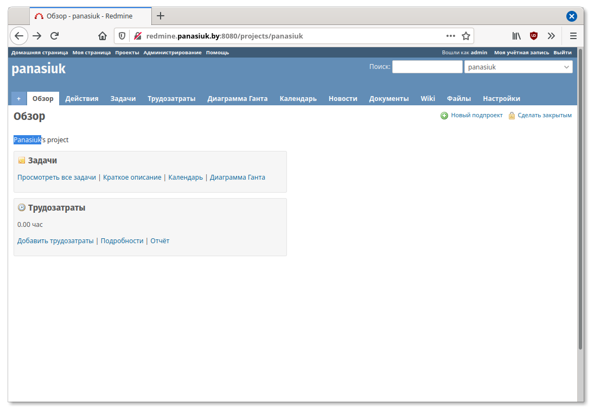

# 09. Ansible. Workshop

## Playbook files tree
```
├── inv.yaml
├── play.yaml
├── roles
│   ├── app
│   │   ├── defaults
│   │   │   └── main.yaml
│   │   ├── handlers
│   │   │   └── main.yaml
│   │   ├── tasks
│   │   │   └── main.yaml
│   │   └── templates
│   │       ├── database.yml.j2
│   │       └── redmine.site.conf.j2
│   └── mysql
│       ├── defaults
│       │   └── main.yaml
│       ├── handlers
│       │   └── main.yaml
│       ├── tasks
│       │   └── main.yaml
│       └── templates
│           └── my.cnf.j2
```

## Output of `ansible-playbook -i inv.yaml play.yaml`

```
PLAY [redmine] ********************************************************************************************************************************************************

TASK [check host] *****************************************************************************************************************************************************
Saturday 15 August 2020  12:42:57 +0300 (0:00:00.034)       0:00:00.034 ******* 
changed: [redmine_14]

TASK [Show host] ******************************************************************************************************************************************************
Saturday 15 August 2020  12:43:30 +0300 (0:00:33.421)       0:00:33.455 ******* 
ok: [redmine_14] => {
    "msg": "ws-14"
}

TASK [mysql : Mysql. Install packages] ********************************************************************************************************************************
Saturday 15 August 2020  12:43:30 +0300 (0:00:00.045)       0:00:33.501 ******* 
ok: [redmine_14]

TASK [mysql : MySQL. Install and setup] *******************************************************************************************************************************
Saturday 15 August 2020  12:43:47 +0300 (0:00:16.553)       0:00:50.054 ******* 
ok: [redmine_14]

TASK [mysql : mysql_db] ***********************************************************************************************************************************************
Saturday 15 August 2020  12:44:17 +0300 (0:00:29.759)       0:01:19.814 ******* 
ok: [redmine_14]

TASK [mysql : mysql_user] *********************************************************************************************************************************************
Saturday 15 August 2020  12:44:35 +0300 (0:00:18.433)       0:01:38.247 ******* 
[WARNING]: Module did not set no_log for update_password
ok: [redmine_14]

TASK [app : Redmine. Install packages] ********************************************************************************************************************************
Saturday 15 August 2020  12:44:56 +0300 (0:00:20.518)       0:01:58.766 ******* 
ok: [redmine_14]

TASK [app : Redmine. Clone repository] ********************************************************************************************************************************
Saturday 15 August 2020  12:45:22 +0300 (0:00:26.346)       0:02:25.113 ******* 
ok: [redmine_14]

TASK [app : Redmine. Change permissions] ******************************************************************************************************************************
Saturday 15 August 2020  12:45:42 +0300 (0:00:19.902)       0:02:45.015 ******* 
ok: [redmine_14]

TASK [app : Redmine. Change permissions] ******************************************************************************************************************************
Saturday 15 August 2020  12:46:00 +0300 (0:00:18.306)       0:03:03.321 ******* 
ok: [redmine_14]

TASK [app : Config database] ******************************************************************************************************************************************
Saturday 15 August 2020  12:46:15 +0300 (0:00:14.929)       0:03:18.251 ******* 
ok: [redmine_14]

TASK [app : Redmine. Setup 01] ****************************************************************************************************************************************
Saturday 15 August 2020  12:46:39 +0300 (0:00:24.136)       0:03:42.387 ******* 
changed: [redmine_14]

TASK [app : Session store secret generation] **************************************************************************************************************************
Saturday 15 August 2020  12:47:08 +0300 (0:00:28.433)       0:04:10.821 ******* 
ok: [redmine_14]

TASK [app : Redmine. Setup 02] ****************************************************************************************************************************************
Saturday 15 August 2020  12:47:26 +0300 (0:00:18.775)       0:04:29.596 ******* 
changed: [redmine_14]

TASK [app : Configuration files for virtualhost] **********************************************************************************************************************
Saturday 15 August 2020  12:47:59 +0300 (0:00:32.147)       0:05:01.744 ******* 
ok: [redmine_14]

TASK [Add redmine.panasiuk.by to host file] ***************************************************************************************************************************
Saturday 15 August 2020  12:48:25 +0300 (0:00:26.338)       0:05:28.082 ******* 
changed: [redmine_14]

TASK [uri] ************************************************************************************************************************************************************
Saturday 15 August 2020  12:48:41 +0300 (0:00:15.955)       0:05:44.038 ******* 
ok: [redmine_14]

TASK [lineinfile] *****************************************************************************************************************************************************
Saturday 15 August 2020  12:48:58 +0300 (0:00:17.260)       0:06:01.299 ******* 
changed: [redmine_14]

PLAY RECAP ************************************************************************************************************************************************************
redmine_14                 : ok=18   changed=5    unreachable=0    failed=0    skipped=0    rescued=0    ignored=0   

Saturday 15 August 2020  12:49:15 +0300 (0:00:16.973)       0:06:18.273 ******* 
=============================================================================== 
check host ---------------------------------------------------------------------------------------------------------------------------------------------------- 33.42s
app : Redmine. Setup 02 --------------------------------------------------------------------------------------------------------------------------------------- 32.15s
mysql : MySQL. Install and setup ------------------------------------------------------------------------------------------------------------------------------ 29.76s
app : Redmine. Setup 01 --------------------------------------------------------------------------------------------------------------------------------------- 28.43s
app : Redmine. Install packages ------------------------------------------------------------------------------------------------------------------------------- 26.35s
app : Configuration files for virtualhost --------------------------------------------------------------------------------------------------------------------- 26.34s
app : Config database ----------------------------------------------------------------------------------------------------------------------------------------- 24.14s
mysql : mysql_user -------------------------------------------------------------------------------------------------------------------------------------------- 20.52s
app : Redmine. Clone repository ------------------------------------------------------------------------------------------------------------------------------- 19.90s
app : Session store secret generation ------------------------------------------------------------------------------------------------------------------------- 18.78s
mysql : mysql_db ---------------------------------------------------------------------------------------------------------------------------------------------- 18.43s
app : Redmine. Change permissions ----------------------------------------------------------------------------------------------------------------------------- 18.31s
uri ----------------------------------------------------------------------------------------------------------------------------------------------------------- 17.26s
lineinfile ---------------------------------------------------------------------------------------------------------------------------------------------------- 16.97s
mysql : Mysql. Install packages ------------------------------------------------------------------------------------------------------------------------------- 16.55s
Add redmine.panasiuk.by to host file -------------------------------------------------------------------------------------------------------------------------- 15.96s
app : Redmine. Change permissions ----------------------------------------------------------------------------------------------------------------------------- 14.93s
Show host ------------------------------------------------------------------------------------------------------------------------------------------------------ 0.05s
Playbook run took 0 days, 0 hours, 6 minutes, 18 seconds
```

## Screenshot of project

