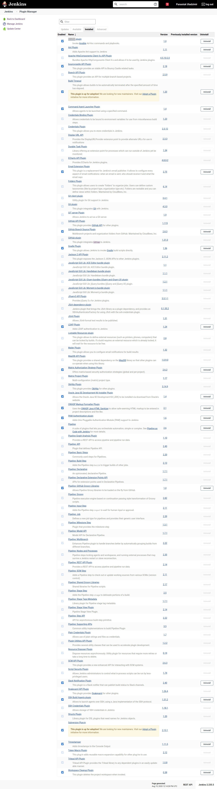
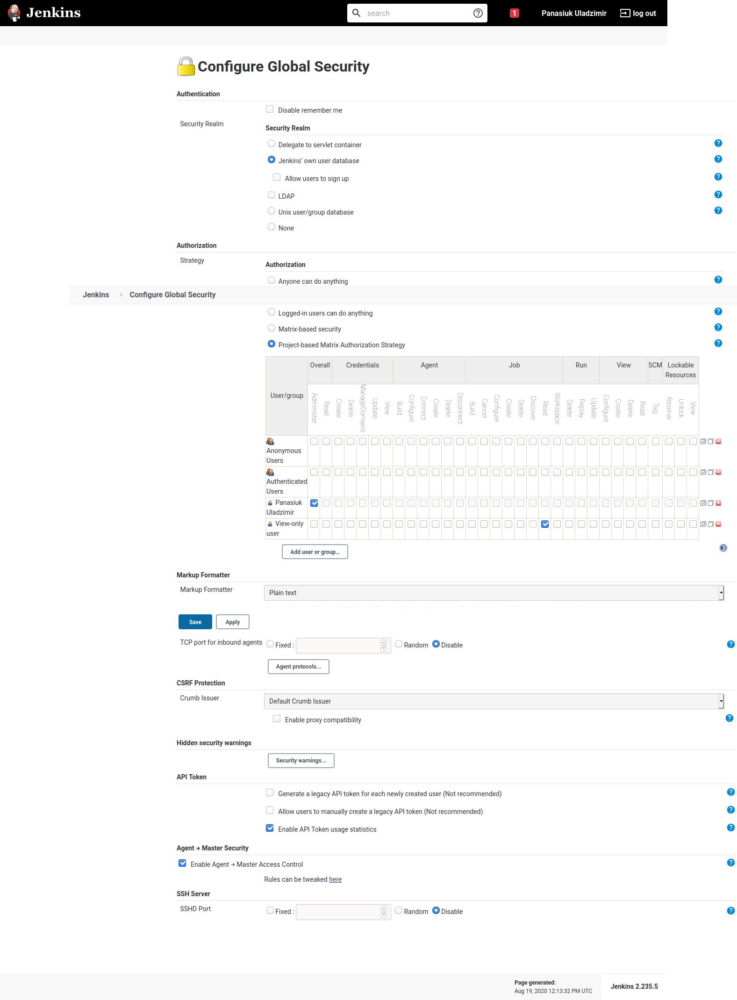

# 10. Jenkins. Start
## Vagrantfile
```ruby
Vagrant.configure("2") do |config|
  config.vm.define "Jenkins"
  config.vm.box = "centos/7"
  config.vm.network "public_network", ip: "192.168.100.101", bridge: "enp3s0"
  
  config.vm.provider "virtualbox" do |vb|
    vb.gui = false
    vb.memory = "1024"
  end

  config.vm.provision "ansible" do |ansible|
    ansible.playbook = "play.yaml"
  end

end
```
## play.yaml
```yaml
---
- hosts: Jenkins
  gather_facts: no
  become: yes
  
  vars:
    - fqdn: jenkins.local
  
  roles:
    - jenkins
    - nginx
  
  tasks:
    - name: Check deployment
      uri:
        url: "http://{{ fqdn }}/login"
        return_content: yes
      register: this
      failed_when: "'Sign in [Jenkins]' not in this.content"
  
    - name: Register Jenkins initial password
      shell: cat /var/lib/jenkins/secrets/initialAdminPassword
      register: this

    - name: Show Jenkins password
      debug:
        msg: "{{ this.stdout }}"
```

Roles tasks you will find inside.

## Installed plugins


## Matrix-based permissions
