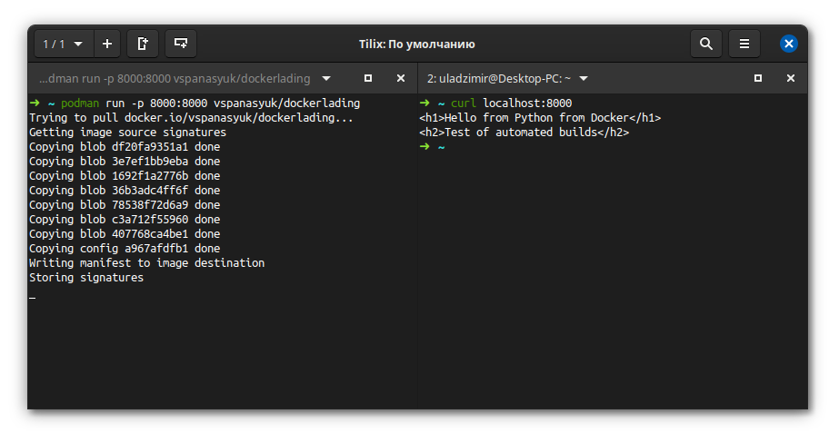
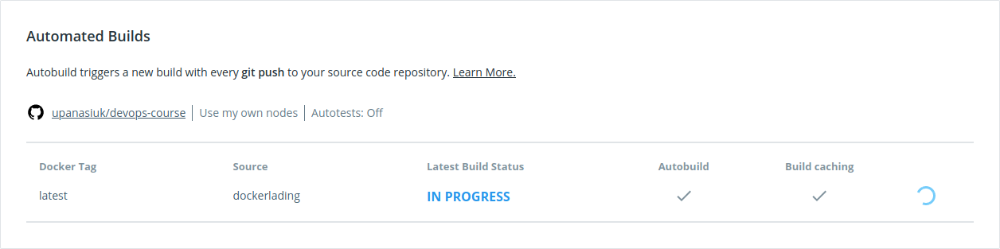

# 13. Docker. Lading

## Content of `Dockerfile`

```
FROM python:alpine

WORKDIR /usr/src/app
COPY . .

EXPOSE 8000

CMD [ "python", "-m", "http.server" ]
```

---

## Test of it



---

## Automated builds Dockerhub <=> Github

[Git repo with Dockerfile and content](https://github.com/upanasiuk/devops-course/tree/dockerlading)

