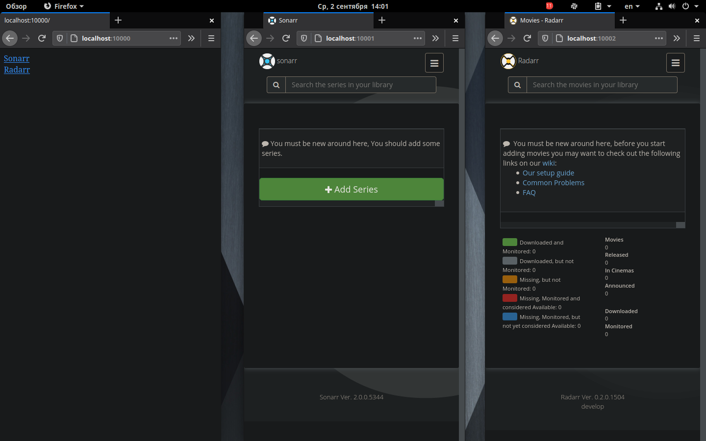

# 14. Docker. Logistics

## Automate task 13. Docker. Lading by Jenkinsfile

### Content of `Jenkinsfile`

```groovy
pipeline {
    agent {
        label 'local'
    }

    environment {
        HUBCREDS = credentials("${params.HubCreds}")
    }

    parameters {
        string(
            name: 'GitRepo',
            defaultValue: 'git@github.com:upanasiuk/devops-course.git'
        )

        string(
            name: 'GitBranch',
            description: 'Branch where the Dockerfile is',
            defaultValue: 'dockerlading'
        )

        credentials(
            name: 'GitCredsToUse',
            description: 'Credentials to use for github repo',
            defaultValue: 'my_github',
            credentialType: 'SSH username with private key',
            required: false
        )

        credentials(
            name: 'HubCreds',
            description: 'Login/password to access docker hub',
            defaultValue: 'dockerhub',
            credentialType: 'Username with password',
            required: true
        )
    }

    stages {
        stage('Clone GIT') {
            steps {
                git credentialsId: "${params.GitCredsToUse}", url: "${params.GitRepo}", branch: "${params.GitBranch}"
            }
        }

        stage('Build image') {
            steps {
                script {
                    Image = docker.build("${env.HUBCREDS_USR}/${params.GitBranch}:${env.BUILD_ID}")
                 }
            }
        }

        stage('Push image') {
            steps {
                script {
                    docker.withRegistry('', "${params.HubCreds}") {
                        Image.push()
                    }
                }
            }
        }

        stage('Remove image from local regisrty') {
            steps {
                script {
                    sh "docker image rm \"$HUBCREDS_USR/$GitBranch:$BUILD_ID\""
                 }
            }
        }
    }
}
```

Image is pushed to [https://hub.docker.com/repository/docker/vspanasyuk/dockerlading](https://hub.docker.com/repository/docker/vspanasyuk/dockerlading) with the tag that is match `$BUILD_ID` inside Jenkins.

---

## Docker compose with nginx, sonarr, radarr

### Content of `docker-compose.yaml`

```yaml
version: '3'
services:
  nginx:
    image: nginx
    container_name: nginx
    volumes:
      - ./app_content/nginx/html:/usr/share/nginx/html
    ports:
      - 10000:80
    restart: unless-stopped

  sonarr:
    image: linuxserver/sonarr
    container_name: sonarr
    environment:
      - PUID=1000
      - PGID=1000
      - TZ=Europe/Minsk
    volumes:
      - ./app_content/sonarr/config:/config
      - ./app_content/sonarr/tv:/tv
      - ./app_content/sonarr/downloads:/downloads
    ports:
      - 10001:8989
    restart: unless-stopped

  radarr:
    image: linuxserver/radarr
    container_name: radarr
    environment:
      - PUID=1000
      - PGID=1000
      - TZ=Europe/Minsk
    volumes:
      - ./app_content/radarr/config:/config
      - ./app_content/radarr/movies:/movies
      - ./app_content/radarr/downloads:/downloads
    ports:
      - 10002:7878
    restart: unless-stopped
```


